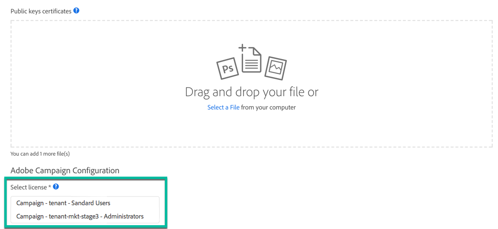

# 设置 API 访问 {#setting-up-api-access}

Adobe Campaign Standard API访问可通过以下步骤进行设置。 有关每个步骤的详情，请参见 [Adobe Developer文档](https://developer.adobe.com/developer-console/docs/guides/#!AdobeDocs/adobeio-auth/master/AuthenticationOverview/ServiceAccountIntegration.md).

>[!IMPORTANT]
>
>在中管理证书 [Adobe Developer](https://developer.adobe.com/)，确保您拥有 **系统管理员** 对组织或机构的权限 [开发人员帐户](https://helpx.adobe.com/cn/enterprise/using/manage-developers.html) 在Admin Console中。

1. **检查您是否拥有数字证书**，或在必要时创建一个。在以下步骤中需要随证书一起提供的公钥和私钥。
1. **创建与Adobe Campaign服务的新集成** 在 [Adobe Developer](https://developer.adobe.com/) 并进行配置。 随后将生成您的证书（API 密钥、客户端密钥等）。
1. 使用您的私钥在之前生成的证书中&#x200B;**创建 JSON Web 令牌 (JWT)** 并对其进行签名。JWT对Adobe验证您的身份并授予您访问API的权限所需的所有身份和安全信息进行编码。

   >[!IMPORTANT]
   >
   >JWT（JSON Web 令牌）目前正在被逐步停用，它将被 OAuth 取代。此过渡将在Campaign即将发布的版本中逐步执行。 服务帐户(JWT)凭据已标记为已弃用，在2025年1月27日之前将继续工作。 因此，您必须在2025年1月27日之前迁移应用程序或集成，才能使用新的OAuth服务器到服务器凭据。 首选OAuth身份验证。 您将在以下页面上找到要从JWT身份验证迁移到OAuth身份验证的所有元素：
   >* [迁移](https://developer.adobe.com/developer-console/docs/guides/authentication/ServerToServerAuthentication/migration/)
   >* [实施](https://developer.adobe.com/developer-console/docs/guides/authentication/ServerToServerAuthentication/implementation/)
   >* [弃用JWT常见问题解答](https://developer.adobe.com/developer-console/docs/guides/authentication/ServerToServerAuthentication/faqs/)

1. **将JWT交换为访问令牌** 通过POST请求。 在 API 请求的每个标头中必须使用此访问令牌。

要建立安全的服务到服务 Adobe I/O API 会话，对 Adobe 服务提出的每个请求都必须在“Authorization”标头中包含以下信息。

```
-X GET https://mc.adobe.io/<ORGANIZATION>/campaign/profileAndServices/profile \
-H 'Content-Type: application/json' \
-H 'Authorization: Bearer <ACCESS_TOKEN>' \
-H 'Cache-Control: no-cache' \
-H 'X-Api-Key: <API_KEY>'
```

* **&lt;organization>**：这是您的个人组织ID，Adobe会为您每个实例提供一个组织ID：

   * &lt;organization> ：您的生产实例，
   * &lt;organization-mkt-stage>：您的暂存实例。

  要获取“ORGANIZATION ID”值，请咨询管理员或 Adobe 技术联系人。您还可以在创建新集成时，在许可证列表中将其检索到Adobe I/O中(请参阅 <a href="https://developer.adobe.com/developer-console/docs/guides/authentication/">Adobe Developer文档</a>)。

* **&lt;access_token>**：您的个人访问令牌，在通过POST请求交换您的JSON Web令牌时检索。

* **&lt;API_KEY>**：您的个人 API 密钥。在创建了与Adobe Campaign服务的新集成后，可在Adobe I/O中提供。

  

## 故障排除

在AdobeIO集成期间，如果出现以下错误：

```
{ 
"code": 502, 
"message": "Oops. Something went wrong. Check your URI and try again." 
}
```


请咨询您的管理员或Adobe的技术联系人，以检查CNAME参数是否正确创建。
