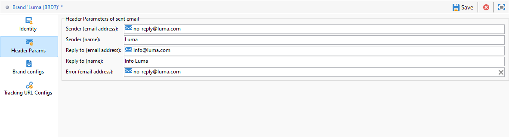

# 配置品牌 {#branding-configure}

>[!IMPORTANT]
>
>最终用户不能创建或修改品牌：必须由 Adobe Campaign 技术管理员执行这些操作。如有任何需求，请与 Adobe 客户关怀部门联系。

在Adobe Campaign V8中，品牌位于 **[!UICONTROL 管理>平台>品牌策略]** 菜单。

**[!UICONTROL 品牌]**&#x200B;由以下特征定义：

* 用于定义和个性化品牌的&#x200B;**[!UICONTROL 标识]**。此部分包含以下字段：

   * 显示在界面中的 **[!UICONTROL Label]**
   * **[!UICONTROL ID]**
   * **[!UICONTROL Brand name]**
   * 品牌的 **[!UICONTROL Website URL]** 和 **[!UICONTROL Website label]**
   * **[!UICONTROL Brand logo]**

  

* **[!UICONTROL 已发送电子邮件的标头参数]** 可将展示给营销策划收件人的标题个性化。 此部分包含以下字段：

   * 使用品牌电子邮件地址的 **[!UICONTROL Sender (email address)]**。
   * 使用品牌名称的 **[!UICONTROL Sender (name)]**。
   * 带有客户回信用电子邮件地址的 **[!UICONTROL Reply to (email address)]**。
   * 带有品牌名称的 **[!UICONTROL Reply to (name)]**。
   * 带有出错回复用电子邮件地址的 **[!UICONTROL Error (email address)]**。

  >[!IMPORTANT]
  >
  >更新了电子邮件的标题参数后，如果从模板创建的电子邮件中发件人的名称和电子邮件地址没有变化，请检查模板的高级设置。

  

* **[!UICONTROL 品牌配置]** 定义还用于跟踪登陆页面访问的服务器。 此部分包含以下字段：

   * **[!UICONTROL 品牌子域]** 是指从Adobe请求委派的特定于此品牌的指定子域URL。

  请注意，跟踪、镜像和应用程序服务器的配置存储在与路由关联的单独外部帐户中。 这些设置将在配置期间应用，且不得修改。 要显示URL，请访问 **[!UICONTROL 品牌化前缀]** 选项卡。

  

<!---->

<!--
* **[!UICONTROL Tracking URL configs]**, which defines the configuration of the URLs tracking for your brand.

  The additional parameters that allow the links to be tracked on external systems such as Web Analytics tools like Adobe Analytics or Google Analytics are defined here.
-->
