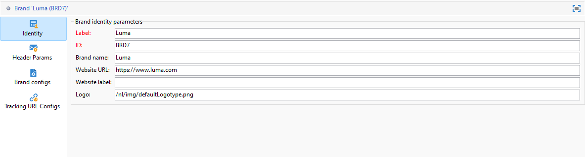

# 配置品牌 {#branding-configure}

>[!IMPORTANT]
>
>最终用户不能创建或修改品牌：必须由 Adobe Campaign 技术管理员执行这些操作。如有任何需求，请与 Adobe 客户关怀部门联系。

在Adobe Campaign V8中，可以在&#x200B;**[!UICONTROL 管理>平台>品牌]**&#x200B;菜单中找到品牌。

**[!UICONTROL 品牌]**&#x200B;由以下特征定义：

* 用于定义和个性化品牌的&#x200B;**[!UICONTROL 标识]**。此部分包含以下字段：

   * 显示在界面中的 **[!UICONTROL Label]**
   * **[!UICONTROL ID]**
   * **[!UICONTROL Brand name]**
   * 品牌的 **[!UICONTROL Website URL]** 和 **[!UICONTROL Website label]**
   * **[!UICONTROL Brand logo]**

  

* **[!UICONTROL 已发送电子邮件的标题参数]**，可个性化营销策划的收件人将看到的内容。 此部分包含以下字段：

   * 使用品牌电子邮件地址的 **[!UICONTROL Sender (email address)]**。
   * 使用品牌名称的 **[!UICONTROL Sender (name)]**。
   * 带有客户回信用电子邮件地址的 **[!UICONTROL Reply to (email address)]**。
   * 带有品牌名称的 **[!UICONTROL Reply to (name)]**。
   * 带有出错回复用电子邮件地址的 **[!UICONTROL Error (email address)]**。

  >[!IMPORTANT]
  >
  >更新了电子邮件的标题参数后，如果从模板创建的电子邮件中发件人的名称和电子邮件地址没有变化，请检查模板的高级设置。

  

* **[!UICONTROL 品牌配置]**&#x200B;定义了用于跟踪以及用于登陆页面访问的服务器。 此部分包含以下字段：

   * **[!UICONTROL Brand子域]**&#x200B;是指从Adobe请求委派的特定于此品牌的指定子域URL。

  请注意，跟踪、镜像和应用程序服务器的配置存储在与路由关联的单独外部帐户中。 这些设置将在配置期间应用，且不得修改。 要显示URL，请从外部帐户访问&#x200B;**[!UICONTROL 品牌前缀]**&#x200B;选项卡。

  

* 通过&#x200B;**[!UICONTROL 跟踪URL配置]**&#x200B;菜单，您可以通过定义用于与Web分析工具(如Adobe Analytics和Google Analytics)集成的其他参数来增强URL跟踪。

  使用&#x200B;**[!UICONTROL 其他URL参数]**&#x200B;菜单创建其他参数作为键值对及其适用条件。 每个参数名称都必须唯一且非空，并且每个参数值都必须非空。 适用性条件可以为空，但所有这些值都不能包含JST标记。

  这些参数将应用于与&#x200B;**[!UICONTROL 域名列表]**&#x200B;中指定的任何域名匹配的跟踪URL，这些URL可以包括正则表达式。
