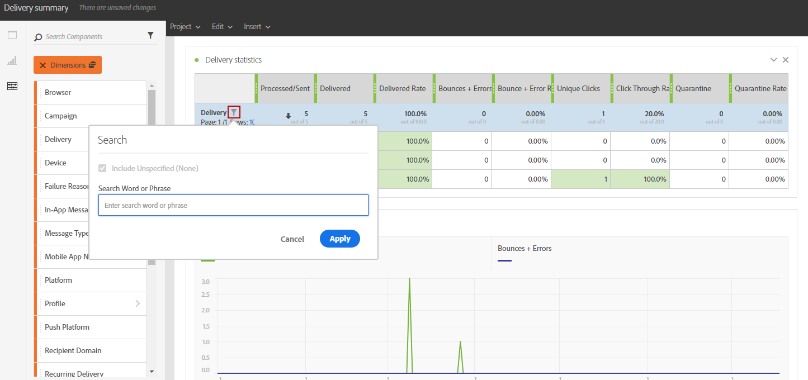

# 添加组件{#adding-components}

组件可帮助您使用不同的维度、量度和时间段自定义报表。

1. 单击 **[!UICONTROL 组件]** 选项卡访问组件列表。

   

1. 中显示的每个类别 **[!UICONTROL 组件]** 选项卡显示五个最常用的项目，单击类别名称可访问其完整的组件列表。

   组件表分为四类：

   * **Dimension**：从投放日志获取详细信息，如收件人的浏览器或域，或投放是否成功。
   * **量度**：获取有关消息状态的详细信息。 例如，如果传送了消息并且用户将其打开。
   * **[!UICONTROL 区段]**：根据收件人的年龄范围过滤数据。 **[!UICONTROL 区段]** 可以直接在自由格式表或面板的顶部栏中拖放。

     只有在管理员批准将在屏幕上显示的动态报告使用协议的条款和条件后，此类别才可用。 如果管理员拒绝协议，则区段在中将不可见 **[!UICONTROL 组件]** 选项卡和数据将不被收集。

   * **时间**：为表设置时间段。

1. 将组件拖放到面板中以开始筛选数据。

   

1. 拖放组件后，您可以使用进一步配置表 **[!UICONTROL 行设置]** 选项。

   

1. 您还可以通过单击 **Search** 图标。 通过此搜索，您可以查找特定结果，例如特定投放或浏览器。

   

您可以根据需要拖放任意数量的组件，并将它们相互进行比较。

**相关主题：**

* [组件列表](list-of-components.md)
* [报告列表](defining-the-report-period.md)
