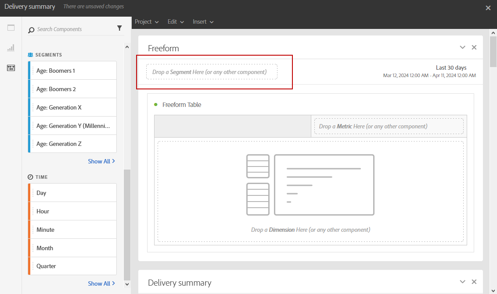

# 添加面板{#adding-panels}

## 添加空白面板 {#adding-a-blank-panel}

要启动报表，可将一组面板添加到开箱即用或自定义报表中。 每个面板包含不同的数据集，由自由格式表和可视化图表组成。

利用此面板，可根据需要构建报告。 您可以在报表中添加所需数量的面板，以按不同的时间段过滤数据。

1. 单击 **面板** 图标。 您还可以通过单击 **插入选项卡** 并选择 **新建空白面板**.

   

1. 拖放 **空白面板** 进入您的信息板。

   

您现在可以向面板中添加自由格式表以开始定位数据。

## 添加自由格式表 {#adding-a-freeform-table}

自由格式表允许您创建一个表，以使用 **组件** 表格。

每个表和可视化图表均可调整大小，并且可以移动以更好地自定义您的报表。

1. 单击 **[!UICONTROL 面板]** 图标。

   

1. 拖放 **[!UICONTROL 自由格式]** 项放入您的仪表板。

   您也可以通过单击 **[!UICONTROL 插入]** 选项卡并选择 **[!UICONTROL 新建自由格式]** 或通过单击 **[!UICONTROL 添加自由格式表]** 在空面板中。

   

1. 在 **[!UICONTROL 将区段拖放到此处]** 字段，添加 **[!UICONTROL 区段]** 从 **[!UICONTROL 组件]** 跳到顶栏中。

   

1. 从拖放项目 **[!UICONTROL 组件]** 制表符以生成表。

   

1. 单击 **[!UICONTROL 设置]** 图标来更改数据在列中的显示方式。

   

   此 **[!UICONTROL 列设置]** 由以下部分组成：

   * **[!UICONTROL 数字]**：用于显示或隐藏列中的概要数字。
   * **[!UICONTROL 百分比]**：用于显示或隐藏列中的百分比。
   * **[!UICONTROL 将零解释为没有值]**：用于在值等于零时显示或隐藏。
   * **[!UICONTROL 背景]**：用于显示或隐藏单元格中的水平进度条。
   * **[!UICONTROL 包括重试]**：用于在结果中包含重试。 此项仅适用于 **[!UICONTROL 已发送]** 和 **[!UICONTROL 退回+错误]**.

1. 选择一行或多行，然后单击 **[!UICONTROL 可视化]** 图标。 添加了一个可视化图表以反映您选择的行。

   

您现在可以根据需要添加任意数量的组件，还可以添加可视化图表以直观地表示您的数据。
