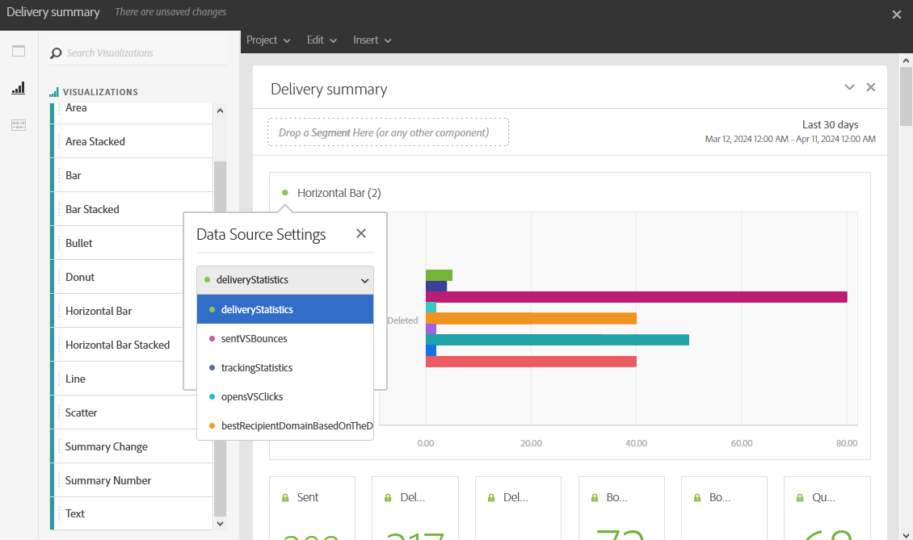

# 添加可视化{#adding-visualizations}

通过&#x200B;**可视化图表**&#x200B;选项卡，您可以拖放可视化图表项，如面积图、圆环图和图形。 可视化可为您提供数据的图形表示。

1. 在&#x200B;**[!UICONTROL 可视化图表]**&#x200B;选项卡中，将可视化图表项拖放到面板中。

   

1. 向面板添加可视化图表后，动态报表会自动检测自由格式表中的数据。 选择可视化图表的设置。
1. 如果您有多个自由格式表，请在&#x200B;**数据Source设置**&#x200B;窗口中选择要添加到图形中的可用数据源。 单击可视化图表标题旁边的彩色圆点，也可以使用此窗口。

   

1. 单击&#x200B;**[!UICONTROL 可视化]**&#x200B;设置按钮直接更改图形类型或图形上显示的内容，例如：

   * **百分比**：显示百分比值。
   * **将Y轴定位为0**：即使值范围在零以上，也强制将y轴设为0。
   * **图例可见**：用于隐藏图例。
   * **标准化**：强制值匹配。
   * **显示双轴**：向图形中添加另一个轴。
   * **限制最大项数**：限制显示的图形数量。
   * **阈值**：允许您为图形设置阈值。 它显示为黑色虚线。

   

此可视化图表允许您在报表中更清楚地查看数据。
