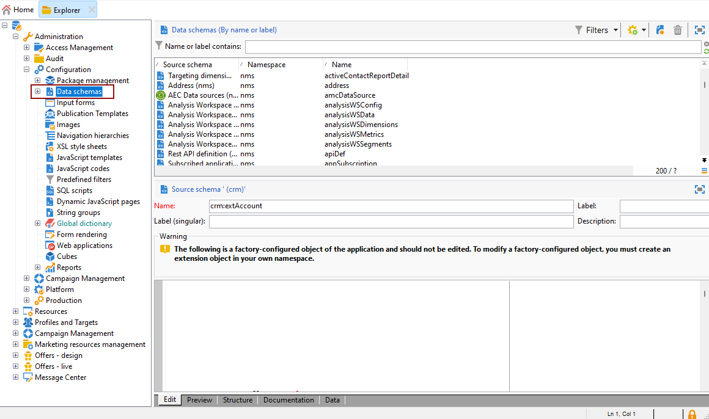
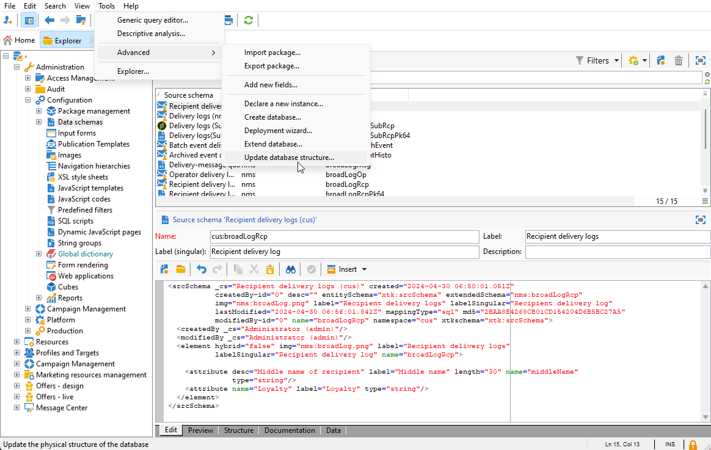

# 创建自定义用户档案维度{#creating-a-custom-profile-dimension}

此外，还可根据在收件人模式扩展期间创建的自定义用户档案数据创建和管理报表。

* [步骤1：扩展收件人模式](##extend-schema)
* [第2步：链接您的新自定义字段](#link-custom)
* [第3步：创建动态报告，以使用自定义用户档案维度筛选收件人](#create-report)

## 步骤1：扩展收件人模式 {#extend-schema}

要添加新用户档案字段，您需要扩展架构，请执行以下步骤：

1. 导航至 **[!UICONTROL 管理]** > **[!UICONTROL 配置]** > **[!UICONTROL 数据架构]** 文件夹。

   

1. 识别您的自定义收件人模式并将其选定。 如果您尚未扩展内置的nms：recipient模式，请参阅 [此过程](https://experienceleague.adobe.com/en/docs/campaign/campaign-v8/developer/shemas-forms/extend-schema).

1. 将自定义字段添加到架构编辑器。

   例如，要在收件人模式中添加忠诚度自定义字段，请执行以下操作：

   ```
   <attribute label="Loyalty" name="loyalty" type="string"/>
   ```

   

1. 单击&#x200B;**[!UICONTROL 保存]**。

1. 然后，识别您的自定义broadLogRcp架构并将其选定。 如果您尚未扩展内置的投放日志模式，请参阅 [此过程](https://experienceleague.adobe.com/en/docs/campaign/campaign-v8/developer/shemas-forms/extend-schema).

1. 将与收件人架构相同的自定义字段添加到架构编辑器。

   

1. 单击&#x200B;**[!UICONTROL 保存]**。

1. 要应用对架构所做的修改，请通过以下方式启动数据库更新向导 **[!UICONTROL 工具]** > **[!UICONTROL 高级]** > **[!UICONTROL 更新数据库结构]** 并运行更新数据库结构。 [了解详情](https://experienceleague.adobe.com/en/docs/campaign/campaign-v8/developer/shemas-forms/update-database-structure)

   

您的新用户档案字段现已准备就绪，可供收件人使用和选择。

## 第2步：链接您的新自定义字段 {#link-custom}

>[!NOTE]
>
> 您最多只能向动态报表添加20个自定义字段。

现在，您的用户档案字段已创建，我们需要将其链接到相应的动态报告维度。

1. 导航至 **[!UICONTROL 管理]** > **[!UICONTROL 配置]** > **[!UICONTROL 数据架构]** > **[!UICONTROL 其他报告字段]** 文件夹。

   

1. 单击 **[!UICONTROL 新建]** 以创建相应的动态报表维度。

1. 选择 **[!UICONTROL 编辑表达式]** 并浏览收件人模式以查找您之前创建的自定义用户档案字段。

   

1. 单击&#x200B;**[!UICONTROL 完成]**。

1. 键入您的维度 **[!UICONTROL 标签]**，在动态报表中可见，然后单击 **[!UICONTROL 保存]**.

   

您的自定义用户档案字段现在可用作报表中的自定义用户档案维度。 要删除您的自定义用户档案维度，您可以选择它并单击 **[!UICONTROL 删除]** 图标。

现在，收件人模式已使用此用户档案字段扩展并创建了自定义维度，您便可以在投放中开始定位收件人。

## 第3步：创建动态报告，以使用自定义用户档案维度筛选收件人 {#create-report}

发送投放后，您可以使用自定义用户档案维度划分报表。

1. 从 **[!UICONTROL 报表]** 选项卡，选择现成的报表或单击 **[!UICONTROL 创建]** 按钮从头开始创建。

   

1. 在 **[!UICONTROL Dimension]** 类别，单击 **[!UICONTROL 个人资料]** 然后将您的自定义配置文件维度拖放到自由格式表中。

   

1. 拖放任何量度以开始筛选数据。

1. 如果需要，可将可视化图表拖放到工作区中。
