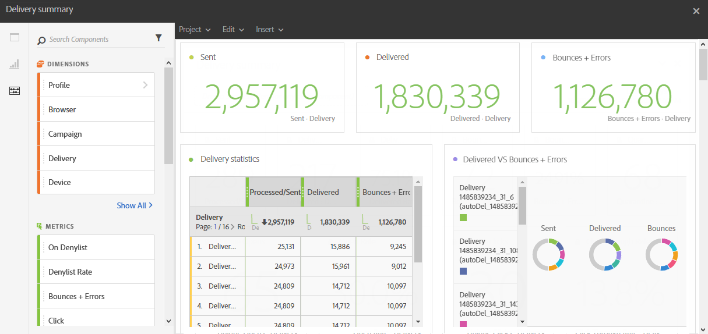

# 投放摘要{#delivery-summary}

此 **[!UICONTROL 投放摘要]** 报告详细列出了与一封电子邮件或多个电子邮件相关的主要信息。

每个表格都由摘要数字和图表表示。 您可以更改详细信息在其各自可视化图表设置中的显示方式。

此 **投放统计信息** 该表包含可用于已发送电子邮件的数据，例如：

* **[!UICONTROL 已处理/已发送]**：投放的发送总数。
* **[!UICONTROL 已投放]**：成功发送的消息数，与已发送消息的总数相关。 会考虑引发的错误（退回）。 但是，不会考虑投诉（垃圾邮件声明）和“不在办公室”等禁用消息。
* **[!UICONTROL 退回+错误]**：投放和自动返回处理期间累计的错误总数与已发送消息的总数之比。

此 **打开和点击** 表，包含每次投放的收件人活动的可用数据，例如：

* **单击**：在投放中单击内容的次数。
* **打开**：投放中打开消息的次数。
* **独特打开次数**：打开投放的收件人数量。
* **独特点击**：点击投放中内容的收件人数量。

此 **域重新分区** 此表根据收件人的域显示投放状态。
