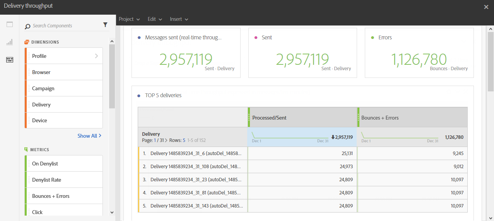

# 投放吞吐量{#delivery-throughput}

此报表包含与一个或多个发送的投放吞吐量相关的数据。 它提供：

* 每小时处理的消息数
* **[!UICONTROL 前5个投放]**&#x200B;表和互补的摘要数字，显示重试次数最多的5个投放。

>[!NOTE]
>
>**[!UICONTROL 投放吞吐量]**&#x200B;页面显示从Campaign到Adobe Campaign Enhanced MTA（消息传输代理）的消息中继的吞吐量速度。
