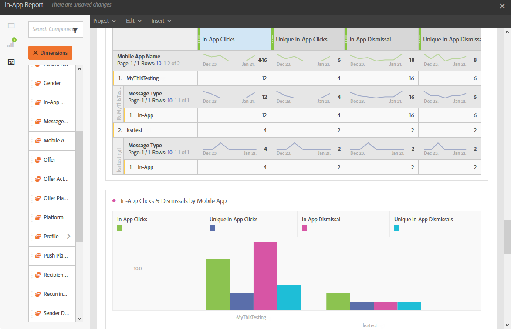

# 应用程序内报告{#in-app-report}

>[!CAUTION]
>
>请注意，您必须将&#x200B;**[!UICONTROL 消息类型]**&#x200B;量度拖放到表中，才能根据您的投放类型拆分数据，在本例中是应用程序内投放。

**应用程序内**&#x200B;报表提供了与应用程序内投放相关的详细信息。

每个表格都由摘要数字和图表表示。 您可以更改详细信息在其各自可视化图表设置中的显示方式。

第一个表&#x200B;**应用程序内参与摘要**&#x200B;分为三个类别：按日、按移动应用程序和按投放。 它包含可用于收件人对投放的反应性的数据：

* **[!UICONTROL 已处理/已发送]**：应用程序内投放的发送总数。
* **[!UICONTROL 已投放]**：成功发送的应用程序内消息数，与已发送的消息总数相关。
* **[!UICONTROL 展示次数]**：收件人查看的应用程序内消息总数，具体取决于是否满足触发器条件。
* **[!UICONTROL 唯一展示次数]**：收件人的展示次数。
* **[!UICONTROL 应用程序内点进率]**：与看到消息的用户相比，点击按钮1或按钮2的用户所占的百分比。
* **[!UICONTROL 应用程序内驳回率]**：收件人驳回的应用程序内消息的百分比。

第二个表&#x200B;**应用程序内点击和解除**&#x200B;分为三个类别：按日、按移动应用程序和按投放。 它包含每次投放的收件人行为可用数据：

* **[!UICONTROL 应用程序内点击次数]**：点击按钮1或按钮2的收件人总数。
* **[!UICONTROL 唯一的应用程序内点击次数]**：收件人点击按钮1或按钮2的次数。
* **[!UICONTROL 应用程序内解除]**：收件人通过单击“关闭”按钮或自动解除而解除的邮件总数。
* **[!UICONTROL 唯一应用程序内取消次数]**：收件人取消应用程序内消息的时间。
