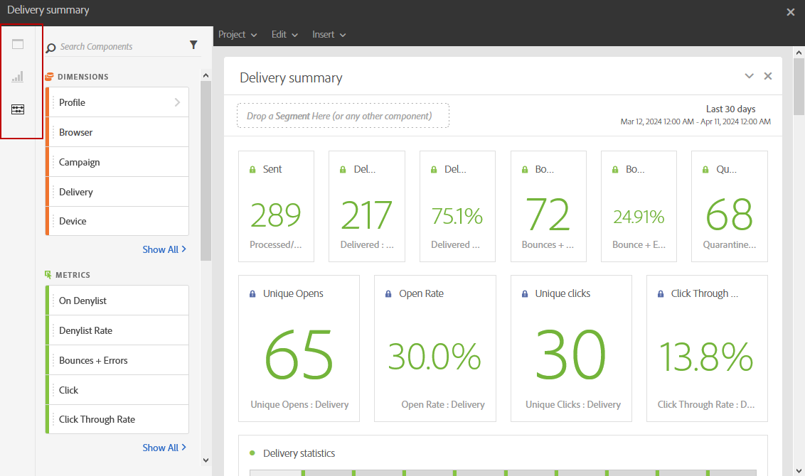

# 报告界面{#reporting-interface}

例如，顶部工具栏允许您修改、保存或打印报告。

使用&#x200B;**项目**&#x200B;选项卡可以：

* **打开……**：打开之前创建的报告或模板。
* **另存为……**：重复了模板以便能够修改它们。
* **刷新项目**：根据新数据和筛选器更改更新报告。
* **下载CSV**：将报表导出到CSV文件。

通过&#x200B;**编辑**&#x200B;选项卡，您可以：

* **撤消**：取消您在仪表板上的上一个操作。
* **全部清除**：删除仪表板上的每个面板。

**插入**&#x200B;表允许您通过向仪表板添加图形和表来自定义报表：

* **新建空白面板**：向仪表板添加新的空白面板。
* **新建自由格式**：向仪表板中添加新的自由格式表。
* **换行符**：向仪表板添加新的换行符。
* **新条形图**：向仪表板中添加新条形图。

**相关主题：**

* [添加面板](adding-panels.md)
* [添加可视化](adding-visualizations.md)
* [添加组件](adding-components.md)

## 选项卡 {#tabs}

通过左侧的选项卡，您可以构建报告并根据需要过滤数据。

这些选项卡可让您访问以下项目：

* **[!UICONTROL 面板]**：向报表中添加空白面板或自由格式以开始筛选数据。 有关更多信息，请参阅添加面板部分
* **[!UICONTROL 可视化图表]**：拖放所选的可视化图表项以为您的报表提供一个图形维度。 有关更多信息，请参阅添加可视化图表一节。
* **[!UICONTROL 组件]**：使用不同的维度、量度、区段和时间段自定义您的报表。

## 工具栏 {#toolbar}

工具栏可以在工作区上方找到。 该页面由不同的选项卡组成，允许您修改、保存、共享或打印报告。

**相关主题：**

* [添加面板](adding-panels.md)
* [添加可视化](adding-visualizations.md)
* [添加组件](adding-components.md)

### “项目”选项卡 {#project-tab}

使用&#x200B;**项目**&#x200B;选项卡可以：

* **打开……**：打开之前创建的报告或模板。
* **另存为……**：重复了模板以便能够修改它们。
* **刷新项目**：根据新数据和筛选器更改更新报告。
* **下载CSV**：将报表导出到CSV文件。
* **[!UICONTROL 打印]**：打印报告。

### “编辑”选项卡 {#edit-tab}

通过&#x200B;**编辑**&#x200B;选项卡，您可以：

* **撤消**：取消您在仪表板上的上一个操作。
* **全部清除**：删除仪表板上的每个面板。

### 插入选项卡 {#insert-tab}

通过&#x200B;**插入**&#x200B;选项卡，可以通过向仪表板添加图形和表格来自定义报表：

* **新建空白面板**：向仪表板添加新的空白面板。
* **新建自由格式**：向仪表板中添加新的自由格式表。
* **换行符**：向仪表板添加新的换行符。
* **新条形图**：向仪表板中添加新条形图。
