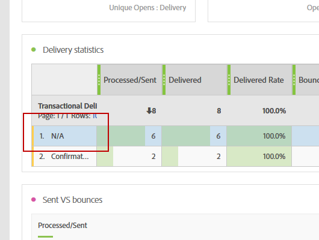

# 故障排除{#troubleshooting}

您可以在此部分中找到与动态报告相关的常见问题。

## 对于唯一打开数和唯一点击数，聚合行中的计数与单个行中的计数不匹配 {#unique-open-clicks-no-match}

这是正常行为。
我们可以通过以下示例来解释这种行为。

向用户档案P1和P2发送电子邮件。

P1在第一天打开电子邮件两次，然后在第二天打开电子邮件树。

而P2会在第一天打开电子邮件一次，并且不会在接下来的几天重新打开电子邮件。
以下是用户档案与已发送电子邮件交互的可视表示形式：

<table> 
 <thead> 
  <tr> 
   <th align="center"> <strong>天</strong>   </th> 
   <th align="center"> <strong>打开次数</strong>   </th> 
   <th align="center"> <strong>独特打开次数</strong>   </th> 
  </tr> 
 </thead> 
 <tbody> 
  <tr> 
   <td align="center"> 第1天  </td> 
   <td align="center"> 2 + 1 = 3  </td> 
   <td align="center"> 1 + 1 = 2  </td> 
  </tr> 
  <tr> 
   <td align="center"> 第2天  </td> 
   <td align="center"> 3 + 0 = 3  </td> 
   <td align="center"> 1 + 0 = 1  </td> 
  </tr>
 </tbody> 
</table>

要了解唯一打开的总数，我们需要将 **[!UICONTROL 独特打开次数]** 这就会得到值3。 但由于电子邮件仅针对2个用户档案，因此打开率应显示150%。

要获得不高于100的百分比，应将 **[!UICONTROL 独特打开次数]** 维护为打开的唯一broadlog数。 在这种情况下，即使P1在第1天和第2天打开了电子邮件，其唯一打开次数仍将为1。

这将生成下表：

<table> 
 <thead> 
  <tr> 
   <th align="center"> <strong></strong>   </th> 
   <th align="center"> <strong>打开次数</strong>   </th> 
   <th align="center"> <strong>独特打开次数</strong>   </th> 
  </tr> 
 </thead> 
 <tbody> 
  <tr> 
   <td align="center"> <strong> 天 </strong>  </td> 
   <td align="center"> <strong> 6 </strong>  </td> 
   <td align="center"> <strong> 2</strong>  </td>
  </tr> 
  <tr> 
   <td align="center"> 第1天  </td> 
   <td align="center"> 3  </td> 
   <td align="center"> 2  </td>
  </tr> 
  <tr> 
   <td align="center"> 第2天  </td> 
   <td align="center"> 3  </td> 
   <td align="center"> 1  </td> 
  </tr> 
 </tbody> 
</table>

>[!NOTE]
>
>独特计数基于基于HLL的草图，这可能会导致大量计数出现轻微不准确性。

## 打开计数与数据库计数不匹配 {#open-counts-no-match-database}

这可能是因为，动态报告中使用启发式来跟踪打开次数，即使我们无法跟踪 **[!UICONTROL 打开]** 操作。

例如，如果用户在其客户端上禁用了图像并单击了电子邮件中的链接，则 **[!UICONTROL 打开]** 不能由数据库跟踪，但 **[!UICONTROL 单击]** 威尔。

因此， **[!UICONTROL 打开]** 跟踪日志计数在数据库中可能没有相同的计数。

此类发生次数将添加为 **“电子邮件点击表示电子邮件已打开”**.

>[!NOTE]
>
>由于独特计数基于基于HLL的草图，因此可能会出现计数之间的细微不一致。

## 如何计算定期/事务投放的计数？ {#counts-recurring-deliveries}

处理循环和事务型投放时，这些计数将同时归属于父投放和子投放。
我们以名为的定期投放为例 **R1** 设置为在第1天(RC1)、第2天(RC2)和第3天(RC3)每天运行。
假设只有一个人员多次打开所有子投放。 在这种情况下，各个定期子投放将显示 **[!UICONTROL 打开]** 每次都计为1。
但是，由于同一人单击了所有投放，因此父定期投放也将具有 **[!UICONTROL 独特打开]** as 1.

报表应如下所示：

<table> 
 <thead> 
  <tr> 
   <th align="center"> <strong>投放</strong>   </th> 
   <th align="center"> <strong>已发送</strong>   </th> 
   <th align="center"> <strong>已投放</strong>   </th>
   <th align="center"> <strong>打开次数</strong>   </th> 
   <th align="center"> <strong>独特打开次数</strong>   </th>
  </tr> 
 </thead> 
 <tbody> 
  <tr> 
   <td align="center"> <strong>R1</strong>  </td> 
   <td align="center"> <strong>100</strong>  </td> 
   <td align="center"> <strong>90</strong>  </td> 
   <td align="center"> <strong>10</strong>  </td> 
   <td align="center"> <strong>3</strong>  </td> 
  </tr> 
  <tr> 
   <td align="center"> RC1  </td> 
   <td align="center"> 20  </td> 
   <td align="center"> 20  </td> 
   <td align="center"> 6  </td> 
   <td align="center"> 1  </td> 
  </tr>
    <tr> 
   <td align="center"> RC2  </td> 
   <td align="center"> 40  </td> 
   <td align="center"> 30  </td> 
   <td align="center"> 2  </td> 
   <td align="center"> 1  </td> 
  </tr> 
    <tr> 
   <td align="center"> RC3  </td> 
   <td align="center"> 40  </td> 
   <td align="center"> 40  </td> 
   <td align="center"> 2  </td> 
   <td align="center"> 1  </td> 
  </tr> 
 </tbody> 
</table>

## 颜色在报表表格中的含义是什么？ {#reports-color-signification}

报表中显示的颜色是随机的，无法进行个性化。 它们表示进度条，并且为了帮助您更好地突出显示报告中达到的最大值而显示。

在下面的示例中，单元格的颜色相同，因为其值为100%。

如果您更改 **[!UICONTROL 条件格式]** 对于自定义，当值达到上限时，单元格将变得更加绿色。 反之，如果达到下限，就会变红。

例如，在此，我们设置 **[!UICONTROL 上限]** 到500和 **[!UICONTROL 下限]** 到0。

## 为什么我的报表中出现值N/A？

值 **不适用** 有时可能出现在动态报告中。 原因有三：

* 投放已被删除，此处显示为 **不适用** 不会导致结果不一致。
* 拖放 **[!UICONTROL 事务性投放]** 维度，值 **不适用** 可能会显示为一个结果。 发生这种情况的原因是，动态报告会获取每个投放，即使它们不是事务型投放。 拖放 **[!UICONTROL 投放]** 维度，但在本例中， **不适用** 值将表示事务性投放。
* 将维度与不与该维度相关的量度一起使用时。 在以下示例中，添加划分时包含 **[!UICONTROL 跟踪URL]** 维度，即使 **[!UICONTROL 单击]** 在此投放中，计数设置为0。

  

## 使用自定义目标映射时，投放报表显示不完整的数据

如果您在投放中使用导入的自定义Target映射，并且不同的报表中未显示任何数据，则可能意味着没有为这些目标映射创建报表增强功能。

要解决此问题：

* 从XML导入Target映射后，您还需要导入Reporting扩充。

* 您可以直接在Adobe Campaign Web用户界面中创建Target映射，而不是导入您的目标映射，该界面会自动创建报表扩充。

## 列标题数和行总和之间的差异

在以下情况下，列标题编号和所有行的总和之间应存在差异：

* **独特量度**：使用唯一量度可能会更改标头中显示的总计数，因为它基于收件人ID，而不是简单的行计数总和。 因此，单个配置文件可能会触发跨不同维度的多个事件，从而导致数据集中出现多行。 但是，在标题中，每个用户档案仅计数一次。

  例如：

   * 如果用户档案A在不同的日期打开电子邮件，则按日期划分的用户档案将在三行中显示A，但在标题中，A将被计为1。

   * 如果个人资料A在同一天点击电子邮件中的三个不同链接，则按跟踪URL划分的将在三行中显示A，但在标题中，A将被计为1。 这同样适用于按设备和浏览器进行的划分。

* **打开量度**：打开次数计数通过汇总实际打开事件和独特点击事件总数（按收件人ID）确定，不包括由于没有打开事件无法点击电子邮件链接而未发生打开事件的情况。

  例如：

   * 当配置文件A打开跟踪电子邮件（带URL U1）时，它将注册为打开事件，URL标为null。 稍后单击U1会生成一个单击事件。 尽管A对U1的点击也计为打开事件，但U1没有特定的打开事件。 因此，A在唯一打开计数中只被计数一次。

   * 用户档案R在第1天打开电子邮件，注册打开事件，然后单击链接。 在接下来的两天中， R会重新打开电子邮件并再次单击链接，从而每天生成一次点击事件。 虽然R的参与每天在Open编号中进行跟踪，但R在列标题中仅计数一次，侧重于唯一参与。

* **否定事件**：在报表中，失效事件是指最初标记为成功，但在重试后最终失败的投放尝试。 这些值由计数–1表示。 为避免混淆，这些负数会从显示的投放量度数字中排除。 因此，投放量度的所有行总数可能与列标题数字不匹配。
