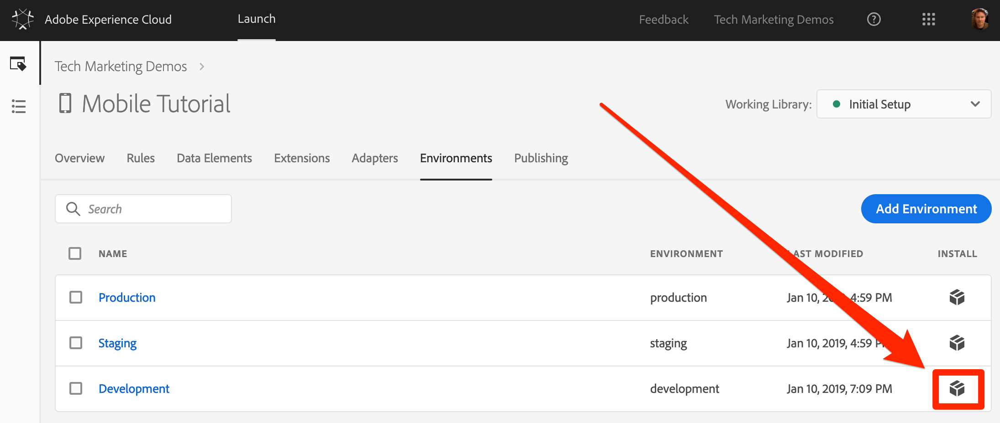
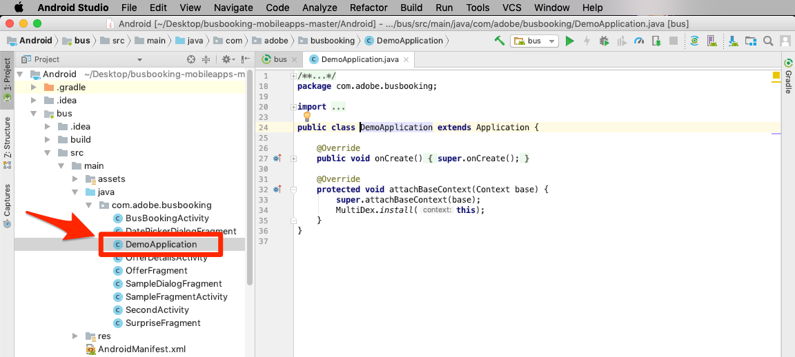
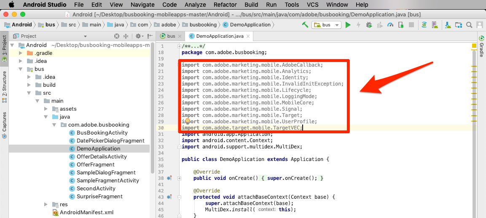
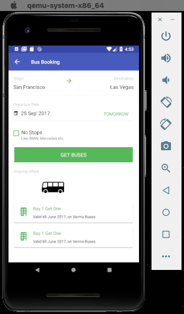
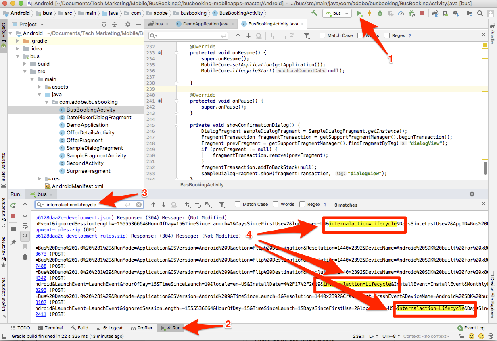

# 安装 Mobile SDK

在本课中，您将使用与Launch属性的“开发”环境相对应的扩展和设置来实施Mobile SDK。

## 先决条件

在本课中，我们将开始向“巴士预订”应用程序添加代码，因此，如果您尚未这样做：

1. 下载和安 [装Android Studio](https://developer.android.com/studio)
1. 下载巴士 [预订应用程序](https://github.com/Adobe-Marketing-Cloud/busbooking-mobileapps)

## 学习目标

在本课程结束后，您将能够：

* 获取移动启动属性的安装说明
* 了解开发、暂存和生产环境之间的差异
* 更新文 `build.gradle` 件以添加Mobile SDK
* 将Mobile SDK导入您的应用程序
* 验证SDK是否已成功实施
* 在应用程序中启用生命周期指标

## 获取安装说明

移动启动属性的安装说明是您添加到移动应用程序中特定位置的代码片段的集合。

单击顶部导 `Environments` 航中的选项卡，以转到环境页面。 请注意，开发、暂存和生产环境已经为您预先创建。 这些代码与代码开发和发布过程中的典型环境相对应。 代码首先由开发人员在开发环境中编写。 完成工作后，开发人员会将代码发送到暂存环境，供 QA 和其他团队审查。满足QA和其他团队的要求后，该代码将发布到生产环境，该环境是访客下载应用程序时体验到的面向公众的环境。

Launch允许额外的开发环境，这对于多个开发人员同时处理不同项目的大型组织非常有用。

开发、暂存和生产是完成本教程所需的唯一环境。


在“开 **[!UICONTROL 发]** ”行中，单击“安装”图标“  ，打开嵌入代码模式。



我们逐步完成说明。

## 更新build.gradle文件

如果您之前在网站中使用过Launch，您首先会注意到的是，与网站相比，移动应用程序的安装说明更多。

适用于Android的Adobe Mobile SDK使用Gradle管理其各个组件之间的依赖关系。 我们首先要做的一件事就是将Adobe Mobile SDK依赖项添加到Bus Booking应用程序的build.gradle文件。

**更新build.gradle文件**

1. 打开Android Studio
1. 选择“打开现有Android studio项目”

   

1. 在Bus Booking android文件夹的根目录下打开build.gradle文件：

   

1. 打开下拉列表并切换到“项目”视图

   

1. 打开 **Android &gt; bus &gt; build.gradle文件**

   

1. 在启动界面中，确保将操作系统设置为 `Android`

1. 通过单击“复制”(Copy)图标，将依赖关系复制到剪  。

   

1. 在Android studio中，将依赖关系从剪贴板粘贴到现有依赖关系之后(但在关闭之前 `}`)
1. 此外，如果您正在安装Adobe Target VEC扩展，则还需要添加以下依赖关系：

   ```java
   implementation 'com.google.code.gson:gson:2.8.2'
   implementation 'android.arch.lifecycle:extensions:1.1.1'
   implementation 'io.github.sac:SocketclusterClientJava:1.7.5'
   implementation 'com.android.support:support-annotations:28.0.0'
   implementation 'com.android.support:support-compat:28.0.0'
   implementation 'com.android.support:design:28.0.0'
   ```

1. 单击“立即同步”链接以同步项目

   

## 更新应用程序

现在是时候更新应用程序以导入SDK了

**导入SDK**

1. 在“总线预订”应用程序中打开“主应用程序”文件，该应用程序位于 **Android &gt; bus &gt; src &gt; main &gt; java &gt; com.adobe.busbooking &gt; DemoApplication**

   

1. 在启动界面中，滚动到添加初始 **[!UICONTROL 化代码部分]** 。
1. 通过单击“添加初始化代码”部分中的第一个“复  ”图标， **[!UICONTROL 复制导入语句]** :

   

1. 在Android Studio中，在文件中现有导入 *之前* ，粘贴这些导入语 `DemoApplication` 句。 请注意，核心扩展包括支持回呼、标识服务、生命周期指标和控制台日志记录等功能的库。

   

1. 在启动界面中，通过单击添加初始化代码部分中的第二个复制图标，复制与核心扩展相  行 **** 。 第二行打开控制台日志记录语句（可用选项为“DEBUG”、“VERBOSE”、“WARNING”和“ERROR”）。

   

1. 在Android studio中，将这些Core语句直接粘贴 `DemoApplication` 到文件中 `super.onCreate()`
1. 删除行 `//` 和行之前 `try` 的注 `catch` 释

   

1. 在启动界面中，通过单击添加初始化代码部分中的第三个  ，复制 [!UICONTROL 扩展语句] 。

   

1. 在Android studio中，将这些扩展语句粘贴到该部 `try` 分中。 请注意， `MobileCore.configureWithAppID` 它包含属性的启动开发环境的标识符。 这很重要，因为当我们准备好将应用程序部署到生产环境时，您需要更新此值。

   

>[!NOTE] 启动界面中提供的移动安装说明包括标识、生命周期和信号扩展的导入和注册语句以及生命周期指标的初始化。 这些扩展被视为移动核心扩展的一部分。 如果您不希望在应用程序中使用这些扩展，则无需导入、注册或实现与这些扩展关联的其他代码。
>
> 此外，使用这些扩展时还应考虑其他实施选项（例如，当用户背景／预先启动应用程序时，可以暂停／重新启动生命周期集合）。 您可以在Mobile Core扩展文档中 [阅读有关此的更多信息](https://aep-sdks.gitbook.io/docs/using-mobile-extensions/mobile-core)

## 验证实施

1. 保存Android studio项目
1. 运行应用程序并在模拟器中启动它。 如果尚未配置任何模拟器设备，请立即配置一个，确保配置运行Android 4.1(API 16)或更高版本的设备。

   

1. 等待模拟器启动并完全打开应用程序到预订屏幕（这可能需要几分钟）

   

1. 确认正在向Android Studio日志中的Adobe服务器发出调用

   

以下是一些可查找的特定调用的示例：

1. **调用以检索启动项配置** (过滤日志到 `adobedtm.com`)。 请注意您在上一课中输入的扩展配置。 虽然添加扩展需要对应用程序进行更新，但可以在Launch中对这些设置进行外部管理并随时更改：

   ```java
   03-14 16:30:29.484 24869-24930/com.adobe.busbooking D/ADBMobile: ConfigurationExtension - Cached configuration loaded.
    {"target.propertyToken":"","target.timeout":5,"global.privacy":"optedin","analytics.backdatePreviousSessionInfo":true,"analytics.offlineEnabled":true,"build.environment":"dev","rules.url":"https://assets.adobedtm.com/launch-EN360aefc739b04410816f751a95861744-development-rules.zip","experienceCloud.org":"7ABB3E6A5A7491460A495D61@AdobeOrg","target.clientCode":"techmarketingdemos","target.autoFetch":true,"target.fetchBackground":false,"lifecycle.sessionTimeout":300,"target.environmentId":"busbookingapp","analytics.server":"tmd.sc.omtrdc.net","analytics.rsids":"tmd-mobile-dev1","analytics.batchLimit":0,"property.id":"PRb4881271498b4f2cbaf67d38a8f3891a","global.ssl":true,"analytics.aamForwardingEnabled":true}
   ```

1. **向Identity Service** (过滤日志到 `IdentityExtension`)请求在此示例中，ID(`d_mid`)已设置，且正在重新报告)

   ```java
   03-14 17:01:18.526 7743-7803/com.adobe.busbooking D/ADBMobile: IdentityExtension - Sending request (https://dpm.demdex.net/id?d_mid=59651426340521082405908216148091920022&d_ver=2&d_orgid=7ABB3E6A5A7491460A495D61%40AdobeOrg)
   ```

1. **分析请求** (将Logcat过滤到 `AnalyticsExtension`)

   ```java
   03-14 17:01:18.509 7743-7777/com.adobe.busbooking D/ADBMobile: AnalyticsExtension - Sending Analytics ID call (https://tmd.sc.omtrdc.net/id?mcorgid=7ABB3E6A5A7491460A495D61%40AdobeOrg&mid=59651426340521082405908216148091920022)
   ```

祝贺您，您已经将SDK添加到移动应用程序！

## 在应用程序中启用生命周期指标

生命周期指标是基于环境的指标和维度，可以使用Experience Platform Mobile SDK在应用程序中轻松启用这些指标和维度。 由于这些解决方案可以被多个Experience cloud解决方案使用，因此在深入了解各个解决方案之前，我们将在此处启用它们。 这很简单，只需在正确的位置将几行代码添加到我们的应用程序。

### 将核心库导入BusBookingActivity文件

要通过Adobe Experience Platform Mobile SDK进行API调用，您需要将库导入相应的文件。 在这种情况下，要利用生命周期API调用，我们需要导入核心库。

1. 在Android studio中打开应用程序后，打开BusBookingActivity文件，该文件与您使用的DemoApplication文件位于同一目录中。
1. 在文件顶部，添加以下MobileCore导入语句，以便您能够使用关联的API调用
   `import com.adobe.marketing.mobile.MobileCore;`


### 添加生命周期代码

您现在将生命周期代码添加到应用程序中的主onResume()函数，以触发生命周期函数。

1. 打开BusBookingActivity文件
1. 在文件底部附近向下滚动并找到onResume()函数
1. 在行下添加以下两行代 `super.onResume()` 码：

   ```java
    MobileCore.setApplication(getApplication());
    MobileCore.lifecycleStart(null);
   ```


### 验证生命周期点击

运行应用程序时，您现在应在Android studio的调试部分收到一条或多条生命周期消息。

1. 运行内部版本，然后选择模拟器以运行应用程序
1. 模拟器启动并运行后，单击Android studio中调试器的“运行”部分
1. 搜索 `internalaction=Lifecycle`
1. 请看，有几行包含此键／值对以及其他生命周期指标。

请注意，您将看到的行实际上是包含生命周期指标的Analytics调用。



[下一个“添加Adobe Experience Platform Identity Service”&gt;](id-service.md)