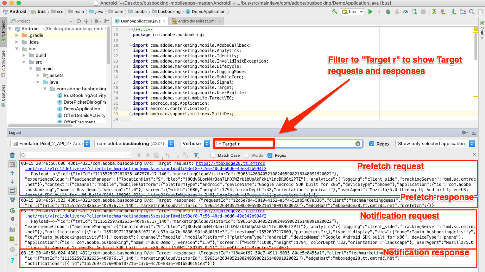
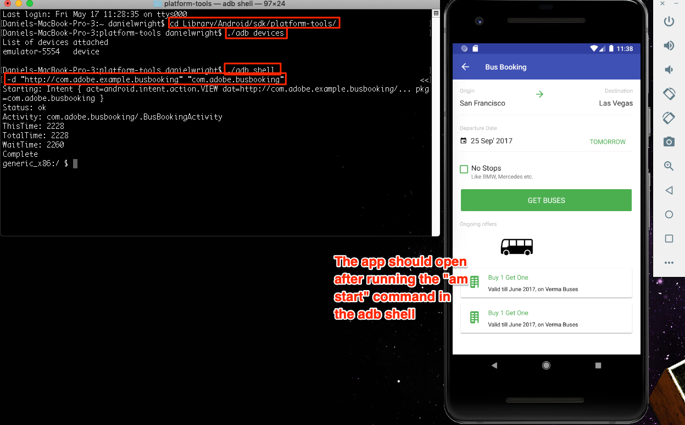

# 添加Adobe Target的可视体验书写器(VEC)

在本课中，您将为移动应用程序启用Target Visual Experience Composer(VEC)。

[Adobe Target是Adobe Experience cloud解决方案](https://docs.adobe.com/content/help/en/target/using/target-home.html) ，它提供定制和个性化客户体验所需的一切，使您能够最大化网站和移动站点、应用程序、社交媒体和其他数字渠道的收入。

使用本机移动设备应用程序的可视化体验编辑器 (VEC)，您能够以 DIY（自己动手）方式创建活动并对本机移动设备应用程序上的内容进行个性化，而无需持续依赖开发和应用程序发布循环。

在“添加扩 [展”课程中](launch-add-extensions.md)，您将Target VEC扩展添加到您的“启动”属性中。 在本课安 [装Mobile SDK](launch-install-the-mobile-sdk.md) ，您将扩展导入到示例应用程序中。 在Target的移动视觉体验编辑器中开始设置活动只需要几次小更新！

>[!IMPORTANT] 在移动应用程序中使用Target VEC时，需要Target和Target VEC启动扩展。

## 学习目标

在本课程结束后，您将能够：

* 为Target VEC启用示例应用程序
* 将参数添加到Target VEC请求
* 将设备与VEC配对
* 使用VEC创建活动

## 先决条件

要完成本节中的课程，您必须：

* 完成“配置启动项” [部分中的课程](launch-create-a-property.md) 。
* 具有Adobe Target界面的审批者级别访问权限

## 应用程序加载请求

由于我们在配置Target VEC扩展时选择的设置，当应用程序首次加载时，Target将触发“应用程序加载”请求。 此请求预取您为应用程序创建的所有Target VEC活动。

在Android Studio中，将Logcat过滤为“Target r”以显示Target请求和响应。 注意应用程序名称和版本的参数。 您创建的所有Target VEC活动将自动定位到这些属性。



## 添加参数

正如您在上一个练习中看到的，应用程序生命周期指标会作为参数自动包含在Target VEC请求中。 您还可以全局向请求或应用程序中特定视图添加自定义参数。

**全局添加自定义参数**

1. 在Android studio中，打开文 `DemoApplication` 件。
1. 通过在现有导入的下方添加，导 `import ACPTargetVEC` 入目标VEC扩展
1. 在注册扩展之前，在函 `onCreate()` 数中添加以下示例代码。 此示例代码显示如何将常规参数、配置文件参数、产品（或实体）参数和订单参数添加到TargetVEC请求中。 此示例使用静态值，而在实际应用程序中，您可能希望使用动态变量填充这些值。 当然，您只希望填充与所有视图相关的参数：

   ```java
   Map<String, String>targetParams = new HashMap<>(); //params
   targetParams.put( "param1", "value1");
   Map<String, String>taregtProfileParams = new HashMap<>(); //profile params
   taregtProfileParams.put("profilekey1","profilevalue1");
   
   TargetVEC.setGlobalRequestParameters(new TargetParameters.Builder()
            .parameters(targetParams)
            .profileParameters(taregtProfileParams)
            .product(new TargetProduct("1234", "furniture"))
            .order(new TargetOrder("12343", 123.45, Arrays.asList("100", "200")))
            .build());
   ```

1. 您可能会注意到Android studio中的错误，因为上述参数代码需要以下导入，您需要将这些导入添加到文件中：

   ```java
   import com.adobe.marketing.mobile.TargetOrder;
   import com.adobe.marketing.mobile.TargetProduct;
   import com.adobe.marketing.mobile.TargetParameters;
   import java.util.Arrays;
   import java.util.Map;
   import java.util.HashMap;
   ```

   

现在您已经向应用程序添加了参数，是时候确认这些参数是在请求中传递的了。

**验证参数**

1. 保存Android studio项目
1. 重新构建应用程序，然后等待它在模拟器中重新打开
1. 打开Android studio的“日志”窗格
1. 过滤器以显示所有带有“目标r”的语句
1. 您刚添加的自定义参数应该显示在请求中

   

有关如何通过特定视图传递参数的详细信息，请参阅 [文档](https://docs.adobe.com/content/help/en/target/using/implement-target/mobile-apps/composer/mobile-visual-experience-composer-android.html#parameters)。

## 将移动应用程序与目标界面配对

要在Target界面中创建VEC活动，必须首先将Target与您的应用程序配对。 这种配对是通过使用深连接实现的。

### 创建深层链接

Android支持使用深层链 [接和Android应用程序链接](https://developer.android.com/training/app-links/deep-linking) ，以创建直接转到应用程序中特定位置的URL。 您可能已经在应用程序中使用这些组件。 如果是，则可以使用现有URL结构与Target配对。 在本教程中，您将查看在“巴士预订”应用程序中预定义的深层链接，确认其是否正在工作，然后使用它将您的应用程序与“针对移动应用程序的Target VEC”配对。

**查看深层链接设置**

1. 在Android studio中，打开AndroidManifest.xml文件
1. 请注意，已为“巴士预订”应用程序的深层链接方案配置“用途过滤器”
1. 请注意， `Host` 和 `Scheme` 已分别设置 `com.adobe.example.busbooking` 为和 `http`。 这意味着类似在模拟器中 `http://com.adobe.example.busbooking` 打开时的URL应自动打开示例应用程序

   

下一步是确认深层链路方案正在运行

### 验证深层链接

现在，我们确保深层链接将在模拟器中打开应用程序。 您可能有自己喜欢的运行adb命令的方式，您当然可以使用它。

**使用adb验证深层链接(Mac®)**

1. 确保Android模拟器正在运行
1. 如果“巴士预订”应用程序已打开，则关闭该应用程序
1. 打开“终端”窗口
1. 导航到Android平台工具目录： `cd Library/Android/sdk/platform-tools/`
1. 确认已连接模拟器： `./adb devices`
1. 打开adb外壳： `./adb shell`
1. 在adb shell中测试深层链接： `am start -W -a android.intent.action.VIEW -d "http://com.adobe.example.busbooking" "com.adobe.busbooking"`
1. 确认在模拟器中已启动“巴士预订”应用程序

   

既然已设置深层链接结构，您就可以使用Target VEC设置活动了！

## 在移动VEC中创建活动

现在，让我们在Target界面中创建一个活动。

**使用目标VEC创建活动**

1. 登录 [Adobe Experience Cloud](https://experiencecloud.adobe.com)
1. 使用解决方案切换器转到Target

   

1. 启动目标

   

1. 单击“ **[!UICONTROL 创建活动]** ”按钮，然后选择 **[!UICONTROL A/B测试]**
1. 选择移 **[!UICONTROL 动应用程序]**
1. 确保在“选 **[!UICONTROL 择体验编写器]** ”下选 **[!UICONTROL 择了“可视化”]**
1. 单击“下 **[!UICONTROL 一步]** ”按钮

   

1. 在“选择要 **[!UICONTROL 使用的应用程序”屏幕上]** ，单击“添加新 **[!UICONTROL 应用程序”]**

   

1. 输入您刚在“输入URL方案”字 **[!UICONTROL 段中定义的url方案]** ，例如， `http://com.adobe.example.busbooking/`
1. 单击“ **[!UICONTROL 创建深层链接”]**

   

   >[!NOTE] 您有几个选项可发送指向应用程序的深层链接。 您可以：
   >
   >   1. 通过电子邮件发送指向有效电子邮件地址的深层链接，然后在设备上打开包含电子邮件应用程序的链接
   >   1. 从Android设备拍下QR码的照片（在我们的教程中，设备必须链接到Android Studio）
   >   1. 从Target界面复制深层链接，然后将其发送到设备，但您需要这样做


1. 单击“复制并 **[!UICONTROL 发送链接”选项卡]** 。
1. 单击生成的URL（请注意，单击该URL将自动将其复制到剪贴板）

   

1. 打开“终端”窗口（或者，如果仍打开该窗口，则切换回该窗口）
1. 导航到您的Android平台工具目录（您可能已在此处）: `cd Library/Android/sdk/platform-tools/`
1. 确认已连接模拟器： `./adb devices`
1. 打开adb外壳： `./adb shell`
1. 在adb shell中，将以 [下命令中的YOUR_TARGET_URL_WITH_TOKEN] ，替换为您刚刚复制到剪贴板的URL: `am start -W -a android.intent.action.VIEW -d "[YOUR_TARGET_URL_WITH_TOKEN]" "com.adobe.busbooking"`
1. 加载应用程序后，切换回已打开Target的浏览器选项卡。 您应当看到应用程序在VEC中加载。
1. 单击应用程序中的文本和图像资产，您应该会看到编辑和替换它们的选项！

   

   > [!TIP] 如果在移动设备中打开深层链接后未在Target界面中看到自动打开的Mobile VEC，请尝试以下几点：
   >
   >   1. 确保您在Target界面中使用的URL完全相同，并且不会意外剪掉任何字符。 在adb shell中运行命令时，确保URL使用引号
      >
      >
      >   

   1. 确认您向Target VEC所需的build.gradle文件添加了其他依赖关系。 在安装Mobile SDK课程中应 [该已添加这些依赖项](https://docs.adobe.com/content/help/en/experience-cloud/implementing-in-mobile-android-apps-with-launch/configure-launch/launch-install-the-mobile-sdk.html#update-the-buildgradle-file)
      >
      >
      >   

   1. 尝试清除应用程序中存储的数据（详见下图）
      >
      >       
      


1. 对应用程序中的第一个屏幕进行一些更改
1. 现在，在VEC打开的情况下将模拟器放置在浏览器旁边
1. 导航到应用程序中的其他屏幕，并注意VEC如何使用模拟器进行更新！
1. 您可以在单个活动中对应用程序中的多个视图进行更新！

   

1. 您还可以以可视方式添加点击跟踪指标！
1. 保存并批准您的活动，并验证您是否可以在范例应用程序中看到它

将设备与VEC配对是一次性操作。 将来在同一设备上创建更多活动时，您只需从列表中选择设备，如下图所示：


>[!TIP] 如果您有设备已打开，但在选择菜单中该设备“不可用”，请尝试关闭并在模拟器或设备上重新打开应用程序。

## 基于生命周期指标构建受众

生命周期指标内置的指标，用于衡量访客对应用程序的使用情况，这些指标会自动包含在Adobe Mobile SDK发出的调用中。 您可以根据这些指标在Target中轻松构建受众。

**创建受众**

1. 在Target界面中，单击顶 **部导航** 中的“受众”
1. Click the **Create Audience** button

   

1. Name the Audience `Launches < 5`
1. Click **Add Rule &gt; Custom**

   

1. 在第一个下拉菜单中，选择 **a.Launches** 参数。 所有生命周期度量参数都以“a”开头。 前缀。 我们将根据用户已启动的应用程序数量来定位内容，这是通过指导性的首次用户体验(FTUE)定位应用程序首次用户的极好方法。
1. 在下一个下拉菜单中， **选择小于**
1. 在第三个下拉列表中，输入 **5**
1. Click **Save**

   

请注意，Target中有各种开箱即用的受众构建选项。 此外，您还可以在Target中发送自定义数据以建立受众，使用从其他Experience cloud解决方案（如Audience Manager和Analytics）共享的受众，以及使用People Core service的客户属性功能共享到Target的CRM数据。

[下一个“添加Adobe Target”&gt;](target.md)