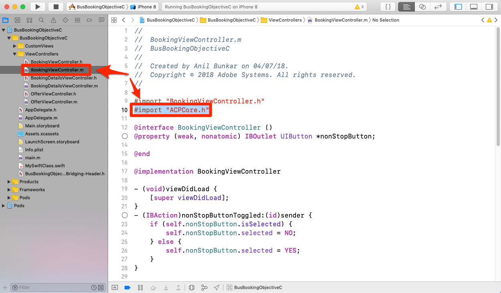
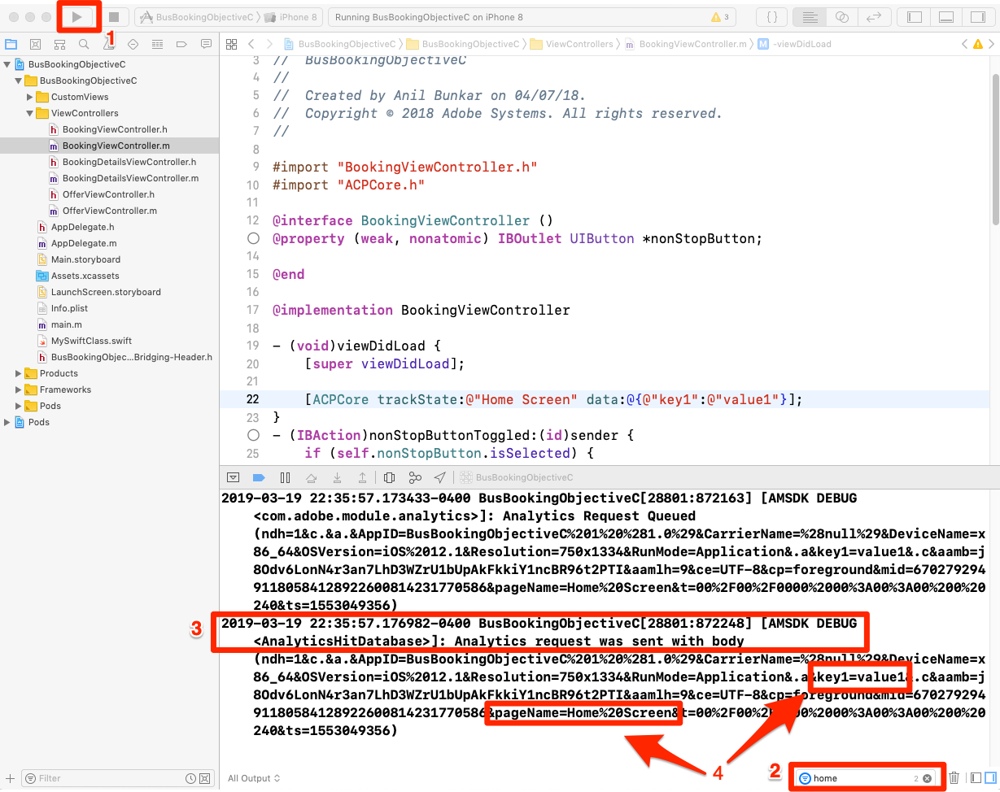
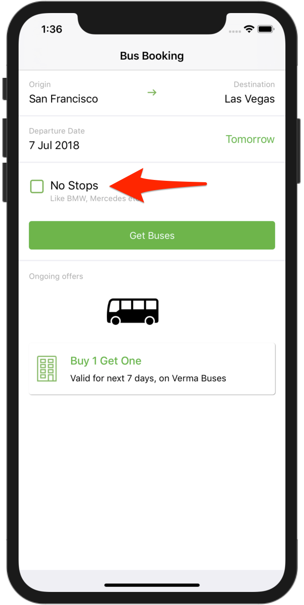
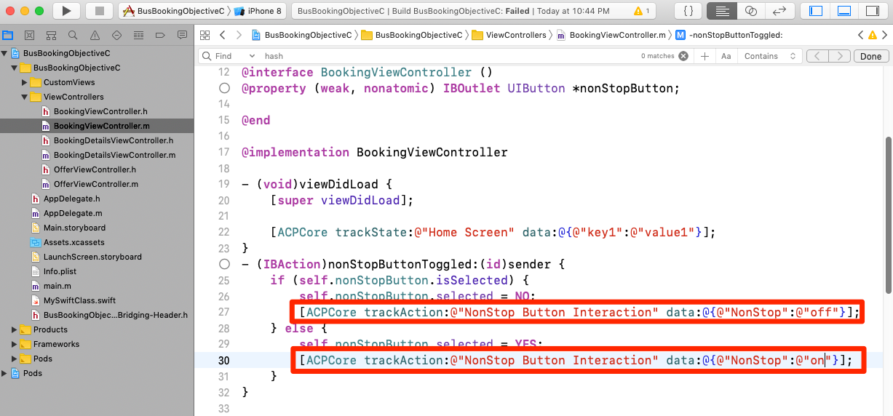

# 添加 Adobe Analytics

在本课中，您将在应用程序中启用Adobe Analytics跟踪。

[Adobe Analytics](https://docs.adobe.com/content/help/en/analytics/landing/home.html) 是一款行业领先的解决方案，可帮助您充分了解客户的行为和需求，并根据客户情报掌控自己的业务发展方向。

在“添 [加扩展](launch-add-extensions.md) ”和“安 [装Mobile SDK](launch-install-the-mobile-sdk.md) ”课程中，您将Adobe Analytics扩展添加到您的Launch属性中，并将其导入到示例应用程序中。  现在，您只需添加代码来跟踪应用程序中的状态和操作！

## 学习目标

在本课程结束后，您将能够：

* 验证是否将生命周期指标发送到Adobe Analytics
* 添加代码以使用其他数据跟踪应用程序中的状态
* 添加代码以跟踪应用程序中的操作并包含其他数据

在Launch中，可以为Analytics实施许多内容。 本课程并非详尽无遗，但应为您提供在您自己的应用程序中实施所需的主要技术的可靠概述。

## 先决条件

You should have already completed the lessons in the [Configure Launch](launch-create-a-property.md) section. 在该部分中，您添加了Analytics扩展并配置了跟踪服务器和报表包ID。

## 生命周期指标和Adobe Analytics

生命周期指标是基于环境的指标和维度，可以使用Experience Platform Mobile SDK在应用程序中轻松启用这些指标和维度。 事实上，你已经加了！

在将核心扩展添加到您的属性中并遵循界面中提供的移动安装说明时，您已经启用了生命周期指标。 这些指标和维度，包括特定于环境和应用程序的指标，如应用程序版本、参与用户数、操作系统版本、分时段、上次使用后的天数等。 在应用程序分析中非常有用，尤其是当您从中构建Analytics区段以应用于所有报告时。 文档中提供了完整的指标 [列表](https://docs.adobe.com/content/help/en/mobile-services/ios/metrics.html)。

### 查看Analytics生命周期点击

尽管您可以在任何调试程序／数据包嗅探器中看到生命周期点击，但我们只需在Xcode调试控制台中显示它们。

1. 在Xcode中构建和运行项目，以便启动模拟器
1. 在Xcode调试控制台中，键 `lifecycle` 入底部的过滤器以限制显示内容，然后滚动到条目的底部
1. 注意部 `Analytics request was sent with body` 分
1. 生命周期指标包括AppID、CarrierName、DayOfWeek、DaysSinceFirstUse等，以及文档中列出的其他指标／维 [度](https://docs.adobe.com/content/help/en/mobile-services/ios/metrics.html)

   

## 导入ACPCore库

在下一个练习中，您将使用API跟踪应用程序中的状态(“trackState”)和操作(“trackAction”)。 要使用这些API，您需要导入包含这些API的库。  在新的Experience Cloud Platform Mobile SDK中，trackState和trackAction API已从Analytics库移动到核心库，这使得可以将这些API用于除Adobe Analytics跟踪之外的其他用途。

在本教程中，您将只跟踪一个状态，但在实际的应用程序中，您将希望跟踪多个状态。

**导入ACPCore库**

1. 在Xcode中打开BookingViewController.m文件
1. 在文件顶部（通常与其他导入语句一起）添加 `#import "ACPCore.h"`
1. 保存
1. 您现在可以在此文件中使用trackState或trackAction API

   <!---->

## 跟踪状态

在您的应用程序中，您可能有许多不同的内容屏幕，供您的用户使用。 这些是网站上的页面。 Adobe Analytics为您提供了一种方法，允许您在这些“页面查看点击”中发送，并在用于Web属性的相同报告中查看这些点击。 此方法称为“trackState”。

在本教程中，您将将trackState调用的代码仅放置到应用程序中的一个屏幕（页面）中。 在现实生活中，您将在应用程序中的所有其他屏幕／状态上复制此项。 您还将探索通过点击发送数据（键／值对）的几种不同方式。

下面是文档中的语法和代码示例，您可以在本教程中或您自己的应用程序中复制并粘贴。

**语法：**

```objective-c
+ (void) trackState: (nullable NSString*) state data: (nullable NSDictionary*) data;
```

**示例：**

```objective-c
[ACPCore trackState:@"state name" data:@{@"key":@"value"}];
```

### 跟踪无数据状态

1. 在Xcode中打开范例应用程序，转到BookingViewController.m，在函数中 `viewDidLoad()` 添加trackState方法调用
1. 设置 `state name` 为“主屏幕”
1. 添加为方法调用中的占位符，而 `null` 不是添加任何额外数据
1. 或复制并粘贴到以下位置：

   ```objective-c
   [ACPCore trackState:@"Home Screen" data:nil];
   ```

   

>[!NOTE] 如果您完成了实施Target VEC的课程，则viewDidLoad()函数中将有一些额外的代码，该代码未显示在本练习的截屏中。 这是预期的，意在为手头的任务提供重点。

**验证trackState**

1. 保存、构建和运行项目
1. 当模拟器运行并打开应用程序的主屏幕时，查看Xcode控制台
1. 将控制台过滤为带有“主页”的条目，并查看显示 `Analytics request was sent with body`
1. 请注意，pageName变量已设置为 `Home Screen`，并且没有其他自定义数据对。 虽然从技术上讲，您是在设置“状态名称”而不是“页面名称”，但使用的参数名称是为了 `pageName` 提供与网站实施的一致性。

   

### 使用数据跟踪状态

1. 返回BookingViewController.m，在函数中，注 `viewDidLoad()` 释（或删除）上次练习中的基本（未添加数据）trackState调用
1. 添加新的trackState方法调用（此次包含数据）, `key1` 用作键 `value1` 和值
1. 保留 `state name` 为“主屏幕”
1. 或复制并粘贴到：

   ```objective-c
   [ACPCore trackState:@"Home Screen" data:@{@"key1":@"value1"}];
   ```

   

**用数据验证trackState**

1. 再次保存、构建和运行项目
1. 当模拟器运行并打开应用程序的主屏幕时，查看Xcode控制台
1. 将过滤器保留为“主页”，并查看显示 `Analytics request was sent with body`
1. 现在，除了设置pageName之外，您还有在点击时发送的键／值对

   

>[!NOTE] 如果您熟悉Analytics中的“prop和eVar”，您会注意到这些变量名称不在SDK中。 来自SDK的所有关键／值数据将作为 [contextData变量发送](https://docs.adobe.com/content/help/en/analytics/implementation/javascript-implementation/variables-analytics-reporting/context-data-variables.html)，因此，需要使用Analytics UI中的处理规则将其映射到prop或eVar [](https://docs.adobe.com/content/help/en/analytics/admin/admin-tools/processing-rules/processing-rules.html) （或其他变量）。

### 其他数据发送选项

在前两个练习中，您提出了两个请求，一个包含额外数据，另一个不包含数据。 但是，如果您希望通过屏幕或状态加载将多个数据点发送到Analytics，该怎么办？ 以下是两个选项。

#### 选项1:多键／值对

在trackState调用中，您可以选择发送多个键／值对，只需在数据集中用逗号分隔它们。 例如：

```objective-c
[ACPCore trackState:@"Home Screen" data:@{@"key1":@"value1",@"key2":@"value2",@"key3":@"value3"}];
```

#### 选项2:词典对象

您还可以在代码中定义词典，然后将其与trackState一起发送。 当然，如果您已经在代码中定义了某些词典对象，并且希望将其发送到Analytics中，这可能是您的最佳选择。 例如：

```objective-c
NSDictionary *theStuff = @{@"key1": @"value1",@"key2": @"value2"};
[ACPCore trackState:@"Home Screen" data:theStuff];
```

**额外积分**&#x200B;继续，在代码中尝试这两个选项，在Xcode调试控制台中查看结果。 您可以像以前一样使用相同的过滤器，并检查结果以确保变量和值都经过

## 跟踪操作

与跟踪网站上的非页面加载操作类似，您通常希望跟踪用户在您的应用程序中执行的操作，例如单击不加载其他屏幕的项。 这的处理方式与上述方法的trackState非常相似，只是调用了此方法 `trackAction`。

下面是文档中的语法和代码示例，您可以在本教程中或您自己的应用程序中复制并粘贴这些代码。

**语法：**

```objective-c
+ (void) trackAction: (nullable NSString*) action data: (nullable NSDictionary*) data;
```

**示例：**

```objective-c
[ACPCore trackAction:@"action name" data:@{@"key":@"value"}];
```

### 使用“不停止”复选框跟踪交互

在此示例巴士预订应用程序中，有一个复选框，让我们的用户决定是否要将其搜索结果限制为选项。 您已决定要在Adobe Analytics中跟踪与该复选框的交互。



此复选框在示例项目的BookingViewController.m文件中控制。 在本练习中，每当有人选中或取消选中该框时，您都会发送trackAction点击。

#### 设置trackAction代码

1. 在Xcode中打开示例项目，转到BookingViewController.m并找到“nonStopButtonToggled”函数
1. 在语句 `if` 中，如果框已被选中，则第一部分将取消选择该框。 在此方案中，您希望使用以下代码发送具有值“off”的点击：

   ```objective-c
   [ACPCore trackAction:@"NonStop Button Interaction" data:@{@"NonStop":@"off"}];
   ```

1. 在下一部分（“else”部分）中，如果尚未选中该框，则会选中该框。 在此方案中，您希望使用以下代码发送具有值“on”的点击：

   ```objective-c
   [ACPCore trackAction:@"NonStop Button Interaction" data:@{@"NonStop":@"on"}];
   ```

请注意代码中的其他自定义设置：

* 您将设置为“ `action name` 不停止按钮交互”。 此值将填充请求的“action”参数和Adobe Analytics中的自定义链接报告／维
* 您使用的名 `key` 称是“NonStop”。 这是您在Analytics Admin Console的处理规则中可以查找的键名称，以便将这些值映射到prop或eVar。

该函数现在如下：



#### 验证trackAction代码

1. 添加代码后，保存项目，运行并构建
1. 单击垃圾图标以清除控制台
1. 选中模拟器中的复选框，注意控制台中显示两个请求。 最后一个是从您刚刚添加的代码向Adobe Analytics发送数据。
1. 请注意，action和pev2参数均设置为“NonStop Button Interaction”（带有编码空格）
1. 请注意，“NonStop=on”键／值对存在，然后可以在处理规则中分配给prop/eVar
1. 注意“pe=lnk_o”键／值，表明这是由trackAction触发的“自定义链接”点击

   

干得好！ 您已完成Analytics课程。 当然，您可以做许多其他事情来增强我们的Analytics实施，但希望这为您提供了满足其余需求所需的一些核心技能。

## trackState和trackAction的其他优点

在上一个练习中，您能够通过使用trackState和trackAction API将数据从应用程序发送到Adobe Analytics。 由于Experience Platform Mobile SDK植根于Launch，因此您可以在Launch界面中利用刚才添加的代码完成更多工作。

在Launch中，您可以创建由trackState和trackAction API触发的规则，并让它们执行其他操作，如向其他Adobe解决方案或外部合作伙伴发出请求。

[下一个“添加Adobe Audience Manager”&gt;](audience-manager.md)
