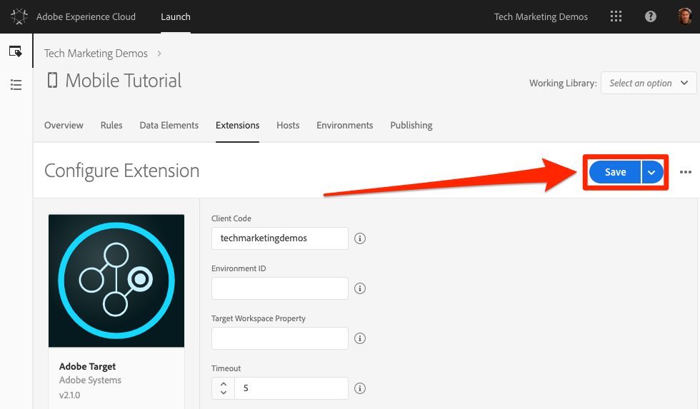

# 添加扩展

在本课中，您将向Launch属性添加扩展。

Launch是一个平台，它允许Adobe和第三方供应商创建扩展，以便通过Launch轻松部署其解决方案。 扩展是扩展启动界面和客户端功能的代码包。 通过扩展功能，您只能为特定应用程序选择Adobe Experience Platform Mobile SDK中需要的部分。  如果将 Launch 看作一种操作系统，那么扩展就是用来完成任务的应用程序。

由于您将要实施Adobe解决方案（例如Target、Analytics和Audience Manager），您将添加支持这些解决方案所需的必要扩展。

>[!WARNING] 在移动启动属性中添加和删除扩展需要您更新应用程序。 这与Web启动属性不同，在Web启动属性中，您可以随时添加或删除扩展，而无需更新网站。

## 先决条件

要完成本课程，您的Launch用户帐户需要“管理扩展”权限。 如果由于用户界面选项不可用而无法完成上述任何步骤，请联系您的Experience cloud管理员以获取访问权限。 For more information on Launch permissions, see [the documentation](https://docs.adobe.com/content/help/en/launch/using/reference/admin/user-permissions.html).

您需要以下解决方案详细信息：

* 至少一个Analytics报告套件ID。 报表包应启用“应 [用程序报告”](https://docs.adobe.com/content/help/en/analytics/admin/admin-tools/mobile-management.html)。 If you don't have a test/dev report suite that you can use for this tutorial, please [create one](https://docs.adobe.com/content/help/en/analytics/admin/manage-report-suites/new-report-suite/new-report-suite.html). 一个报表包就足以完成本教程，但在现实生活中，您需要为开发、暂存和生产环境使用不同的报表包。

* 您的Analytics跟踪服务器。 您可以从当前实施、Adobe顾问或客户关怀代表中检索跟踪服务器。

## 学习目标

在本课程结束后，您将能够：

* 将扩展添加到移动启动属性
* 配置 Analytics 扩展
* 配置Target和Target VEC扩展

>[!NOTE] Adobe Audience manager可以通过Analytics扩展中的配置来实施，因此您无需在本教程中添加Audience Manager扩展

## 查看预安装的扩展

1. 单击“ **[!UICONTROL 扩展]** ”选项卡以转到扩展页面
1. 请注意，Mobile core和扩 `Profile` 展功能已预安装在您的新移动资产中
1. 单击核 **[!UICONTROL 心扩展]** 上的“配置”按钮以检查其设置

   

1. Mobile Core扩展代表任何应用程序实施所需的核心Adobe Experience Platform Mobile SDK。 核心包含Experience Cloud Identity服务、数据事件中心、规则引擎、可重用网络、磁盘访问例程等常见功能和框架集，这是所有Adobe和第三方扩展所必需的。  有关Mobile Core扩展的详细信息，请参阅 [文档](https://aep-sdks.gitbook.io/docs/using-mobile-extensions/mobile-core)。

   1. 请注意，系统会自动检测您的Experience cloud组织ID并预填充
   1. 通过Experience Cloud server字段，可指定访客ID服务请求的自定义端点。 使用本教程的默认设置（将其留空）。
   1. “会话超时”字段允许您指定应用程序生命周期会话何时应超时。 默认情况下，如果应用程序在后台运行300秒，则此操作将超时。 使用本教程的默认设置。

1. 由于您尚未更改任何设置，请单击“取 **[!UICONTROL 消]** ”以保留扩展配置

   

1. 配置文件扩展允许SDK在客户端配置文件中存储数据。 它没有配置，所以没有什么可看的。 有关配置文件扩展的详细信息，请参 [阅文档](https://aep-sdks.gitbook.io/docs/using-mobile-extensions/profile)。

## 添加解决方案扩展

现在，是时候开始学习有趣的部分并开始为您将在本教程中实施的解决方案添加扩展了。 将Launch与移动应用程序一起使用时，每次添加或删除扩展时都必须更新应用程序。 为了节省以后的时间，我们将在本课中添加所有扩展。 只需跳过您的公司未获得许可的任何解决方案。

### 添加Adobe Analytics扩展

>[!NOTE] 如果您没有Adobe Analytics的许可证，可跳过此部分。 目前，移动属性的Analytics扩展仅用于管理SDK设置，不会向Launch添加界面选项，如“规则”操作。

**添加扩展**

1. 单击“目录”选项卡可查看已卸载的 _扩展_ 。

1. 查找 **[!UICONTROL Adobe Analytics扩展]** ，然后单击安 **[!UICONTROL 装]**

   

1. 从预填 **[!UICONTROL 充的列表中]** ，选择您的报表包。 这些是应用程序将向其发送数据的报表包。 您可以为开发、暂存和生产环境选择不同的报表包。
1. 您 **[!UICONTROL 的Analytics Tracking Server]** （分析跟踪服务器）可能已预填充，或者您可能需要从预填充列表中选择它或手动输入它。 这是信标将发送到的域，通常采用格式 `yoursite.sc.omtrdc.net`。
1. 选中“启用脱 **[!UICONTROL 机”框]**。 选中“启用脱机”复选框后，Analytics点击将在设备脱机时排队，并在设备重新联机时稍后发送。 要使用脱机跟踪 **** ，请确保您的报表包启用了时间戳。 有关详细信息，请参阅 [ 文档](https://docs.adobe.com/content/help/en/analytics/implementation/javascript-implementation/offline-tracking.html)。
1. 选中“ **[!UICONTROL Audience Manager转发”框]**。 这会将Analytics数据转发到Audience Manager，这样您就不必再从应用程序拨叫Audience Manager了。 在本练习中，我们假定您拥有Audience Manager，因此将从Analytics转发数据。 如果您没有Audience Manager，请不要选中此框，因为您为自己的实施设置了Analytics。
1. 选中该框以倒 **[!UICONTROL 换上一会话信息]**
1. 单击“保 **[!UICONTROL 存]** ”按钮

   

### 添加 Target 扩展

Adobe Target有两个正式扩展，即Adobe Target扩展和Adobe Target VEC扩展。 Adobe Target支持我们早期移动SDK用户所熟悉的所有API。 Adobe Target VEC扩展增加了对Target的Visual Experience Composer的支持，使营销人员能够在“所见即所得”(WYSIWYG)界面中构建更改页面上的图像和文本元素的简单活动。 在本教程中，您将同时使用这两种方法。

>[!NOTE] 如果您没有Adobe Target的许可证，可跳过此部分。 目前，移动属性的Target扩展仅用于管理SDK设置，而不向Launch添加界面选项，如“规则”操作。

**添加扩展**

1. 单击“目录”选项卡可查看已卸载的 _扩展_ 。

1. 查找 **[!UICONTROL Adobe Target扩展]** ，然后单击“安 **[!UICONTROL 装”]**

   

1. 您 **[!UICONTROL 的客户代码]** 将预填充。
1. 将“环 **[!UICONTROL 境Id]** ”留空。 此设置与Adobe Target中的 [Hosts](https://docs.adobe.com/help/en/target/using/administer/hosts.html) （主机）功能结合使用，该功能允许您将数据发送到不同的报告环境（如开发、暂存、生产）。 默认情况下，数据将发送到生产环境。
1. 将“目标 **[!UICONTROL 工作区属性]** ”留空。 此设置与Target Premium [Enterprise User Permissions（目标高级企业用户权限）功能](https://docs.adobe.com/content/help/en/target/using/administer/manage-users/enterprise/property-channel.html) 结合使用。
1. 将“超 **[!UICONTROL 时]** ”设置为5秒。 此设置控制应用程序在显示默认内容之前应等待Target响应的时间。
1. 单击“保 **[!UICONTROL 存]** ”按钮

   

### 添加目标VEC扩展

添加Target扩展后，您可以添加Target VEC扩展。

>[!NOTE] 如果您没有Adobe Target的许可证，可跳过此部分。 此时，移动属性的Target VEC扩展仅用于管理SDK设置，而不向Launch添加界面选项，如“规则”操作。

**添加扩展**

1. 单击“目录”选项卡可查看已卸载的 _扩展_ 。

1. 查找 **[!UICONTROL Adobe Target VEC扩展]** ，然后单击“安 **[!UICONTROL 装”]**

   

1. 转 **[!UICONTROL 换自动获取目标营销活动]**`ON` 。 这将在应用程序首次加载时预取所有Target活动，从而减少需要发出的请求数。
1. 保 **[!UICONTROL 留后台提取]**`OFF`。 此设置仅在使用时 `Auto-Fetch Target Campaigns` 显示。  离开此设 `OFF` 置将允许您在应用程序的主屏幕上运行VEC活动，但也会为应用程序启动添加延迟，以确保在主屏幕显示之前Target请求已完成或超时。 建议您在主屏幕上运 `OFF` 行活动时保留此设置，如果不在主屏幕上 `ON` 切换此设置。  可以随时在启动界面中更改此设置，无需更新应用程序。
1. 单击“保 **[!UICONTROL 存]** ”按钮

   

就这么简单！现在，您已将扩展添加到属性中，您可以将它们添加到库：

[下一个“创建库”&gt;](launch-create-a-library.md)