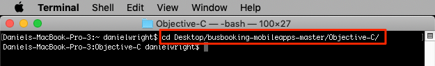
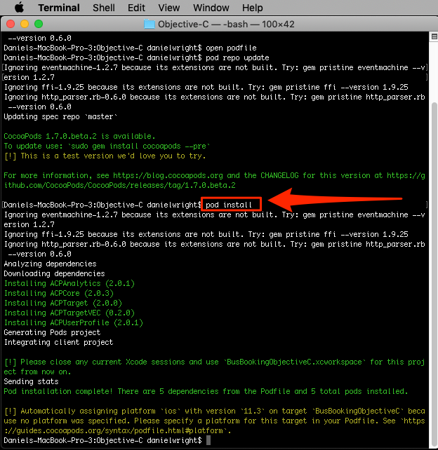
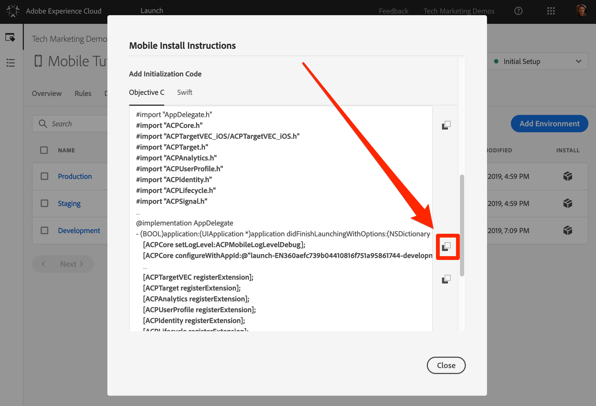
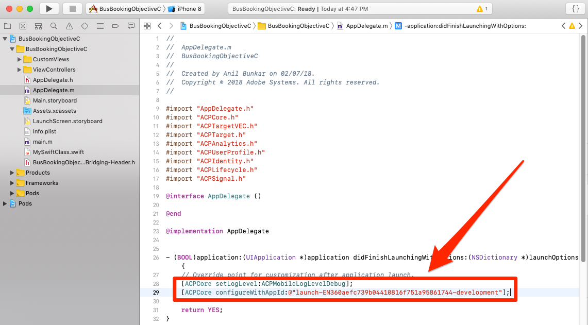
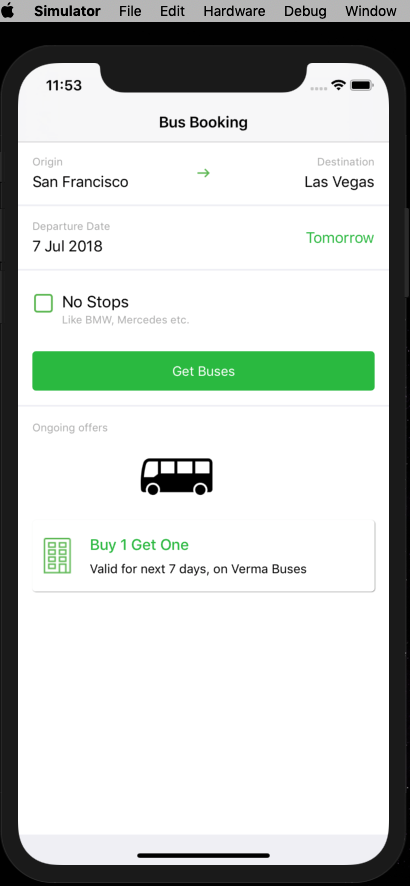
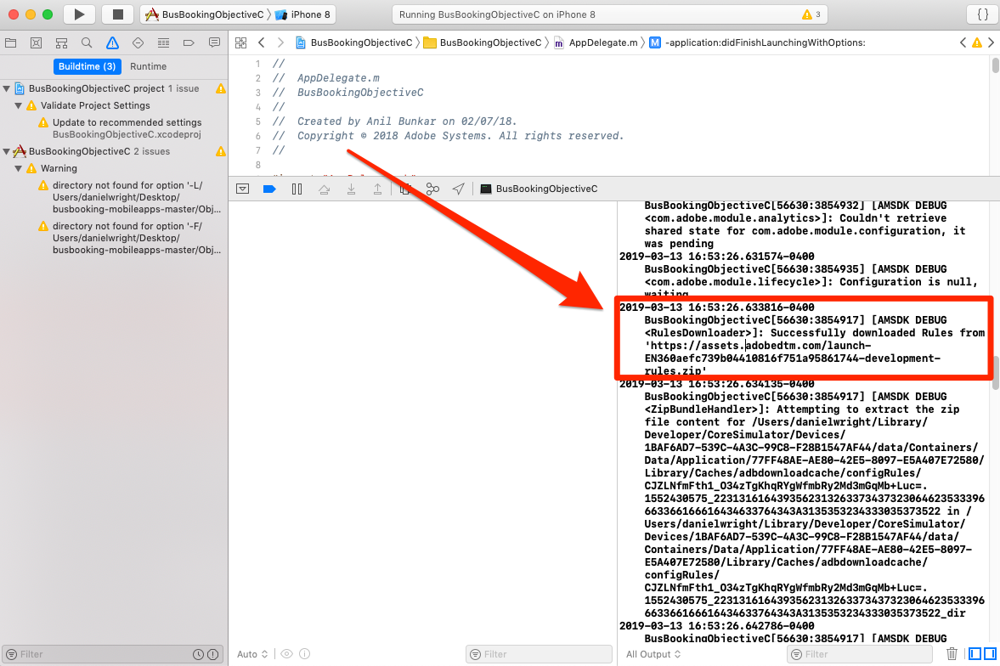

# 安装 Mobile SDK

在本课中，您将使用与Launch属性的“开发”环境相对应的扩展和设置来实施Mobile SDK。

## 学习目标

在本课程结束后，您将能够：

* 获取移动启动属性的安装说明
* 了解开发、暂存和生产环境之间的差异
* 创建和编辑播客文件
* 将Mobile SDK导入您的AppDelegate文件
* 验证SDK是否已成功实施

## 获取安装说明

移动启动属性的安装说明是您在终端中运行或添加到移动应用程序中特定位置的代码片段的集合。

单击顶部导 `Environments` 航中的选项卡，以转到环境页面。 请注意，开发、暂存和生产环境已经为您预先创建。 这些代码与代码开发和发布过程中的典型环境相对应。 代码首先由开发人员在开发环境中编写。 完成工作后，开发人员会将代码发送到暂存环境，供 QA 和其他团队审查。满足QA和其他团队的要求后，该代码将发布到生产环境，该环境是访客下载应用程序时体验到的面向公众的环境。

Launch允许额外的开发环境，这对于多个开发人员同时处理不同项目的大型组织非常有用。

开发、暂存和生产是完成本教程所需的唯一环境。


在“开 **[!UICONTROL 发]** ”行中，单击“安装”图标“  ，打开嵌入代码模式。


我们逐步完成说明。

## 创建播客文件并安装窗格

如果您之前在网站中使用过Launch，您首先会注意到的是，与Web属性相比，此模式中的信息要多得多。

适用于iOS的Adobe Mobile SDK使用CocoaPods管理其各个组件之间的依赖关系。 如果您的开发环境中尚未安 [装CocoaPod](https://cocoapods.org/) ，请按照其网站上的安装说明进行操作。 此外，如果尚未下载“ [Bus Booking”（巴士预订）应用程序](https://github.com/Adobe-Marketing-Cloud/busbooking-mobileapps)，请将其保存到本地计算机，然后将zip存档解压缩到桌面。

**创建播客文件**

1. 在Mac® `Terminal` 上打开应用程序

1. 导航到保存Bus Booking Objective-C应用程序的项目文件夹(例如， `cd Desktop/busbooking-mobileapps-master/Objective-C/`)

   

1. 在启动界面中，将操作系统更改为 `iOS`

1. 通过单击“复制”图 `pod init`标复制第一个iOS  。

   

1. 在您的终端应用程序中，运 `pod init` 行命令并等待其完成

   

1. 在您的终端应用程序中，使用命令打开播客文 `open podfile` 件

   

1. 您的计算机可能会打开一个对话框，询问您要打开播客文件的应用程序。 选择任何文本编辑器，如 `TextEdit`

1. 在启动项界面中，通过单击复制图标复制依赖项  。 请注意，如何为您在上一课中添加的每个扩展添加一行对应的代码。 每个扩展都有其自己的一组代码，这些代码在Mobile Core扩展上构建，并且只能通过应用程序更新添加或删除：

   

1. 在文本编辑器中，将从剪贴板中的依赖项粘贴到行的正后面 `# Pods for BusBookingObjectiveC`

1. 在文本编辑器中保存对播客文件的更新

   

1. 您现在可以关闭文本编辑器

1. 在启动界面中，通过单击复制图标 `pod repo update`复制下一个iOS 

   

1. 在您的终端应用程序中，运 `pod repo update` 行命令并等待其完成（这可能需要几分钟）

   

1. 在启动界面中，通过单击复制图标 `pod install`复制下一个iOS 

   

1. 在您的终端应用程序中，运 `pod install` 行命令并等待其完成

   

1. 您现在可以关闭终端窗口

1. 打开Finder窗口，导览至保存“总线预订”应用程序的文件夹，确认已创建BusBookingObjectiveC.xcworkspace文件、Podfile、Podfile.lock文件以及Pods文件夹

   

## 更新AppDelegate

现在是时候更新应用程序以导入SDK了：

1. 在XCode中 `BusBookingObjectiveC.xcworkspace` 打开文件
1. Open the `AppDelegate.m` file

   

1. 在启动界面中，滚动到添 **[!UICONTROL 加初始化代码部分]** ，然后选择 **[!UICONTROL 目标C]** ，作为您使用的iOS语言。
1. 通过单击“添加初始化代码”部分中的第一个“复  ”图标， **[!UICONTROL 复制导入语句]** :

   

1. 在XCode中，将这些导入语句粘贴 `AppDelegate.m` 到文件中的 `AppDelegate.h`

   

1. 在启动界面中，通过单击添加初始化代码部分中的第二个复制图标，复制与核心扩展相  行 **** 。 第一行打开控制台日志记录语句（可用选项为“debug”、“verbose”、“warning”和“error”）。 第二行指向启动环境的唯一标识符。 这很重要，因为当我们准备好将应用程序部署到生产环境时，您需要更新此值。

   

1. 在XCode中，将这些Core语句粘贴到方法顶部的AppDelegate文 `application(_:didFinishLaunchingWithOptions:)` 件中：

   

1. 在启动界面中，通过单击添加初始化代码部分中的第三个复制  ，复制 [!UICONTROL 扩展语句] :

   

1. 在XCode中，将这些扩展语句粘贴到AppDelegate文件中，就在方 `return true` 法行的前 `application(_:didFinishLaunchingWithOptions:)` 面：

   

>[!NOTE] 启动界面中提供的移动安装说明包括标识、生命周期和信号扩展的导入和注册语句以及生命周期指标的初始化。 这些扩展被视为移动核心扩展的一部分。 如果您不希望在应用程序中使用这些扩展，则无需导入、注册或实现与这些扩展关联的其他代码。
>
> 此外，使用这些扩展时还应考虑其他实施选项（例如，当用户背景／预先启动应用程序时，可以暂停／重新启动生命周期集合）。 您可以在Mobile Core扩展文档中 [阅读有关此的更多信息](https://aep-sdks.gitbook.io/docs/using-mobile-extensions/mobile-core)

## 验证实施

1. 保存XCode项目
1. 运行应用程序并在模拟器中启动它。 如果尚未配置任何模拟器设备，请立即配置一个，确保配置运行iOS 10+的设备。 我们喜欢使用iPhone 8模拟器，因为用鼠标单击按钮 `Home` 很容易。

   

1. 等待模拟器启动并完全打开应用程序到预订屏幕（这可能需要几分钟）

   

1. 确认正在XCode控制台中向Adobe服务器发出调用

   

以下是一些可查找的特定调用的示例：

1. **调用以检索启动项配置** (将控制台筛选为 `adobedtm.com`)。 请注意您在上一课中输入的扩展配置。 虽然添加扩展需要对应用程序进行更新，但可以在Launch中对这些设置进行外部管理并随时更改：

   ```objective-c
   2019-03-13 16:53:26.633816-0400 BusBookingObjectiveC[56630:3854917] [AMSDK DEBUG <RulesDownloader>]: Successfully downloaded Rules from 'https://assets.adobedtm.com/launch-EN360aefc739b04410816f751a95861744-development-rules.zip'
   
   {"target.propertyToken":"","target.timeout":5,"global.privacy":"optedin","analytics.backdatePreviousSessionInfo":true,"analytics.offlineEnabled":true,"build.environment":"dev","rules.url":"https://assets.adobedtm.com/launch-EN360aefc739b04410816f751a95861744-development-rules.zip","experienceCloud.org":"7ABB3E6A5A7491460A495D61@AdobeOrg","target.clientCode":"techmarketingdemos","target.autoFetch":true,"target.fetchBackground":false,"lifecycle.sessionTimeout":300,"target.environmentId":"busbookingapp","analytics.server":"tmd.sc.omtrdc.net","analytics.rsids":"tmd-mobile-dev1","analytics.batchLimit":0,"property.id":"PRb4881271498b4f2cbaf67d38a8f3891a","global.ssl":true,"analytics.aamForwardingEnabled":true}
   ```

1. **向Identity service请求** (将控制台过滤为 `demdex.net`)在此示例中，ID(`d_mid`)已设置，且正在重新报告)

   ```objective-c
   2019-03-13 16:53:26.655908-0400 BusBookingObjectiveC[56630:3854937] [AMSDK DEBUG <com.adobe.module.identity>]:
   
   Sending request (https://dpm.demdex.net/id?d_rtbd=json&d_ver=2&d_orgid=7ABB3E6A5A7491460A495D61@AdobeOrg&d_mid=67027929491180584128922600814231770586)
   ```

1. **来自Identity service的响应** (将控制台过滤为 `ID Service`)。 请注意该 `mid` 值如何与上述请 `d_mid` 求中的值相匹配：

   ```objective-c
   2019-03-13 16:53:27.397048-0400 BusBookingObjectiveC[56630:3854937] [AMSDK DEBUG <com.adobe.module.identity>]:
   
   ID Service - Got ID Response (mid: 67027929491180584128922600814231770586, blob: j8Odv6LonN4r3an7LhD3WZrU1bUpAkFkkiY1ncBR96t2PTI, hint: 9, ttl: "604800000 ms")
   ```

1. **分析请求** (将控制台筛选到 `Analytics request`)

   ```objective-c
   2019-03-13 16:53:27.689061-0400 BusBookingObjectiveC[56630:3855024] [AMSDK DEBUG <AnalyticsHitDatabase>]: Analytics request was sent with body
   
   (ndh=1&c.&a.&AppID=BusBookingObjectiveC%201%20%281.0%29&CarrierName=%28null%29&DailyEngUserEvent=DailyEngUserEvent&DayOfWeek=4&DeviceName=x86_64&HourOfDay=16&InstallDate=3%2F13%2F2019&InstallEvent=InstallEvent&LaunchEvent=LaunchEvent&Launches=1&MonthlyEngUserEvent=MonthlyEngUserEvent&OSVersion=iOS%2012.1&Resolution=750x1334&RunMode=Application&TimeSinceLaunch=1&internalaction=Lifecycle&locale=en-US&.a&.c&ce=UTF-8&cp=foreground&mid=67027929491180584128922600814231770586&pageName=BusBookingObjectiveC%201%20%281.0%29&pe=lnk_o&pev2=ADBINTERNAL%3ALifecycle&t=00%2F00%2F0000%2000%3A00%3A00%200%20240&ts=1552510406)
   ```

祝贺您，您已经将SDK添加到移动应用程序！

[下一个“添加Adobe Experience Platform Identity Service”&gt;](id-service.md)