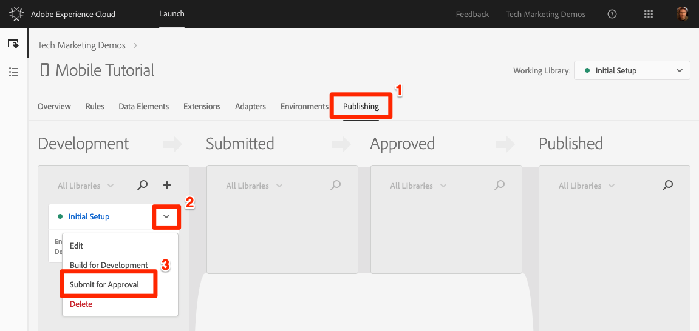
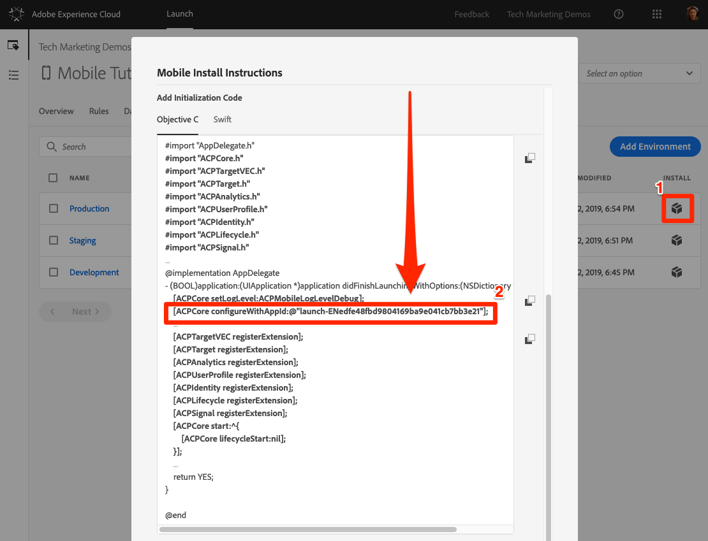

# 发布启动项属性

现在，您已经在开发环境中实施了Adobe Experience cloud的一些关键解决方案，是时候学习发布工作流程了。

## 先决条件

要完成本课程，您的Launch用户帐户需要“批准”和“发布”权限。 如果由于用户界面选项不可用而无法完成上述任何步骤，请联系您的Experience cloud管理员以获取访问权限。 For more information on Launch permissions, see [the documentation](https://docs.adobe.com/content/help/en/launch/using/reference/admin/user-permissions.html).

## 学习目标

在本课程结束后，您将能够：

1. 将开发库发布到暂存环境
1. 更新应用程序以加载不同的启动环境
1. 将暂存库发布到生产环境

## 发布到暂存环境

既然您已在开发环境中创建并验证了库，现在该将其发布到暂存了。

1. Go to the **[!UICONTROL Publishing]** page

1. 打开库旁边的下拉框，然后选择“提 **[!UICONTROL 交以待批准”]**

   

1. 单击对 **[!UICONTROL 话框中]** “提交”按钮：

   

1. 您的库现在将以未构建状态 [!UICONTROL 显示在] “已提交”列中：

1. 打开下拉列表，然后选择 **[!UICONTROL 构建以进行升级]**:

   
1. 出现绿色圆点图标后，便可以在暂存环境中预览库。

在真实情景中，该过程的下一步通常是让您的 QA 团队验证暂存库中所做的更改。

**验证暂存库中的更改**

1. 在“启动”属性中，打开“环 [!UICONTROL 境] ”页

1. 在“暂 [!UICONTROL 存] ”行中，单击“安装”图标

    ，以打开模态
   

如果您为登台应用程序使用了其他工作区，则需要确保此工作区包含您在本教程中进行的所有窗格和应用程序更新。 此时，开发环境中安装说明的唯一区别是核心配置中的启动参考，如上面的屏幕截图所示。 您需要更新AppDelegate.h文件中的相应行并重新构建应用程序。

在实际操作中，一旦QA团队通过查看暂存环境中的更改注销，就是时候发布到生产了。

## 发布到生产环境

1. Go to the [!UICONTROL Publishing] page

1. 从下拉列表中，单击 **[!UICONTROL 批准发布]**:

   

1. 单击对 **[!UICONTROL 话框]** 中的“批准”按钮：

   

1. 库现在将显示在未构建状 [!UICONTROL 态] （黄点）的“已批准”列中：

1. 打开下拉框，然后选择 **[!UICONTROL 构建并发布到生产]**:

   

1. 单击对 **[!UICONTROL 话框中的]** “发布”:

   

1. 库现在将显示在“已发布 [!UICONTROL ”列] :

   

同样，请注意，生产环境使用核心配置中的启动项引用，如下面的屏幕截图中所示。  如果您为登台应用程序使用了其他工作区，则需要确保此工作区包含您在本教程中进行的所有窗格和应用程序更新。

>[!WARNING] 下次更改启动项配置时，您需要在开发环境中创建新库。 请记住，添加和删除扩展将需要更新应用程序本身。 要注意保持Launch环境和应用程序代码彼此同步，以避免出现问题。

就是这样！ 您已经完成了教程，并在Launch中发布了您的第一个移动属性！