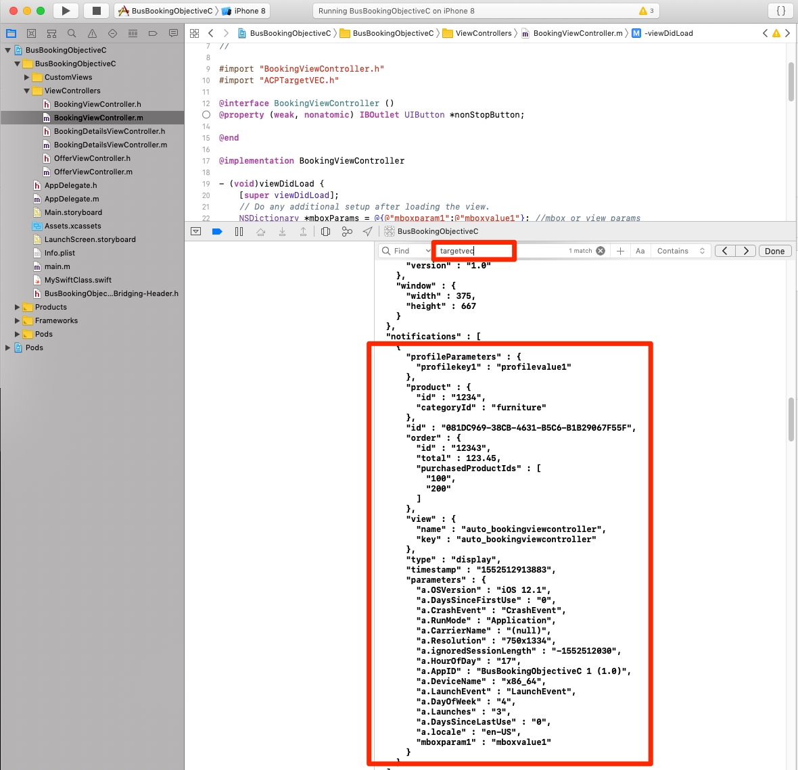
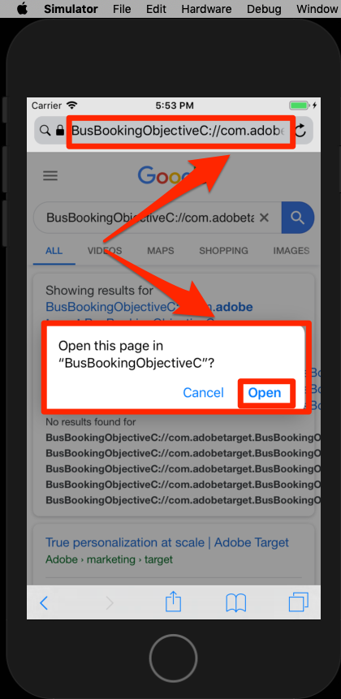
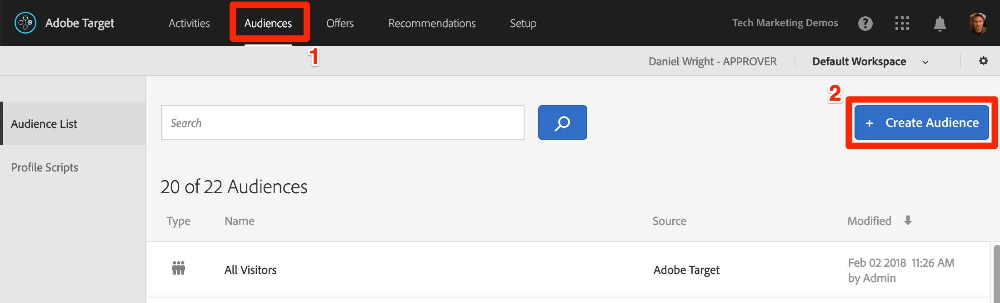

# 添加Adobe Target的可视体验书写器(VEC)

在本课中，您将为移动应用程序启用Target Visual Experience Composer(VEC)。

[Adobe Target是Adobe Experience cloud解决方案](https://docs.adobe.com/content/help/en/target/using/target-home.html) ，它提供定制和个性化客户体验所需的一切，使您能够最大化网站和移动站点、应用程序、社交媒体和其他数字渠道的收入。

使用本机移动设备应用程序的可视化体验编辑器 (VEC)，您能够以 DIY（自己动手）方式创建活动并对本机移动设备应用程序上的内容进行个性化，而无需持续依赖开发和应用程序发布循环。

在“添加扩 [展”课程中](launch-add-extensions.md)，您将Target VEC扩展添加到您的“启动”属性中。 在本课安 [装Mobile SDK](launch-install-the-mobile-sdk.md) ，您将扩展导入到示例应用程序中。 在Target的移动视觉体验编辑器中开始设置活动只需要几次小更新！

>[!WARNING] 在移动应用程序中使用Target VEC时，需要Target和Target VEC启动扩展。

## 学习目标

在本课程结束后，您将能够：

* 为Target VEC启用示例应用程序
* 将参数添加到Target VEC请求
* 将设备与VEC配对
* 使用VEC创建活动

## 先决条件

要完成本节中的课程，您必须：

* 完成“配置启动项” [部分中的课程](launch-create-a-property.md) 。
* 具有Adobe Target界面的审批者级别访问权限

## 添加参数

生命周期指标会作为参数自动包含在Target VEC请求中。 您还可以向请求中添加自定义参数。

**添加自定义参数**

1. 在Xcode中，打开文 `BookingViewController.m` 件。 此文件由主屏幕使用。
1. 在现有导入下导入Target和Target VEC扩展

   ```swift
   #import "ACPTarget.h"
   #import "ACPTargetVEC.h"
   ```

1. 在函 `viewDidLoad` 数中，在行后添加以 `super.viewDidLoad` 下代码。 此示例代码显示如何将参数、配置文件参数、产品（或实体）参数和订单参数添加到TargetVEC请求中。 此示例使用静态值，而在实际应用程序中，您希望使用动态变量填充这些值。 当然，您只希望填充与视图相关的参数：

   ```objective-c
   NSDictionary *params = @{@"param1":@"value1"};
   NSDictionary *profileParams = @{@"profilekey1":@"profilevalue1"};
   ACPTargetProduct *product = [ACPTargetProduct targetProductWithId:@"1234" categoryId:@"furniture"];
   ACPTargetOrder *order = [ACPTargetOrder targetOrderWithId:@"12343" total:@(123.45) purchasedProductIds:@[@"100",@"200"]];
   ACPTargetParameters *targetParams = [ACPTargetParameters targetParametersWithParameters:params
                                                                         profileParameters:profileParams
                                                                                   product:product
                                                                                     order:order];
   [ACPTargetVEC setGlobalRequestParameters:targetParams];
   ```

   

现在您已经向应用程序添加了参数，是时候确认这些参数是在请求中传递的了。

**验证参数**

1. 保存Xcode项目
1. 重新构建应用程序，然后等待它在模拟器中重新打开
1. 在Xcode的控制台窗格中单击
1. 使用ales-F打开“查找”框
1. 在“查找 `targetvec` ”框中搜索
1. 点击 `Enter` 以跳转到Target请求和帖子正文。 找到刚添加到请求的自定义参数：

   

## 将移动应用程序与目标界面配对

要在Target界面中创建VEC活动，必须首先将Target与您的应用程序配对。 这种配对是通过使用深连接实现的。

### 创建深层链接方案

iOS支持使用通用 [链接](https://developer.apple.com/documentation/uikit/core_app/allowing_apps_and_websites_to_link_to_your_content)[](https://developer.apple.com/documentation/uikit/core_app/allowing_apps_and_websites_to_link_to_your_content/defining_a_custom_url_scheme_for_your_app) 和自定义URL方案创建指向应用程序的深层链接。 您可能已在应用程序中使用自定义URL方案。 如果是，您可以使用这些现有链接与Target配对。 在本教程中，您必须创建自定义URL方案。

**注册URL方案**

1. 在Xcode中，双击应用程序以打开“设置”屏幕
1. 在“设置”屏幕上，单击选 `Info` 项卡
1. 展开部 `URL Types` 分
1. 请注意， **[!UICONTROL Identifier]** is set to `com.adobetarget.BusBookingObjectiveC`. 您可以使用此标识符，或根据需要更改它。
1. 请注意， **[!UICONTROL URL方案是]**`BusBookingObjectiveC`。 您可以使用此方案，也可以根据需要更改它。
1. 确保选 **[!UICONTROL 择]** “编辑器”作为角 **[!UICONTROL 色]**

   

1. 如果您更新了标识符或方案，请单击选项卡， `General` 以便保存该方案。  单击选项卡上 `Info` 的返回，展开该 `URL type` 部分，验证您的标识符或方案是否已保存。

下一步是向深层链接添加一个处理函数。

**处理深层链接**

1. Open the `AppDelegate.m` file
1. 如下图 `[ACPCore collectLaunchInfo:@ {@"adb_deeplink": url.absoluteString}];` 所示，将 `AppDelegate:application:openURL` 行添加到部分
   

### 验证深层链接

现在，当安装了应用程序的用户在模拟器中打开URL( `BusBookingObjectiveC://com.adobetarget.BusBookingObjectiveC` 或您定义的任何方案)时，它将打开您的应用程序。

**验证深层链路方案**

1. 保存Xcode项目
1. 重新构建应用程序
1. 在模拟器中，打开Safari
1. 在地址栏 `BusBookingObjectiveC://com.adobetarget.BusBookingObjectiveC` 中输入url（或您定义的任何方案）。 如果您遇到任何困难，请参阅下面的提示部分。
1. 您应该会收到“在BusBookingObjectiveC中打开此页面”的模态提示。 如果您遇到任何困难，请参阅下面的提示部分。
1. 单击 `Open`
1. 这应打开“巴士预订”应用程序

   > [!TIP] 如果您在将URL从桌面复制并粘贴到模拟器时失败，通常是出于以下两个原因之一：
   >
   >   1. **从Target界面复制的URL不会粘贴到模拟器中** 。当桌面和模拟器剪贴板未同步时，会发生这种情况。  如果发生这种情况，请尝试关闭模拟器中的 `Automatically Sync Pasteboard` 设置并再次复制／粘贴：
      >
      >      
      
      >
      >   
   1. **粘贴URL后，该URL将登录到Google搜索结果页面** 。尝试将深层链接URL重新粘贴到地址栏并点击 `Enter`。 你可能需要重复几次。


   

既然已设置深层链接结构，您就可以使用Target VEC设置活动了！

## 在移动VEC中创建活动

现在，让我们在目标UI中创建活动。

**使用目标VEC创建活动**

1. 登录 [Adobe Experience Cloud](https://experiencecloud.adobe.com)
1. 使用解决方案切换器转到Target

   

1. 启动目标

   

1. 单击“ **[!UICONTROL 创建活动]** ”按钮，然后选择 **[!UICONTROL A/B测试]**
1. 选择移 **[!UICONTROL 动应用程序]**
1. 确保在“选 **[!UICONTROL 择体验编写器]** ”下选 **[!UICONTROL 择了“可视化”]**
1. 单击“下 **[!UICONTROL 一步]** ”按钮

   

1. 在“选择要 **[!UICONTROL 使用的应用程序”屏幕上]** ，单击“添加新 **[!UICONTROL 应用程序”]**

   

1. 输入您刚在“输入URL方案”字 **[!UICONTROL 段中定义的url方案]** ，例如， `BusBookingObjectiveC://com.adobetarget.BusBookingObjectiveC`
1. 单击“ **[!UICONTROL 创建深层链接”]**

   

   >[!NOTE] 您有几个选项可发送指向应用程序的深层链接。 您可以：
   >
   >   1. 从iOS设备上拍下QR码的照片（在我们的教程中，设备必须链接到Xcode）
   >   1. 从Target界面复制深层链接，然后将其发送到设备，但您需要这样做
   >   1. 通过电子邮件发送指向有效电子邮件地址的深层链接，然后在设备上打开包含电子邮件应用程序的链接


1. 单击“复制并 **[!UICONTROL 发送链接”选项卡]** 。
1. 单击链接上的任意位置，自动将链接复制到剪贴板

   

1. 切换回模拟器
1. 在模拟器中打开Safari
1. 将深层链接URL粘贴到地址栏中
1. 单击按 `Open` 钮以打开应用程序

   > [!TIP] 如果您在将URL从桌面复制并粘贴到模拟器时失败，通常是出于以下两个原因之一：
   >
   >   1. **从Target界面复制的URL不会粘贴到模拟器中** 。当桌面和模拟器剪贴板未同步时，会发生这种情况。  如果发生这种情况，请尝试关闭模拟器中的 `Automatically Sync Pasteboard` 设置并再次复制／粘贴：
      >
      >      
      
      >
      >   
   1. **粘贴URL后，该URL将登录到Google搜索结果页面** 。尝试将深层链接URL重新粘贴到地址栏并点击 `Enter`。 你可能需要重复几次。


   

1. 加载应用程序后，切换回已打开Target的浏览器选项卡。 您应当看到应用程序在VEC中加载。
1. 单击应用程序中的文本和图像资产，您应该会看到编辑和替换它们的选项！

   

1. 对应用程序中的第一个屏幕进行一些更改
1. 现在，在VEC打开的情况下将模拟器放置在浏览器旁边
1. 导航到应用程序中的其他屏幕，并注意VEC如何使用模拟器进行更新！
1. 您可以在单个活动中对应用程序中的多个视图进行更新！
   
1. 您还可以以可视方式添加点击跟踪指标，并使用A4T与Analytics!
1. 保存并批准您的活动，并验证您是否可以在范例应用程序中看到它

将设备与VEC配对是一次性操作。 将来在同一设备上创建更多活动时，您只需从列表中选择设备，如下图所示：


>[!TIP] 如果设备处于打开状态，但在选择菜单中该设备为“不可用”，则通过返回主屏幕对应用程序进行后台处理，然后将应用程序移回前台，使其再次变为“可用”。

## 基于生命周期指标构建受众

生命周期指标内置的指标，用于衡量访客对应用程序的使用情况，这些指标会自动包含在Adobe Mobile SDK发出的调用中。 您可以根据这些指标在Target中轻松构建受众。

**创建受众**

1. 在Target界面中，单击顶 **部导航** 中的“受众”
1. Click the **Create Audience** button

   

1. Name the Audience `Launches < 5`
1. Click **Add Rule &gt; Custom**

   

1. 在第一个下拉菜单中，选择 **a.Launches** 参数。 所有生命周期度量参数都以“a”开头。 前缀。 我们将根据用户已启动的应用程序数量来定位内容，这是通过指导性的首次用户体验(FTUE)定位应用程序首次用户的极好方法。
1. 在下一个下拉菜单中， **选择小于**
1. 在第三个下拉列表中，输入 **5**
1. Click **Save**

   

请注意，Target中有各种开箱即用的受众构建选项。 此外，您还可以在Target中发送自定义数据以建立受众，使用从其他Experience cloud解决方案（如Audience Manager和Analytics）共享的受众，以及使用People Core service的客户属性功能共享到Target的CRM数据。

[下一个“添加Adobe Target”&gt;](target.md)