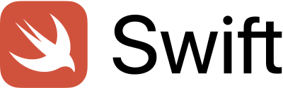

# 概述

_在移动iOS Swift™应用程序中实施Experience Cloud_ ，是移动应用程序开发人员的理想起点，他们希望了解如何在其iOS Swift应用程序中实施Adobe Experience cloud解决方案。

每个课程都包含操作方法练习和基本信息，帮助您实施Experience Cloud并了解其价值。  为您提供了一个演示版Swift应用程序以完成教程，以便您在安全的环境中学习底层技术。 完成本教程后，您应该准备好在自己的iOS Swift应用程序中开始实施所有Experience Cloud解决方案！

完成本教程后，您将能够：

* 创建移动启动属性

* 在Swift应用程序中安装Launch属性

* 实施以下Adobe Experience cloud解决方案：
   * **[Adobe Experience Platform Identity Service](id-service.md)**
   * **[Adobe Target](target-vec.md)**
   * **[Adobe Analytics](analytics.md)**
   * **[Adobe Audience Manager](audience-manager.md)**

* 通过开发、暂存和生产环境发布Launch中的更改

>[!NOTE] 以下平台也提供类似的多解决方案教程：
>
> * [在移动iOS Objective-C应用程序中实施Experience Cloud](/help/mobile-ios-objective-c-implementation/index.md)
> * [在移动Android™应用程序中实施Experience Cloud](/help/mobile-android-implementation/index.md)
* [在Launch的网站中实施Experience Cloud](/help/website-implementation/index.md)

## 先决条件

在这些课程中，假定您拥有Adobe ID和完成练习所需的权限。 否则，您可能需要联系您的Experience cloud管理员以请求访问权限。

* 对于Launch，您必须拥有“开发”、“批准”、“发布”、“管理扩展”和“管理环境”的权限。 For more information on Launch permissions, see [the documentation](https://docs.adobe.com/content/help/en/launch/using/reference/admin/user-permissions.html).
* 对于Target，您必须具有Adobe Target界面的审批者级别访问权限
* 对于Adobe Analytics，您必须了解跟踪服务器以及要用于完成本教程的报表包

此外，还假定您熟悉Swift的iOS开发。 你不必成为Swift的大师，就能完成课程，但如果你能轻松阅读和理解代码，你将从中获得更多的回报。

## 关于课程

在这些课程中，您将使用自己的Experience cloud组织将Adobe Experience cloud实施到名为“[Bus Booking](https://github.com/Adobe-Marketing-Cloud/busbooking-mobileapps)”的演示应用程序中。 该应用程序具有一些简单的功能，使您能够先完成基本的Experience cloud移动实施，然后再在您自己的应用程序中完成。

## 获取工具

1. 必须使用Mac®来完成本教程
1. 下载 [Xcode](https://developer.apple.com/xcode/)
1. 下载巴士 [预订应用程序](https://github.com/Adobe-Marketing-Cloud/busbooking-mobileapps)
1. 安装 [Cocoapod](https://guides.cocoapods.org/using/getting-started.html)

开始吧！

[下一个“创建启动项属性”&gt;](launch-create-a-property.md)

_Apple、Apple徽标、iPad、iPhone、iPod和iPod touch是Apple Inc.在美国和其他国家／地区的注册商标。 Swift和Swift徽标是Apple Inc.的商标。_