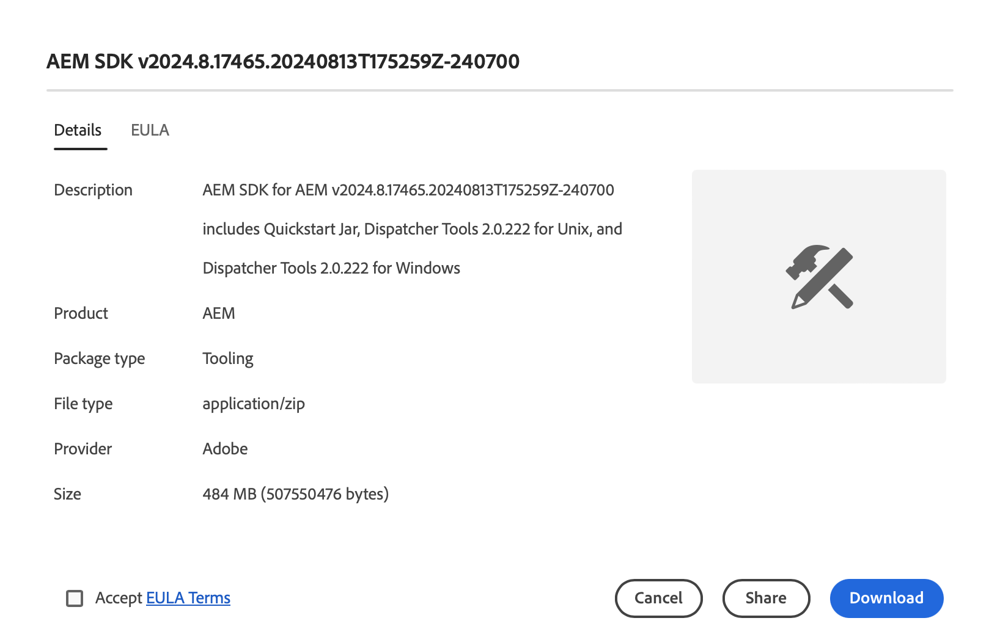

# 软件分发

了解如何使用Software Distribution下载Adobe Experience Cloud软件。

## 简介

Software Distribution提供了高效的Adobe Experience Cloud软件查找和下载体验。 经批准的Adobe软件包和合作伙伴公司的软件包可用于以下产品：

1. **Adobe Experience Manager** — 与服务和维护、安全性、工具等相关的所有功能 — 适用于所有受支持的AEM版本
1. **Adobe Experience Manager作为[!UICONTROL Cloud Service]** - [!UICONTROL AEM Cloud SDK]、[!UICONTROL AEM Cloud]迁移工具等
1. **Adobe Campaign** — 所有当前[!DNL Campaign]安装程序版本和相关工具
1. **常规** — 通用工具，包括面向Adobe客户的[!DNL Oracle] JDK

使用Software Distribution非常简单，如下所示：

1. [访问Software Distribution](#accessing)
1. [选择您的产品](#selecting)
1. [正在查找您的下载](#finding)
1. [下载软件](#downloading)

## 访问 Software Distribution {#accessing}

要访问Software Distribution，请转到[`https://experience.adobe.com/downloads`](https://experience.adobe.com/downloads)并使用您的Adobe ID登录到[!UICONTROL Software Distribution]。

## 选择您的产品 {#selecting}

Software Distribution UI按产品进行组织，如菜单中所示。

您到达了&#x200B;**常规**&#x200B;选项卡，您可以在其中找到通用软件下载。

点按或单击要下载软件的菜单中的产品。 只有贵组织已许可的产品才可供下载。

## 正在查找您的下载 {#finding}

选择所需的产品选项卡后，您将看到所有相关下载。 使用左侧面板中的搜索筛选器快速查找下载内容。 筛选器选项因产品而异。

## 下载软件 {#downloading}

通过点按或单击显示的下载，将打开一个对话框，为您提供有关下载的更多信息。 例如，您可以看到描述、提供程序名称和EULA。

您必须通过选择&#x200B;**接受EULA条款**&#x200B;来接受EULA以启用&#x200B;**下载**&#x200B;按钮。

您还可以通过点按或单击&#x200B;**共享**&#x200B;来复制该URL，以共享指向该特定下载的链接。

## 包共享 {#package-share}

在2020年6月，[!UICONTROL Software Distribution]替换了AEM的[!UICONTROL 包共享]和[!DNL Campaign]的[!DNL Neolane]。 直观的用户界面、简化的搜索和大幅提升的下载速度都使下载Experience Cloud产品的软件包获得更好的使用Software Distribution的体验。

>[!IMPORTANT]
>
>来自[!UICONTROL Package Share]或[!DNL Neolane]的登录凭据无法用于[!UICONTROL Software Distribution]，后者提供使用Adobe范围的安全标准登录的功能。 如果您不知道自己的Adobe ID，请联系您组织中的支持管理员。

>[!NOTE]
>
>[!UICONTROL Software Distribution] 仅支持浏览器下载。如果使用 AEM [!UICONTROL Package Manager] 进行新安装，则建议将包下载到本地文件夹并从此处安装包。
