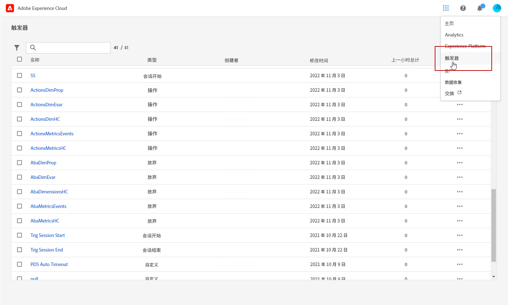

# 创建 Experience Cloud 触发器 {#create-triggers}

>[!NOTE]
>
> Experience Cloud 触发器的新用户界面提供一种直观的体验以管理消费者行为并使用户体验个性化。要切换回以前的界面，请单击&#x200B;**[!UICONTROL 转到经典模式]**&#x200B;按钮。

创建触发器并配置触发器的条件。例如，您可以指定访问期间触发器规则的条件，如量度（购物车放弃）或维度（产品名称）。当满足规则时，触发器会运行。

1. 在Experience Cloud中，选择解决方案切换器菜单，然后 **[!UICONTROL 触发器]**.

   

1. 从您的触发器主页，单击&#x200B;**[!UICONTROL 创建触发器]**，然后指定触发器的类型。

   有三种类型的触发器可用：

   * **[!UICONTROL 放弃：]**&#x200B;可创建触发器，以便在访客查看产品却未将任何东西添加到购物车时触发。

   * **[!UICONTROL 操作：]**&#x200B;可创建触发器，以便在例如新闻稿注册、电子邮件订阅或信用卡申请（确认）后触发。如果您是零售商，则可以针对注册会员计划的访客创建一个触发器。在媒体和娱乐业中，可以为观看特定节目并且您可能想要收集调查结果的访客创建触发器。

   * **[!UICONTROL 会话开始和会话结束：]**&#x200B;为会话开始和会话结束事件创建触发器。

   

1. 将&#x200B;**[!UICONTROL 名称]**&#x200B;和&#x200B;**[!UICONTROL 描述]**&#x200B;添加到您的触发器。

1. 选择用于此触发器的 Analytics **[!UICONTROL 报表包]**。此设置标识要使用的报表数据。

   [了解有关报表包的更多信息](https://experienceleague.adobe.com/docs/analytics/admin/admin-tools/manage-report-suites/c-new-report-suite/t-create-a-report-suite.html){target="_blank"}.

1. 选择&#x200B;]**无操作多久后触发**[!UICONTROL &#x200B;有效期。

1. 可从&#x200B;**[!UICONTROL 访问必须包括]**&#x200B;和&#x200B;**[!UICONTROL 访问不得包括]**&#x200B;类别中定义希望或不希望发生的标准或访客行为。您可以在容器内或容器之间指定 **And** 或 **Or** 逻辑，具体取决于您确定的标准。

   例如，一个简单的购物车放弃触发器规则可以是：

   * **[!UICONTROL 访问必须包括]**：`Carts (metric) Is greater or equal to 1` 以面向购物车中至少有一件商品的访客。
   * **[!UICONTROL 访问不得包括]**：`Checkout (metric) Exists.` 以删除购买了其购物车中商品的访客。

   

1. 单击&#x200B;**[!UICONTROL 容器]**&#x200B;以建立和保存定义触发器的规则、条件或筛选器。要使事件同时发生，您应该将其置于同一容器中。

   每个容器在点击级别单独处理，即如果用 **[!UICONTROL And]** 运算符连接两个容器，则只有当两次点击满足要求时，规则才符合要求。

1. 从&#x200B;**[!UICONTROL 元数据]**&#x200B;字段中，单击 **[!UICONTROL + 维度]**&#x200B;以选择特定的 Campaign 维度或与访客行为相关的变量。

   

1. 单击&#x200B;**[!UICONTROL 保存]**。

1. 从列表中选择您新创建的&#x200B;**[!UICONTROL 触发器]**&#x200B;以访问触发器的详细报告。

   

1. 可从触发器的详细视图中访问有关触发了多少触发器的报告。如果需要，您可以使用铅笔图标编辑触发器。

   
