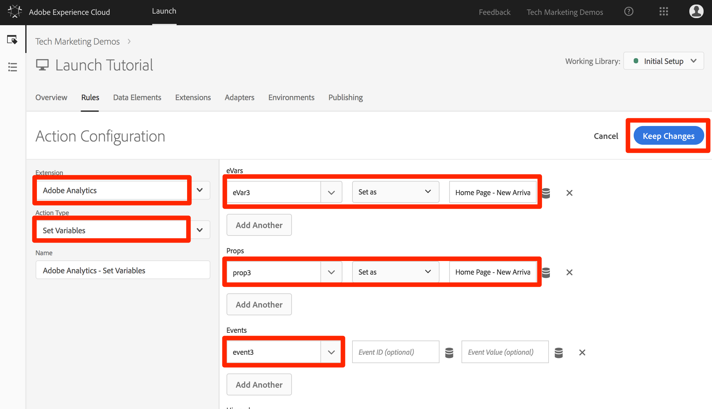
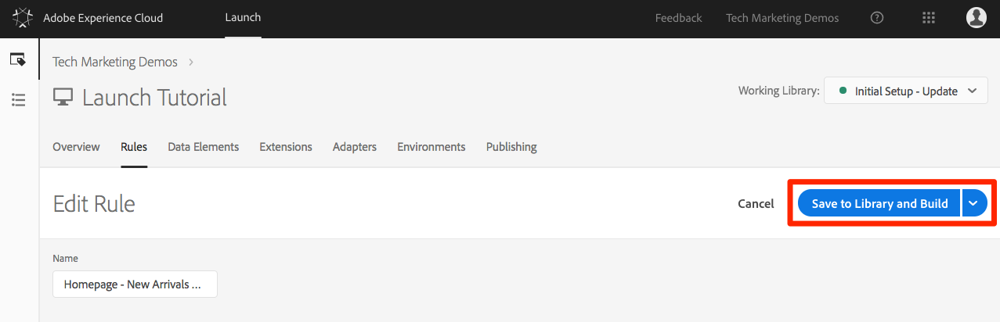
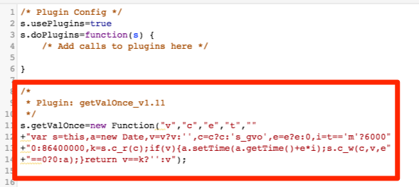

# 添加 Adobe Analytics

在本课中，您将实施 [Adobe Analytics扩展](https://docs.adobe.com/content/help/en/launch/using/extensions-ref/adobe-extension/analytics-extension/overview.html) ，并创建将数据发送到Adobe Analytics的规则。

[Adobe Analytics](https://docs.adobe.com/content/help/en/analytics/landing/home.html) 是一款行业领先的解决方案，可帮助您充分了解客户的行为和需求，并根据客户情报掌控自己的业务发展方向。

## 学习目标

在本课程结束后，您将能够：

1. 添加Adobe Analytics扩展
1. 使用该扩展设置全局变量
1. 添加页面查看信标
1. 使用规则添加其他变量
1. 添加“点击跟踪”信标和其他基于事件的信标
1. 添加Analytics插件

在Launch中，可以为Analytics实施许多内容。 本课程并非详尽无遗，但应为您详细介绍在您自己的站点中实施所需的主要技术。

## 先决条件

You should have already completed the lessons in [Configure Launch](launch.md) and [Add the Identity Service](id-service.md).

此外，您至少需要一个报表包ID和跟踪服务器。 如果您没有可用于本教程的测试／开发报告套件，请创建一个。 如果不确定如何执行此操作，请参阅[本文档](https://docs.adobe.com/content/help/en/analytics/admin/manage-report-suites/new-report-suite/new-report-suite.html)。您可以从当前实施、Adobe顾问或客户关怀代表中检索跟踪服务器。

## 添加 Analytics 扩展

Analytics扩展包括两个主要部分：

1. 扩展配置，用于管理核心 AppMeasurement.js 库设置并可设置全局变量
1. 规则操作，用于执行以下操作：
   1. 设置变量
   1. 清除变量
   1. 发送分析信标

**添加Analytics扩展**

1. 转到“扩 **[!UICONTROL 展”&gt;“目录”]**
1. 找到Adobe Analytics扩展
1. Click **[!UICONTROL Install]**

   

1. 在“ [!UICONTROL 库管理”&gt;“报表包”下]，输入要与每个启动环境一起使用的报表包ID。 请注意，在开始在框中键入内容时，您将看到所有报表包的预填充列表。 （本教程中为所有环境都可以使用一个报表包，但在现实生活中，您需要使用单独的报表包，如下图所示）

   

   >[!TIP] 我们建议使用“ [!UICONTROL 为我管理库] ”选项作为“库管理”设置，因为这样可以更轻松地使 `AppMeasurement.js` 库保持最新状态。

1. 在“ [!UICONTROL 常规”&gt;“跟踪服务器]”下，输入跟踪服务器，例如“`tmd.sc.omtrdc.net`”。 Enter your SSL Tracking Server if your site supports `https://`

   

1. 在“全 [!UICONTROL 局变量”部分]，使用数据元素 [!UICONTROL 设置“页面名称]`Page Name` ”变量。 单击数  ，打开模态并选择页面数 `Page Name` 据元素)

1. 单击“ **[!UICONTROL 保存到库并构建”]**

   

>[!NOTE]  全局变量可以在扩展配置或规则操作中进行设置。Be aware that when setting variables in the extension configuration, the data layer must be defined *before* the Launch embed codes.

## 发送页面查看信标

现在，您将创建一个规则以触发分析信标，该信标将发送在扩展配 [!UICONTROL 置中设置的页面名称] 变量。

You have already created an "All Pages - Library Loaded" rule in the [Add a Data Element, a Rule and a Library](launch-data-elements-rules.md) lesson of this tutorial, which is triggered on every page when the Launch library loads. 您也 *可以将此规则* 用于Analytics，但是，此设置要求在启动嵌入代码之前定义Analytics信标中使用的所有数据层属性。 为使数据收集更灵活，您将创建在DOM Ready上触发的新“所有页面”规则以触发分析信标。

**发送页面查看信标**

1. 转到顶部导 **[!UICONTROL 航中]** “规则”部分，然后单击添加 **[!UICONTROL 规则]**

   

1. Name the rule `All Pages - DOM Ready`
1. Click **[!UICONTROL Events &gt; Add]** to open the `Event Configuration` screen

   

1. 选 **[!UICONTROL 择事件类型&gt; DOM Ready]** （请注意，规则的顺序为“50”）
1. Click **[!UICONTROL Keep Changes]**
   

1. Under Actions, click the  to add a new action

   

1. 选择“ **[!UICONTROL 扩展”&gt;“Adobe Analytics”]**

1. 选择 **[!UICONTROL 操作类型&gt;发送信标]**

1. 将 Tracking 保留设置为 `s.t()`。Note that if you wanted to make an `s.tl()` call in a click-event rule you could do that using the Send Beacon action, as well.

1. 单击“保 **[!UICONTROL 持更改]** ”按钮

   

1. 单击“ **[!UICONTROL 保存到库并构建”]**

   

### 验证页面查看信标

既然您已创建规则来发送Analytics信标，那么您应该可以在Experience cloud调试器中查看请求。

1. Open the [Luma site](https://luma.enablementadobe.com/content/luma/us/en.html) in your Chrome browser
1. 单击调试器图  ，打开 **[!UICONTROL Adobe Experience Cloud调试器]**
1. Make sure the Debugger is mapping the Launch property to *your* Development environment, as described in the [earlier lesson](launch-switch-environments.md)

   

1. 单击以打开“Analytics”（分析）选项卡
1. 展开“报表包”名称以显示向其发出的所有请求
1. 确认已使用页面名称变量和值触发请求

   

>[!NOTE]  如果未显示页面名称，请回溯本页面上列出的各个步骤，以确保未遗漏任何内容。

## 使用规则添加变量

When you configured the Analytics Extension, you populated the `pageName` variable in the extension configuration. 如果在 Launch 嵌入代码加载之前页面上就有可用的值，那么也可以在扩展配置中填充其他全局变量，例如 eVar 和 prop。

设置变量以及事件的更灵活位置是使用动作的规则 `Set Variables` 中。 规则允许您在不同的条件下设置不同的Analytics变量和事件。 For example, you could set the `prodView` only on product detail pages and the `purchase` event only on order confirmation pages. 本节将教您如何使用规则设置变量。

### 用例

产品详细信息页面 (PDP) 是零售网站上的重要数据收集点。通常，您希望Analytics注册已发生产品查看以及已查看的产品。 这有助于您了解哪些产品在客户中受欢迎。在媒体站点上，文章或视频页面可以使用与本节中使用的跟踪技术类似的跟踪技术。  When you load a Product Detail Page, you might want to put that value into a "Page Type" `eVar`, as well as set some events and the product id. 这样，我们就可以在分析中看到以下内容：

1. 产品详细信息页面的加载次数
1. 查看哪些特定产品以及查看次数
1. 其他因素（营销活动、搜索等）如何影响PDP的人员加载量

### 为页面类型创建数据元素

首先，您需要确定哪些页面是“产品详细信息”页面。 您将使用数据元素执行此操作。

**为页面类型创建数据元素**

1. 单击 **[!UICONTROL 顶部导航中的]** “数据元素”
1. 单击 **[!UICONTROL 添加数据元素]**

   

1. Name the data element `Page Type`
1. 选择“ **[!UICONTROL 数据元素类型”&gt;“JavaScript变量”]**
1. 使 `digitalData.page.category.type` 用 `JavaScript variable name`
1. Check the `Clean text` and `Force Lower Case` options
1. 单击“ **[!UICONTROL 保存到库并构建”]**

   

### 为产品ID创建数据元素

接下来，您将收集包含数据元素的当前“产品详细信息”页面的产品ID

**为产品ID创建数据元素**

1. 单击 **[!UICONTROL 顶部导航中的]** “数据元素”
1. 单击 **[!UICONTROL 添加数据元素]**

   

1. Name the data element `Product Id`
1. 选择“ **[!UICONTROL 数据元素类型”&gt;“JavaScript变量”]**
1. 使 `digitalData.product.0.productInfo.sku` 用 `JavaScript variable name`
1. Check the `Force lowercase value` option
1. Check the `Clean text` option
1. 单击“ **[!UICONTROL 保存到库并构建”]**

   

### 添加 Adobe Analytics 产品字符串扩展

If you are already familiar with Adobe Analytics implementations, you are probably familiar with the [products variable](https://docs.adobe.com/content/help/en/analytics/components/variables/dimensions-reports/reports-products.html). products变量的语法很特定，其使用方式因上下文而异。 为了帮助在Launch中更轻松地填充产品变量，已在Launch扩展市场中创建了三个额外的扩展！ 在本节中，您将添加由Adobe Consulting创建的扩展，以在“产品详细信息”页面上使用。

**添加扩展名的步`Adobe Analytics Product String`骤**

1. 转到“扩 [!UICONTROL 展&gt;目录] ”页
1. 查找Adobe Consulting services `Adobe Analytics Product String` 的扩展，然后单击“安 **[!UICONTROL 装”]**
   
1. 花点时间阅读说明
1. 单击“ **[!UICONTROL 保存到库并构建”]**

   

### 为产品详细信息页面创建规则

现在，您将使用新的数据元素和扩展来构建您的产品详细信息页面规则。 对于此功能，您将创建由DOM Ready触发的另一页加载规则。 However, you will use a condition so that it only fires on the Product Detail pages and the order setting so that it fires _before_ the rule that sends the beacon.

**构建“产品详细信息”页面规则**

1. 转到顶部导 **[!UICONTROL 航中]** “规则”部分，然后单击添加 **[!UICONTROL 规则]**

   

1. Name the rule `Product Details - DOM Ready - 40`
1. Click **[!UICONTROL Events &gt; Add]** to open the `Event Configuration` screen

   

1. 选择“ **[!UICONTROL 事件类型”&gt;“DOM就绪”]**
1. Set the **[!UICONTROL Order]** to 40, so that the rule will run *before* the rule containing the Analytics &gt; Send Beacon action
1. Click **[!UICONTROL Keep Changes]**
   

1. 在“ **[!UICONTROL 条件]**”下，单击“  ，打开屏 `Condition Configuration` 幕
   

   1. 选择 **[!UICONTROL 条件类型&gt;值比较]**
   1. Use the data element picker, choose `Page Type` in the first field
   1. 从比 **[!UICONTROL 较运算符下拉列表中]** ，选择包含
   1. 在下一个字段类 `product-page` 型中（这是从PDP上的数据层提取的页面类型值的唯一部分）
   1. Click **[!UICONTROL Keep Changes]**

      

1. Under Actions, click the  to add a new action

   

1. 选择“ **[!UICONTROL 扩展”&gt;“Adobe Analytics”]**
1. 选择“ **[!UICONTROL 操作类型”&gt;“设置变量”]**
1. 选择 **[!UICONTROL eVar1 &gt;设置为]** ，然后输入 `product detail page`
1. Set **[!UICONTROL event1]**, leaving the optional values blank
1. 在“活动”下，单击“添 **[!UICONTROL 加其他]** ”按钮
1. Set the **[!UICONTROL prodView]** event, leaving the optional values blank
1. Click **[!UICONTROL Keep Changes]**

   

1. Under Actions, click the  to add a new action

   

1. 选择“ **[!UICONTROL 扩展”&gt;“Adobe Analytics产品字符串”]**
1. 选择 **[!UICONTROL 操作类型&gt;设置s.products]**

1. 在“分 **[!UICONTROL 析电子商务事件”(Analytics E-commerce Event]** )部分，选择 **[!UICONTROL prodView]**

1. 在产品 **[!UICONTROL 数据的数据层变量部分]** ，使用数据元素选取器选择数 `Product Id` 据元素

1. Click **[!UICONTROL Keep Changes]**

   

1. 单击“ **[!UICONTROL 保存到库并构建”]**

   

### 验证产品详细信息页面数据

您刚刚创建了一个规则，在发送信标之前设置变量。 您现在应能够在Experience Cloud调试器中查看点击中的新数据。

**验证“产品详细信息”页面数据**

1. Open the [Luma site](https://luma.enablementadobe.com/content/luma/us/en.html) in your Chrome browser
1. 导航到任何产品详细信息页面
1. 单击调试器图标  ，打开 **[!UICONTROL Adobe Experience Cloud调试器]**
1. 单击“Analytics”（分析）选项卡
1. 扩展您的报表包
1. Notice the Product Detail Variables that are now in the debugger, namely that `eVar1` has been set to "product detail page", that the `Events` variable has been set to "event1" and "prodView", that the products variable is set with the product id of the product you are viewing, and that your Page Name is still set by the Analytics extension

   

## 发送跟踪链接信标

页面加载时，通常会触发由 `s.t()` 函数触发的页面加载信标。This automatically increments a `page view` metric for the page listed in the `pageName` variable.

但是，有时您不希望增加站点上的页面查看次数，因为所执行的操作与页面查看“较小”（或者可能只是不同）。 In this case, you will use the `s.tl()` function, which is commonly referred to as a "track link" request. 虽然它称为跟踪链接请求，但不需要在单击链接时触发。It can be triggered by *any* of the events that are available to you in the Launch rule builder, including your own custom JavaScript.

在本教程中，您将使用最 `s.tl()` 酷的JavaScript事件之一（事件）触发调 `Enters Viewport` 用。

### 用例

对于此用例，您希望了解人们是否在Luma主页上向下滚动到足以查看我们页面的 *New Arrivals* （新到访）部分。 我们公司内部对于人们是否看到该部分存在一些不一致，因此您希望使用Analytics确定真相。

### 在启动项中创建规则

1. 转到顶部导 **[!UICONTROL 航中]** “规则”部分，然后单击“添 **[!UICONTROL 加规则”]**
   
1. Name the rule `Homepage - New Arrivals enters Viewport`
1. Click **[!UICONTROL Events &gt; Add]** to open the `Event Configuration` screen

   

1. 选择“ **[!UICONTROL 事件类型”&gt;“进入视区”]**。 这将显示一个字段，您需要在其中输入CSS选择器，该选择器将标识页面上在进入浏览器视图时应触发规则的项目。
1. 返回Luma主页，向下滚动到“New Arrivals”部分。
1. 右键单击“NEW ARRIVALS”标题与此部分所含项目之间的空白处，然后从右键单击菜单中选择 `Inspect`。这样你就能接近你想要的。
1. 就在那里，可能就在选定部分下方，您正在查找带有的div `class="we-productgrid aem-GridColumn aem-GridColumn--default--12"`。 找到此元素。
1. 右键单击此元素，然后选择“复制” **[!UICONTROL &gt;“复制选择器”]**

   

1. 返回到“启动”，并将此值从剪贴板粘贴到标有标签的字段中 `Elements matching the CSS selector`。
   1. 在附注中，由您决定如何识别CSS选择器。 此方法有点脆弱，因为页面上的某些更改可能会破坏此选择器。 在Launch中使用任何CSS选择器时，请考虑这一点。
1. Click **[!UICONTROL Keep Changes]**
   

1. 在“条件”下，单  ，以添加新条件
1. 选择 **[!UICONTROL 条件类型&gt;值比较]**
1. Use the data element picker, choose `Page Name` in the first field
1. 从比 **[!UICONTROL 较运算符下拉列表中选择]** “等于”
1. 在下一个字段类 `content:we-retail:us:en` 型中（这是从数据层提取的主页的页面名称——我们只希望此规则在主页上运行）
1. Click **[!UICONTROL Keep Changes]**

   

1. Under Actions, click the  to add a new action
1. 选择“ **[!UICONTROL 扩展”&gt;“Adobe Analytics”]**
1. 选择“ **[!UICONTROL 操作类型”&gt;“设置变量”]**
1. Set `eVar3` to `Home Page - New Arrivals`
1. Set `prop3` to `Home Page - New Arrivals`
1. Set the `Events` variable to `event3`
1. Click **[!UICONTROL Keep Changes]**

   

1. Under Actions, click the  to add another new action

   

1. 选择“ **[!UICONTROL 扩展”&gt;“Adobe Analytics”]**
1. 选择 **[!UICONTROL 操作类型&gt;发送信标]**
1. Choose the **[!UICONTROL s.tl()]** tracking option
1. 在“链 **[!UICONTROL 接名称]** ”字段中，输入 `Scrolled down to New Arrivals`。 此值将放入Analytics的“自定义链接”报表中。
1. Click **[!UICONTROL Keep Changes]**

   

1. 单击“ **[!UICONTROL 保存到库并构建”]**

   

### 验证跟踪链接信标

现在，您需要确保在向下滚动到我们网站主页的“New Arrivals”部分时，此点击会进入。 首次加载主页时，不应发出请求，但是当您向下滚动并看到章节时，点击会触发我们的新值。

1. 在Chrome浏 [览器中打开](https://luma.enablementadobe.com/content/luma/us/en.html) Luma站点，并确保您位于主页顶部。
1. 单击调 **[!UICONTROL 试器图]** ，打开 [!UICONTROL Adobe Experience Cloud调试器]
1. 单击“Analytics”（分析）选项卡
1. 扩展您的报表包的点击量
1. 请注意，主页的普通页面查看点击次数与页面名称等有关。 （但eVar3或prop3中没有）。

   

1. 使调试器保持打开状态，在您的站点上向下滚动，直到您看到“新到达”部分
1. 再次查看调试器，此时应该出现另一次Analytics点击。 此点击应具有与您设置的s.tl()点击关联的参数，即：
   1. `LinkType = "link_o"` （这表示点击是自定义链接点击，而非页面查看点击）
   1. `LinkName = "Scrolled down to New Arrivals"`
   1. `prop3 = "Home Page - New Arrivals"`
   1. `eVar3 = "Home Page - New Arrivals"`
   1. `Events = "event3"`

      

## 添加插件

插件是一段JavaScript代码，您可以将其添加到实现中以执行产品中未内置的特定功能。 插件可以由您、其他Adobe客户／合作伙伴或Adobe Consulting构建。

要实施插件，基本上有三个步骤：

1. 包括doPlugins函数，其中将引用插件
1. 为插件添加主函数代码
1. 包含用于调用函数、设置变量和执行其他操作的代码。

### 使Analytics对象可全局访问

如果要添加doPlugins函数（见下文）并使用插件，则需要选中一个框以在Analytics实施中全局提供Analytics“s”对象。

1. 转到“扩 **[!UICONTROL 展”&gt;“已安装”]**

1. 在Adobe Analytics扩展中，单击“配 **[!UICONTROL 置”]**

   

1. 在“ **[!UICONTROL 库管理]**”下，选择标有标签的框 `Make tracker globally accessible`。 正如您在帮助泡泡中看到的，这将使跟踪器在窗口下全局范围，这在您在客户JavaScript中引用它时很重要。

### 包括doPlugins函数

要添加插件，您需要添加一个名为doPlugins的函数。 默认情况下不添加此函数，但添加后，该函数由AppMeasurement库处理，并在点击被发送到Adobe Analytics时最后调用。 因此，您可以使用此函数运行某个 JavaScript，以设置更容易通过此方式进行设置的变量。

1. While still in the Analytics extension, scroll down and expand the section titled `Configure Tracker Using Custom Code.`
1. Click **[!UICONTROL Open Editor]**
1. 将以下代码粘贴到代码编辑器中：

   ```javascript
   /* Plugin Config */
   s.usePlugins=true
   s.doPlugins=function(s) {
   /* Add calls to plugins here */
   }
   ```

1. 使此窗口保持打开状态以执行下一步

### 为插件添加函数代码

实际上，您将调用此代码中的两个插件，但其中一个内置于AppMeasurement库中，因此您无需添加要调用的函数即可。 但是，对于第二个，您也需要添加函数代码。 此函数称为getValOnce()。

### getValOnce()插件

此插件的目的是防止在访客刷新页面或使用浏览器的返回按钮返回设置值的页面时，在代码中的值被错误复制。 在本课中，您将使用它防止重复 `clickthrough` 该事件。

此插件的代码可在 [Analytics 文档](https://docs.adobe.com/content/help/en/analytics/implementation/javascript-implementation/plugins/getvalonce.html)中找到，但我们仍在此处提供，方便您复制/粘贴。

1. 复制以下代码

   ```javascript
   /*
   * Plugin: getValOnce_v1.11
   */
   s.getValOnce=new Function("v","c","e","t",""
   +"var s=this,a=new Date,v=v?v:'',c=c?c:'s_gvo',e=e?e:0,i=t=='m'?6000"
   +"0:86400000,k=s.c_r(c);if(v){a.setTime(a.getTime()+e*i);s.c_w(c,v,e"
   +"==0?0:a);}return v==k?'':v");
   ```

1. 将其粘贴到Analytics扩展的代码窗口中（如果尚未打开它，请按照上一步重新打开它），完全位于 **doPlugins函数** （不在其中）的下方。

   

您现在可以从doPlugins中调用此插件。

### 从 doPlugins 中调用插件

现在，该代码已存在并可被引用，您可以在doPlugins函数中调用插件。

首先，您将调用一个插件，该插件已并入AppMeasurement库，因此称为“实用程序”。 It is referred to as `s.Util.getQueryParam`, because it is part of the s object, is a built-in utility, and will grab values (based on a parameter) from the query string in the URL.

1. 复制以下代码：

   ```javascript
   s.campaign = s.Util.getQueryParam("cid");
   ```

1. 将其粘贴到doPlugins函数中。 This will look for a parameter called `cid` in the current page URL and place it into the s.campaign variable.
1. 现在，通过复制以下代码并将其粘贴到getQueryParam调用的正下方，调用getValOnce函数：

   ```javascript
   s.campaign=s.getValOnce(s.campaign,'s_cmp',30);
   ```

   此代码将确保在30天内，同一值在一行中不多次发送（有关根据您的需要自定义此代码的方法，请参阅文档）。

   

1. 保存代码窗口
1. 单击“ **[!UICONTROL 保存到库并构建”]**

   

### 验证插件

现在，您可以确保增效工具正常工作。

**验证插件**

1. Open the [Luma site](https://luma.enablementadobe.com/content/luma/us/en.html) in your Chrome browser
1. 单击调试器图  ，打开 **[!UICONTROL Adobe Experience Cloud调试器]**
1. 单击“Analytics”（分析）选项卡
1. 扩展您的报表包
1. 注意，Analytics点击没有Campaign变量
1. Leaving the Debugger open, go back to the Luma site and add  `?cid=1234` to the URL and hit Enter to refresh the page with that query string included

   

1. Check the Debugger and confirm that there is a second Analytics request with a Campaign variable set to `1234`

   

1. 返回并再次刷新Luma页面，查询字符串仍在URL中
1. 检查调试器中的下一次点击，并且Campaign变量不应存在 **** ，因为getValOnce插件确保它不会重复，并且看起来就像是其他人从系列活动跟踪代码中输入的一样。

   

1. BONUS: You can test this over and over by changing the value of the `cid` parameter in the query string. The Campaign variable should only be there if it is the **first** time you run the page with the value. If you are not seeing the Campaign value in the debugger, simply change the value of the `cid` in the query string of the URL, hit enter, and you should see it again in the debugger.

   >[!NOTE] 实际上，从URL的查询字符串中提取参数有几种不同的方法，包括在Analytics扩展配置中。 但是，在这些其他非插件选项中，它们不能像此处使用getValOnce插件那样停止不必要的重复。 这是作者最喜欢的方法，但您应确定哪种方法最适合您和您的需求。

干得好！ 您已完成Analytics课程。 当然，您可以做许多其他事情来增强我们的Analytics实施，但希望这为您提供了满足其余需求所需的一些核心技能。

[下一个“添加Adobe Audience Manager”&gt;](audience-manager.md)
