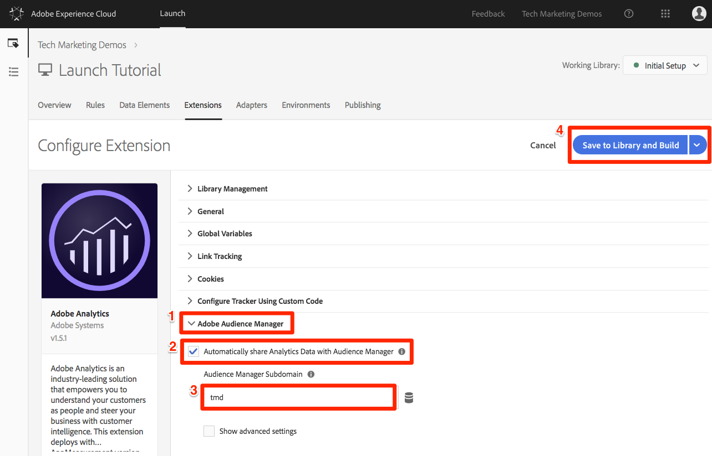

# 添加Adobe Audience Manager

本课将指导您完成启用“服务器端转发”的Adobe Audience Manager的步骤。

[Adobe Audience Manager](https://docs.adobe.com/content/help/en/audience-manager/user-guide/aam-home.html) (AAM)为在线受众数据管理提供行业领先的服务，为数字广告商和出版商提供控制和利用其数据资产来帮助推动销售成功所需的工具。

## 学习目标

在本课程结束后，您将能够：

1. 描述在网站中实施Audience Manager的两种主要方式
1. 使用分析信标的服务器端转发添加Audience Manager
1. 验证Audience manager实施

## 先决条件

要完成本课程，您需要：

1. 要完成配置启动、添 [加Adobe Analytics](launch.md)和添加Identity service中的 [课程，请执行以下操作](analytics.md)。

1. 管理员对Adobe Analytics的访问权限，以便您能够为本教程中使用的报表包启用服务器端转发。 或者，也可以按照下面的说明，请求贵组织的现有管理员为您执行此操作。

1. 您的“Audience Manager子域”（也称为“合作伙伴名称”、“合作伙伴ID”或“合作伙伴子域”）。 如果您的实际网站上已经实施了Audience Manager，则获取它的最简单方法是转到实际网站并打开调试器。 子域位于Audience manager部分的“摘要”选项卡上：

   

如果您尚未实施Audience Manager，请按照以下说明获取 [您的Audience Manager子域](https://docs.adobe.com/content/help/en/audience-manager-learn/tutorials/web-implementation/how-to-identify-your-partner-id-or-subdomain.html)。

## 实施选项

在网站中实施Audience Manager有两种方法：

* **服务器端转发(SSF)**-对于使用Adobe Analytics的客户，这是最简单、推荐的实施方式。 Adobe Analytics将数据转发到Adobe后端的AAM，允许在页面上减少一次请求。 这还支持关键集成功能，并符合Audience manager代码实施和部署的最佳实践。

* **客户端DIL**—— 此方法适用于没有Adobe Analytics的客户。 DIL代码（数据集成库代码， AAM javaScript配置代码）直接从网页向Audience manager发送数据。

由于您在本教程中已经部署了Adobe Analytics，您将使用服务器端转发来部署Audience Manager。 For a complete description and requirements list for Server-Side forwarding, please review the [documentation](https://docs.adobe.com/content/help/en/analytics/admin/admin-tools/server-side-forwarding/ssf.html), so that you are familiar with how it works, what is required, and how to validate.

## 启用服务器端转发

执行SSF实施有两个主要步骤：

1. 在Analytics Admin Console中打开“切换”，将数据从Analytics转发到每个报告包 *的Audience Manager*。
1. 将代码置于适当位置，即通过Launch完成。 为了使其正常工作，您需要安装Adobe Experience Platform Identity service扩展和Analytics扩展(您实际上不需要 ** AAM扩展，如下所述)。

### 在 Analytics Admin Console 中启用服务器端转发

需要在Adobe Analytics Admin Console中配置，才能开始将数据从Adobe Analytics转发到Adobe Audience Manager。 由于开始转发数据可能需要4个小时，因此您应首先执行此步骤。

#### 在Analytics Admin Console中启用SSF

1. 通过Experience Cloud UI登录Analytics。 如果您没有Analytics的管理员访问权限，则需要与Experience cloud或Analytics管理员交谈，为您分配访问权限或完成这些步骤。

   

1. 从Analytics的顶部导航中，选择 **[!UICONTROL Admin &gt; Report Suites]**，然后从列表中选择（多选）要转发到Audience Manager的报表包。

   

1. 从“报表包”屏幕中，在选择报表包的情况下，选择“编辑设置”&gt;“ **[!UICONTROL 常规”&gt;“服务器端转发”]**。

   

   >[!WARNING]  如上所述，您需要拥有管理员权限，才能查看此菜单项。

1. 在“服务器端转发”页面上，阅读信息并选中该框以为报表包启 **[!UICONTROL 用服务器端转发]** 。

1. Click **[!UICONTROL Save]**

   

>[!NOTE] 由于每个报表包都需要启用SSF，因此，在实际站点的报表包上部署SSF时，请不要忘记为实际报表包重复此步骤。
>
>此外，如果SSF选项灰显，您需要“将报表包映射到您的Experience Cloud组织”，以启用此选项。 [此文档](https://docs.adobe.com/content/help/en/core-services/interface/about-core-services/report-suite-mapping.html)对此进行了说明。

完成此步骤后，如果您启用了Adobe Experience Platform Identity Service，数据将从Analytics转发到AAM。 但是，要完成该过程，以便将响应从AAM正确返回到页面（以及通过Audience Analytics功能返回到Analytics），您还必须在Launch中完成以下步骤。 别担心，这很简单。

### 在 Launch 中启用服务器端转发

这是启用SSF的两个步骤中的第二个。 您已在Analytics Admin Console中翻转了开关，现在您只需添加代码，如果您只选中了正确的框，Launch将为您执行此操作。

>[!NOTE] 要将Analytics数据的服务器端转发到AAM中，我们将实际在Launch中编辑／配置Analytics扩展，而 **不是** AAM扩展。 AAM扩展专门用于客户端DIL实施，适用于没有Adobe Analytics的用户。 因此，当他们将您发送到Analytics扩展以设置此功能时，以下步骤是正确的。

#### 在启动中启用SSF

1. 转到“扩 **[!UICONTROL 展”&gt;“已安装]** ”，然后单击以配置Analytics扩展。

   

1. 展开部 `Adobe Audience Manager` 分

1. 选中该复选框， **[!UICONTROL 与Audience Manager自动共享分析数据]**。 这会将Audience Manager的“模块”（代码）添加到Analytics实施 `AppMeasurement.js` 中。

1. 添加您的“Audience Manager子域”（也称为“合作伙伴名称”、“合作伙伴ID”或“合作伙伴子域”）。 按照以下说明 [获取Audience Manager子域](https://docs.adobe.com/content/help/en/audience-manager-learn/tutorials/web-implementation/how-to-identify-your-partner-id-or-subdomain.html)。

1. 单击“ **[!UICONTROL 保存到库并构建”]**

   

服务器端转发代码现已实现！

### 验证服务器端转发

验证服务器端转发是否已启动并正在运行的主要方法是查看对任何Adobe Analytics点击的响应。 我们马上就到。 同时，让我们检查一些其他事情，这些事情可以帮助我们确保它按我们希望的方式工作。

#### 验证代码是否正确加载

Adobe Launch安装的用于处理转发的代码，特别是AAM到页面的响应，称为Audience Manager“模块”。 我们可以使用Experience Cloud调试器来确保它已加载。

1. 打开Luma站点
1. 单击浏览器中的调试器图标以打开Experience cloud调试器
1. 保留在“摘要”选项卡上，向下滚动到“分析”部分
1. Verify that **AudienceManagement** is listed under the Modules section

   

#### 在 Debugger 中验证合作伙伴 ID

接下来，我们还可以验证调试器是否正在获取正确的“合作伙伴ID”（AKA合作伙伴子域等）从代码中。

1. 当仍处于调试器中且仍位于“摘要”选项卡上时，向下滚动到Audience Manager部分
1. 在“Partner”下验证您的Partner ID/Subdomain

   

>[!WARNING] 您可能会注意到，调试器的Audience manager部分引用“DIL”（即“数据集成库”），通常指客户端实施，而不是我们在此处实施的服务器端方法。 事实是，AAM“模块”（在此SSF方法中使用）使用与客户端DIL库相同的大量代码，因此此调试器当前正按此方式报告它。 如果您遵循了本教程中的步骤，并且验证部分中的其余项目正确，您可以放心，服务器端转发正在运行。

#### 验证Analytics请求和响应

好吧，这是大事。 如果您不从Analytics向Audience Manager发送数据的服务器端转发，则实际上对Analytics信标没有响应（除2x2像素外）。 但是，如果您正在执行SSF，则有一些项目可以在Analytics请求和响应中进行验证，这些项目会告知您SSF正常工作。
不幸的是，目前，Experience cloud调试器不支持显示对信标的响应。 因此，您应使用其他调试器／数据包嗅探器，如Charles Proxy或浏览器的“开发人员工具”。

1. 在您的浏览器中打开“开发人员工具”并转到“网络”选项卡
1. 在筛选器字段中，键 `b/ss` 入将您看到的内容限制在Adobe Analytics请求中的类型
1. 刷新页面以查看Analytics请求

   

1. 在分析信标（请求）中，查找“回调”参数。 它将设置为这样： `s_c_il[1].doPostbacks`

   

1. 您将对分析信标做出响应。 它将包含对doPostbacks的引用（在请求中调用），最重要的是，它应该有一个“stuff”对象。 这是AAM区段ID将发送回浏览器的位置。 如果您有“stuff”对象，SSF正在工作！

   

>[!WARNING] 谨防错误的“成功”—如果有反应，而一切似乎都在起作用，请 **确保** “物品”对象。 如果不这样做，您可能会在回复中看到一条消息，说“status”:“SUCCESS”。 尽管听起来很疯狂，但这实际上证明它 **不能正确** 工作。 如果您看到这一点，则表示您已经完成了第二个步骤（启动项中的代码），但Analytics Admin Console中的转发（此部分的第一个步骤）尚未完成。 在这种情况下，您需要验证是否已在Analytics Admin Console中启用SSF。 如果你有，而且还没有4小时，请耐心点。

[下一个“Experience cloud集成”&gt;](integrations.md)