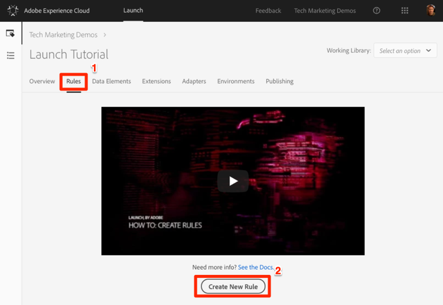
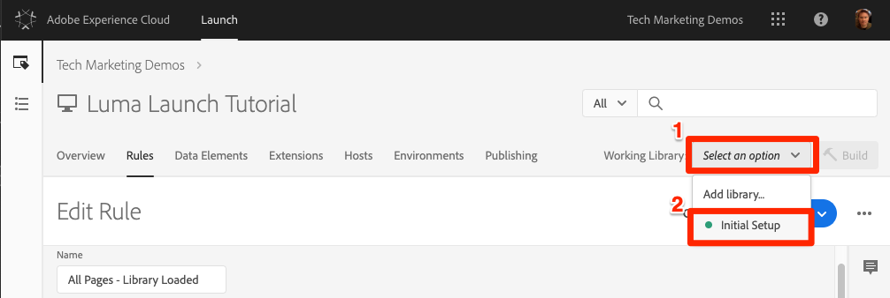

# 添加数据元素、规则和库

在本课中，您将创建您的第一个数据元素、规则和库。

数据元素和规则是Launch的基本构建块。 Data Elements会存储您要发送到营销和广告解决方案的属性，而Rules会在适当的条件下向这些解决方案发送请求。  库是在页面上加载以完成所有工作的JavaScript文件。 在本课中，您将使用这三种方法来改进示例页面。

## 学习目标

在本课程结束后，您将能够：

* 创建数据元素
* 创建规则
* 创建库
* 将更改添加到库
* 验证您的库是否正在 Web 浏览器中加载
* 使用“工作库”功能提高工作效率

## 为页面名称创建数据元素

数据元素是Launch的数据层版本。 他们可以存储您自己的数据层对象、cookie、本地存储对象、查询字符串参数、页面元素、元标记等的值。 在本练习中，您将为页面名称创建一个数据元素，稍后您将在Target和Analytics实施中使用该元素。

**创建数据元素**

1. 在顶部导航中，单击“数 **[!UICONTROL 据元素”]**

1. 由于您尚未在此属性中创建任何数据元素，因此将显示一个简短的视频，其中包含有关此主题的其他信息。 如有需要，请观看此视频。

1. Click the **[!UICONTROL Create New Data Element]** button:

   

1. Name the data element, e.g. `Page Name`

1. Use the [!UICONTROL JavaScript Variable] Data Element type to point to a value in your sample page's data layer: `digitalData.page.pageInfo.pageName`

1. Use "`not available`" as the [!UICONTROL Default Value]. The [!UICONTROL Default Value] tells Launch what value to use for the data element if your JavaScript Variable specified above is not found.

1. Check the boxes for **[!UICONTROL Force lowercase value]** and **[!UICONTROL Clean text]** to standardize the case and remove extraneous spaces

1. 保留 **[!UICONTROL “无]** ”作为“存 **[!UICONTROL 储持续时间]** ”设置，因为该值通常在每个页面上都不同

1. 单击“ **[!UICONTROL 保存]** ”按钮以保存数据元素

   。

>[!NOTE]**** DTM迁移程序：新的数据元素类型已添加到Launch中，而DTM中不存在这种类型。 其中一些新数据元素类型包括“本地存储”、“会话存储”、“页面信息”和“随机数”
<!-- -->
>[!NOTE]数据元素功 _能可以通过扩展进行扩展_。 例如，ContextHub扩展允许您使用扩展的功能添加数据元素。

## 创建规则

接下来，您将以简单的规则使用此数据元素。 规则是Launch中最强大的功能之一，允许您指定当访客与您的网站交互时应发生的情况。 当满足规则中概述的条件时，该规则将触发您指定的操作。

您即将创建一个规则，将页面名称数据元素值输出到浏览器控制台。

**创建规则**

1. In the top navigation, click **[!UICONTROL Rules]**

1. 由于您尚未在此属性中创建任何规则，因此将显示一个简短的视频，其中包含有关主题的其他信息。 如有需要，请观看此视频。

1. Click the **[!UICONTROL Create New Rule]** button:

   

1. Name the Rule `All Pages - Library Loaded`. 此命名约定指示规则将触发的位置和时间，使得在启动属性到期时更容易识别和重复使用。

1. 在“事件”下，单击&#x200B;**[!UICONTROL 添加]**。该事件告知Launch规则何时应触发，并且可能包括页面加载、单击、自定义JavaScript事件等。

   

   1. 对于事件类型，选择&#x200B;**[!UICONTROL 已加载库（页面顶部）]**。请注意，当您选择事件类型时，Launch会使用您的选择预填充该事件的名称。 另请注意，事件的默认顺序为50。 排序是Launch中的一项强大功能，当多个规则由同一事件触发时，它使您能够精确地控制操作顺序。 您将在教程的稍后部分使用此功能。

   1. 单击“保 **[!UICONTROL 持更改]** ”按钮
   

1. 由于此规则应在所有页面上触发，因此将“条 **[!UICONTROL 件]** ”留空。 如果您打开 Conditions 模式，则会发现条件可以根据各种选项（包括 URL、数据元素值、日期范围等）添加限制条件和排除条件。

1. Under Actions, click **[!UICONTROL Add]**

1. 选择“ **[!UICONTROL 操作类型”&gt;“自定义代码]**”，此时该选项是唯一的选项。 稍后在教程中，当您添加扩展时，会有更多的选项可用。

1. 选择 **[!UICONTROL &lt;/&gt;打开编辑器]** ，打开代码编辑器

   

1. 将以下内容添加到代码编辑器中。 此代码将将页面名称数据元素的值输出到浏览器控制台，以便您确认它正在工作：

   ```javascript
   console.log('The page name is '+_satellite.getVar('Page Name'));
   ```

1. 保存代码编辑器

   

1. On the Action configuration screen click **[!UICONTROL Keep Changes]**

1. Click **[!UICONTROL Save]** to save the rule

>[!NOTE]**** DTM迁移程序：在Launch中，规则是触发大多数营销像素所必需的。 例如，要触发Adobe Analytics信标，您必须使用规则指示Launch执行此操作。
>
> 规则构建器已在Launch中大幅重新设计和重新构建。
> 一些主要更改包括：
>
> * 只有一个规则构建器。DTM规则类型（如“页面底部”、“单击”和“直接调用”）只是规则构建器中的事件类型。 例如，当您需要将触发器从某个 DOM 就绪事件更改为自定义事件时，这可以让您更轻松地更新规则。
> * 有一个新的“自定义代码”事件类型
> * 扩展可以向规则构建器中添加新的事件类型。例如，Target 扩展最终会为其 [at.js 自定义事件](https://docs.adobe.com/content/help/en/target/using/implement-target/client-side/functions-overview/atjs-custom-events.html)添加内置支持，因此使用此功能不需要自定义代码。
> * 扩展可以向规则构建器添加新操作，通过取消对自定义代码的依赖来减少问题。 您将在本教程中使用其中的许多扩展操作。
> * 需要使用规则来触发与大多数营销工具相关的请求。这需要进行心态调整，尤其是对于设置客户ID、触发Analytics信标和触发Target请求等情况。


## 将更改保存到库

在启动界面中配置扩展、数据元素和规则的集合后，您需要将这些功能和逻辑打包到一组JavaScript代码中，您可以在网站上部署这些代码，这样，当访客访问网站时，营销标记会触发。 库是将执行此操作的一组JavaScript代码。

在前面的课程中，您在示例页面上实施了开发环境的嵌入代码。加载示例页面时，嵌入代码URL会返回404错误，因为尚未构建启动库并将其分配给环境。 现在，您将新数据元素和规则放入库中，这样样例页面就可以做点什么。

**添加和构建库**

1. Go to the [!UICONTROL Publishing] tab

1. Click **[!UICONTROL Add New Library]**

   

1. 将库命名为“初始设置”

1. 选择“ **[!UICONTROL 环境”&gt;“开发”]**

1. Click **[!UICONTROL Add All Changed Resources]**

   

1. 请注意，在单击“添 **[!UICONTROL 加所有更改的资源]** ”启动项后，将汇总您刚才所做的更改。

1. Click **[!UICONTROL Save &amp; Build for Development]**

   

片刻后，状态点将变为绿色，表示库已成功构建。


## 验证您的作品

现在验证您的规则是否按预期运行。

重新加载示例页面。如果查看“开发人员工具”-&gt;“网络”选项卡，您现在应看到启动库的200响应！


如果查看“开发人员工具”-&gt;“控制台”，您应看到文本“页面名称是主页”


恭喜您，您创建了您的第一个数据元素和规则，并构建了您的第一个启动库！

## 使用工作库功能

在启动项中进行大量更改时，每次要查看结果时，都不方便转到“发布”选项卡、添加更改和构建库。  现在您已创建“初始设置”库，可以使用名为“工作库”的功能快速保存更改并通过单步重建库。

对“所有页面——载入库”规则进行小幅更改。 In the top navigation, click **[!UICONTROL Rules]** and then click on the `All Pages - Library Loaded` rule to open it up.


在页面 `Edit Rule` 上，单击“工 ***[!UICONTROL 作库”下拉框]*** ，然后选择您的 `Initial Setup` 库。



选择库后，您应看到“保存”按钮现 **[!UICONTROL 在默认为“保存]** 到库和内部版本” ****。 在启动项中进行更改时，可以使用此选项将更改直接添加到工作库并重新构建。

测试一下。 打开“自定义代码”操作，只需在文本“页面名称为”后添加一个冒号，这样整个代码块就会显示：

```javascript
console.log('The page name is: '+_satellite.getVar('Page Name'));
```

保存代码，在动作中保留更改，现在单击“保存到库 **[!UICONTROL 并构建”按钮]** 。


等待片刻，直到“工作库”( [!UICONTROL Working Library] )下拉框旁重新显示绿点。 现在，重新加载示例页面，您应当看到控制台消息中反映的更改（您可能需要清除浏览器缓存并重新加载，才能看到对页面所做的更改）:


这是一种更快的工作方式，您将在教程的其余部分使用此方法。

[下一个“使用Experience Cloud调试器切换环境”&gt;](launch-switch-environments.md)
