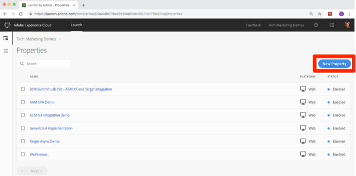

# 创建启动项属性

在本课中，您将创建您的第一个Launch属性。

资产基本上就是一个容器，在将标记部署到网站时可在其中填充扩展、规则、数据元素和库。

## 先决条件

要完成接下来的几个课程，您必须拥有在Launch中开发、批准、发布、管理扩展和管理环境的权限。 如果由于用户界面选项不可用而无法完成上述任何步骤，请联系您的Experience cloud管理员以请求访问权限。 For more information on Launch permissions, see [the documentation](https://docs.adobe.com/content/help/en/launch/using/reference/admin/user-permissions.html).

## 学习目标

在本课程结束后，您将能够：

* 登录Launch用户界面
* 创建新的启动项属性
* 配置启动项属性

## 转到 Launch

**要开始使用Launch**

1. 登录 [Adobe Experience Cloud](https://experiencecloud.adobe.com)

1. 单击“解决方  ，打开解决方案切换器

1. 从菜 **[!UICONTROL 单中选择]** “启动”使用图 

1. 在 **[!UICONTROL Adobe Experience Cloud Launch下]**，单击“转 **[!UICONTROL 到启动”按钮]**

   

You should now see the `Properties` screen (if no properties have ever been created in the account, this screen might be empty):

如果您经常使用Launch，您还可以将以下URL加入书签并直接登录 [https://launch.adobe.com](https://launch.adobe.com)

## 创建资产

资产基本上就是一个容器，在将标记部署到网站时可在其中填充扩展、规则、数据元素和库。资产可以是一个或多个域和子域的任意组合。您可以通过相似的方式管理和跟踪这些资产。例如，假定您有多个基于一个模板的网站，并希望在所有这些网站中跟踪相同的资产。您可以将一个资产应用于多个域。有关创建属性的详细信息，请参 [阅产品文档中的](https://docs.adobe.com/content/help/en/launch/using/reference/admin/companies-and-properties.html) “公司和属性”。

**创建属性**

1. 单击“新 **[!UICONTROL 建属性]** ”按钮：

   

1. 命名您的属性(例如 `Launch Tutorial` 或 `Daniel's Launch Tutorial`)
1. 作为域，输入 `enablementadobe.com` ，因为这是托管Luma演示站点的域。 尽管“域”字段是必填字段，但启动属性将在实施该字段的任何域上工作。 此字段的主要用途是在规则生成器中预填充菜单选项。
1. 单击“保 **[!UICONTROL 存]** ”按钮

   

您的新属性应显示在“属性”页面上。 Note that if you check the box next to the property name, options to **[!UICONTROL Configure]** or **[!UICONTROL Delete]** the property appear above the property list. 单击您的属性的名称(例如， `Launch Tutorial`)打开屏 `Overview` 幕。

[下一个“添加启动项嵌入代码”&gt;](launch-add-embed.md)
