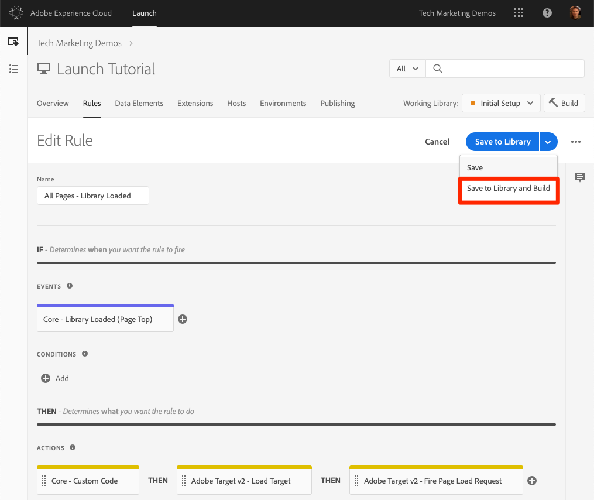
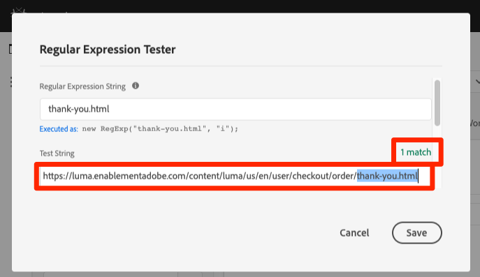

# 添加 Adobe Target

在本课中，我们将使用页面加载请求和自定 [义参数来实施](https://docs.adobe.com/content/help/en/launch/using/extensions-ref/adobe-extension/target-extension/overview.html) Adobe Target扩展。

[Adobe Target是Adobe Marketing](https://docs.adobe.com/content/help/en/target/using/target-home.html) cloud解决方案，它提供定制和个性化客户体验所需的一切功能，使您能够最大化网站和移动站点、应用程序、社交媒体和其他数字渠道的收入。

## 学习目标

在本课程结束后，您将能够：

* 添加预隐藏的代码片断，该代码片断用于在将Target与异步启动嵌入代码一起使用时管理闪烁
* 添加Target v2扩展
* 触发页面加载请求（以前称为“全局mbox”）
* 向页面加载请求添加参数
* 说明如何将配置文件和实体参数添加到页面加载请求
* 使用所需参数触发订单确认请求
* 说明如何添加高级配置，如库标题和库页脚代码
* 验证Target实施

## 先决条件

To complete the lessons in this section, you must first complete the lessons in [Configure Launch](launch.md) and [Add the Identity Service](id-service.md).

## 添加目标预隐藏代码片断

在开始之前，我们需要对Launch嵌入代码稍作更新。 当异步加载启动嵌入代码时，页面可能会在完全加载目标库并执行其内容交换之前完成呈现。 这可能导致“闪烁”，默认内容在被Target指定的个性化内容替换之前会短暂显示。 如果您希望避免这种闪烁，我们强烈建议在Launch的异步嵌入代码之前立即对特殊的预隐藏代码片断进行硬编码。

这已在Luma站点上完成，但让我们继续在示例页面上执行此操作，以便您了解实施。 复制以下代码行：

```html
<script>
    //prehiding snippet for Adobe Target with asynchronous Launch deployment
    (function(g,b,d,f){(function(a,c,d){if(a){var e=b.createElement("style");e.id=c;e.innerHTML=d;a.appendChild(e)}})(b.getElementsByTagName("head")[0],"at-body-style",d);setTimeout(function(){var a=b.getElementsByTagName("head")[0];if(a){var c=b.getElementById("at-body-style");c&&a.removeChild(c)}},f)})(window,document,"body {opacity: 0 !important}",3E3);
</script>
```

打开示例页面，并将其粘贴到启动项嵌入代码之前（如下图所示）（如果行号不同，不用担心）:将

重新加载示例页面。您会注意到该页面在显示前将隐藏三秒。 此行为是临时的，在您部署Target后将消失。 此预隐藏行为由代码片断结尾的两个配置控制，这两个配置可以自定义，但通常最好保留在默认设置上：

* `body {opacity: 0 !important}` 指定在Target加载之前用于预隐藏的css定义。 默认情况下，整个正文将隐藏。 例如，如果您具有一致的DOM结构，并且容器元素可轻松识别，并将所有内容包装在导航下方，并且您从未想要测试或个性化您的导航，则可以使用此设置将预隐藏限制在该容器元素。
* `3E3` 它指定预隐藏的超时设置。 默认情况下，如果Target在三秒后未加载，则将显示页面。 这种情况应极其少见。

For more details and to obtain the un-minified pre-hiding snippet, please see [the Adobe Target extension with an asynchronous deployment&#x200B;](https://docs.adobe.com/content/help/en/launch/using/extensions-ref/adobe-extension/target-extension/overview.html#adobe-target-extension-with-an-asynchronous-deployment).

## 添加目标扩展

Adobe Target扩展支持使用Target的JavaScript SDK进行现代Web的客户端实现，at.js。 Customers still using Target's older library, mbox.js, [should upgrade to at.js 2.x](https://docs.adobe.com/content/help/en/target/using/implement-target/client-side/mbox-implement/migrate-mbox/target-atjs-implementation.html) in order to use Launch.

Target v2扩展由两个主要部分组成：

1. 扩展配置，用于管理核心库设置
1. 规则操作，用于执行以下操作：
   1. 加载目标(at.js 2.x)
   1. 向页面加载请求添加参数
   1. Add Params to All Requests
   1. Fire Page Load Request

在第一个练习中，我们将添加扩展并查看配置。 在稍后的练习中，我们将使用这些动作。

**添加扩展**

1. 转到“扩 **[!UICONTROL 展”&gt;“目录”]**
1. 在滤 `target` 镜中键入以快速找到Adobe Target扩展。 有两个扩展- Adobe Target和Adobe Target v2。 本教程将使用v2版的扩展，该扩展使用最新版at.js（当前为2.x），该版本既适用于传统网站，也适用于单页应用程序(SPA)。
1. Click **[!UICONTROL Install]**

   

1. 添加扩展时，它将从Target界面导入许多（但不是所有at.js设置），如下图所示。 不会导入的一个设置是超时，添加扩展后的超时时间将始终为3000毫秒。 在本教程中，请保留默认设置。请注意，在左侧，它将显示扩展的当前版本附带的at.js版本。

1. 单击“ **[!UICONTROL 保存到库并构建”]**

   

此时，Target并未真正做任何事情，因此没有任何可验证的事情。

>[!NOTE] Target扩展的每个版本都附带特定版本的at.js，该版本在扩展描述中列出。 您可以通过更新Target扩展来更新at.js版本。

## 加载目标并触发页面加载请求

营销人员在测试和定位内容时使用Target控制页面上的访客体验。 由于在页面显示中扮演了这一重要角色，您应尽早加载Target，以最大限度地减少对页面可见性的影响。 在本节中，我们将加载Target javaScript库at.js，并触发页面加载请求（在at.js的早期版本中称为“全局mbox”）。

您可以使用 `All Pages - Library Loaded`[](launch-data-elements-rules.md)在课程“添加数据元素、规则和库”中创建的规则来实施Target，因为它已在页面加载时尽早触发。

**加载目标**

1. Go to the **[!UICONTROL Rules]** in the top navigation and then click on `All Pages - Library Loaded` to open the rule editor

   

1. Under Actions, click the  to add a new action

   

1. 选择“ **[!UICONTROL 扩展”&gt;“Adobe Target v2”]**

1. 选择“ **[!UICONTROL 操作类型”&gt;“加载目标”]**

1. Click **[!UICONTROL Keep Changes]**

   

With the `Load Target` action added, at.js will load on the page. 但是，在添加操作之前，不会触发任何Target `Fire Page Load Request` 请求。

**触发页面加载请求**

1. 在“操作”下，再次单  ，以添加其他操作

   

1. 选择“ **[!UICONTROL 扩展”&gt;“Adobe Target v2”]**

1. 选择“ **[!UICONTROL 操作类型”&gt;“触发页面加载请求”]**

1. 对于页面加载请求，有一些可用的配置与是否隐藏页面以及用于预隐藏的CSS选择器相关。 这些设置与页面上硬编码的预隐藏代码片断结合使用。 保留默认设置。

1. Click **[!UICONTROL Keep Changes]**

   

1. 新操作将在操作后按顺序添 `Load Target` 加，这些操作将按此顺序执行。 您可以拖放操作以重新排列顺序，但在此方案中，需 `Load Target` 要先执行 `Fire Page Load Request`。

1. 单击“ **[!UICONTROL 保存到库并构建”]**

   

### 验证页面加载请求

现在，您已添加Target v2扩展并触发了和 `Load Target` 操 `Fire Page Load Request` 作，应在使用Launch属性的所有页面上发出页面加载请求。

**要验证“加载目标”和“触发”页面的“加载请求”操作，请执行以下操作：**

1. 重新加载示例页面。此时，页面应该不会再延迟 3 秒才显示。If you are loading the sample page using the `file://` protocol, you should do this step in Firefox or Safari browsers since Chrome will not fire a Target request when using the `file://` protocol.

1. Open the [Luma site](https://luma.enablementadobe.com/content/luma/us/en.html)

1. Make sure the Debugger is mapping the Launch property to *your* Development environment, as described in the [earlier lesson](launch-switch-environments.md)

   

1. 转到调试器的“摘要”选项卡

1. In the `Launch` section, confirm that `Target` appears under the `Extensions` heading

1. 在部分 `Target` 中，确认显示您的at.js库版本

   

1. 最后，转到选项卡，展 `Target` 开您的客户端代码，并确认出现您的页面加载请求：

   

恭喜！ 您已实施Target!

## 添加参数

在Target请求中传递参数可为您的定位、测试和个性化活动添加强大的功能。 启动扩展提供了两个用于传递参数的操作：

1. `Add Params to Page Load Request`，它向页面加载请求添加参数(等效 [于targetPageParams()方法](https://docs.adobe.com/content/help/en/target/using/implement-target/client-side/functions-overview/cmp-atjs-functions.html) )

1. `Add Params to All Requests`，可在所有Target请求中添加参数，例如页面加载请求以及通过自定义代码操作或硬编码在您的站点上发出的额外请求(等效于 [targetPageParamsAll()方法](https://docs.adobe.com/content/help/en/target/using/implement-target/client-side/functions-overview/cmp-atjs-functions.html) )

These actions can be used *before* the `Load Target` action and can set different parameters on different pages based on your rule configurations. 使用在Identity service中设置客户ID时使用的规则排序功能，在触发页面加载请求的规则之前为事件设置 `Library Loaded` 其他参数。
>[!TIP] 由于大多数实施都使用页面加载请求进行活动交付，因此通常只需使用操作即可 `Add Params to Page Load Requests` 完成。

### 请求(mbox)参数

参数用于将自定义数据传递到Target，从而丰富了您的个性化功能。 这些属性非常适合在浏览会话期间频繁更改的属性，如页面名称、模板等。 不要持续。

让我们将之前在“添 `Page Name` 加数据元素”、“规则”和“库”课程中 [](launch-data-elements-rules.md) 创建的数据元素添加为请求参数。

**添加请求参数**

1. 转到顶部导航中的 **[!UICONTROL Rules]**，然后单击 `All Pages - Library Loaded` 以打开规则编辑器。

   

1. Under Actions, click the  to add a new action

   

1. 选择“ **[!UICONTROL 扩展”&gt;“Adobe Target v2”]**

1. 选择“ **[!UICONTROL 操作类型”&gt;“向页面加载请求添加参数”]**

1. 输入 `pageName` 为名 **[!UICONTROL 称]**

1. Click the  to open the data element modal

1. 单击数 `Page Name` 据元素

1. 单击“选 **[!UICONTROL 择]** ”按钮

   

1. Click **[!UICONTROL Keep Changes]**

   

1. 单击并拖动操作的左边缘，以重新排 `Add Params to Page Load Request` 列该操作在操作之前(可能在操作之 `Fire Page Load Request` 前或之后 `Load Target`)的操作

1. 单击“ **[!UICONTROL 保存到库并构建”]**

   

#### 验证请求参数

对于时间问题，随at.js 2.x请求一起传递的自定义参数在调试器中不易见，因此我们将利用浏览器的开发人员工具。

**验证pageName请求参数**

1. 重新加载Luma站点，确保它已映射到您自己的启动项属性
1. 打开浏览器的开发人员工具
1. 单击“网络”选项卡
1. 筛选到(或您 `tt.omtrdc` 的CNAME域的Target请求)的请求
1. 展开 `Headers` &gt; `Request Payload` &gt; `execute.pageLoad.parameters` 部分以验证参 `pageName` 数和值
   

<!--Now go to the **[!UICONTROL Target]** tab in the Debugger. Expand your client code and look at the requests. You should see the new `pageName` parameter passed in the request:

-->

### 配置文件参数

与请求参数类似，配置文件参数也会通过Target请求传递。 However, profile parameters get stored in Target's visitor profile database and will persist for the [duration of the visitor's profile](https://docs.adobe.com/content/help/en/target/using/audiences/visitor-profiles/visitor-profile-lifetime.html). 您可以在站点的一个页面上设置它们，然后在另一个页面的Target活动中使用它们。 以下是一个汽车网站的示例。当访客进入车辆页面时，您可以传递配置文件参数“profile.lastViewed=sportscar”，记录他们对该特定车辆的兴趣。 当访客浏览到其他非车辆页面时，您可以根据上次查看的内容定位内容。  配置文件参数非常适合于很少更改或仅在某些页面上可用的属性

You won't pass any profile parameters in this tutorial, but the workflow is almost identical to what you just did when passing the `pageName` parameter. 唯一的不同之处在于，您需要为配置文件参数名称指定 `profile.` 前缀。This is what a profile parameter called "userType" would look like in the `Add Params to Page Load Request` action:


### 实体参数

实体参数是[实施推荐](https://docs.adobe.com/content/help/en/target/using/recommendations/plan-implement.html)时使用的特殊参数，主要有三个原因：

1. 用作触发产品推荐的键值。例如，当使用诸如“查看了产品 X 的人员还查看了 Y”之类的推荐算法时，“X”便是推荐的“键值”。它通常为访客当前正在查看的产品 SKU (`entity.id`) 或类别 (`entity.categoryId`)。
1. 收集访客行为以支持推荐算法，如“最近查看的产品”或“最近查看的产品”
1. 用于填充 Recommendations 目录。Recommendations包含网站上所有产品或文章的数据库，因此可以在推荐选件中提供这些产品或文章。 例如，推荐产品时，您通常希望显示诸如产品名称 (`entity.name`) 和图像 (`entity.thumbnailUrl`) 之类的属性。一些客户使用后端源填充其目录，但也可以使用Target请求中的实体参数填充他们。

您无需在本教程中传递任何配置文件参数，但工作流与您之前传递请求参数时所做的相同，只需为该参数指定一个前缀为“entity”的名称即可。 `pageName` 并映射到相关数据元素。 请注意，某些常见实体具有必须使用的保留名称（例如，产品sku的entity.id）。 This is what it would look like to set entity parameters in the `Add Params to Page Load Request` action:


### 添加客户 ID 参数

通过Adobe Experience Platform Identity service收集客户ID，可以使用Adobe Experience cloud的“客户属性 [](https://docs.adobe.com/content/help/en/target/using/audiences/visitor-profiles/working-with-customer-attributes.html) ”功能轻松将CRM数据导入Target。 It also enables [cross-device visitor stitching](https://docs.adobe.com/content/help/en/target/using/integrate/experience-cloud-device-co-op.html), allowing you to maintain a consistent user experience as your customers switch between their laptops and their mobile devices.

在触发页面加载请求之前，必须在Identity service的操作中 `Set Customer IDs` 设置客户ID。 为此，请确保您能够在网站上执行以下操作：

* 在启动嵌入代码之前，客户ID必须在页面上可用
* 必须安装Adobe Experience Platform Identity service扩展
* You must use the `Set Customer IDs` action in a rule that fires at the "Library Loaded (Page Top)" event
* Use the `Fire Page Load Request` action in a rule that fires *after* the "Set Customer IDs" action

在上一课中，添 [加Adobe Experience Platform Identity Service](id-service.md)，您创建了规则以 `All Pages - Library Loaded - Authenticated - 10` 触发“设置客户ID”操作。 由于此规则的设 `Order` 置为， `10`因此在我们的页面加载请求从规则触发之前设置客户ID, `All Pages - Library Loaded` 其设置 `Order` 为 `50`。 因此，您已经为Target实施了客户ID集合！

#### 验证客户ID

对于时间问题，随at.js 2.x请求一起传递的自定义参数在调试器中不易见，因此我们将利用浏览器的开发人员工具。

**验证客户ID**

1. Open the [Luma site](https://luma.enablementadobe.com/content/luma/us/en.html)

1. Make sure the Debugger is mapping the Launch property to *your* Development environment, as described in the [earlier lesson](launch-switch-environments.md)

   

1. 使用凭据 `test@adobe.com`/`test`
1. Return to the [Luma homepage](https://luma.enablementadobe.com/content/luma/us/en.html)

1. 打开浏览器的开发人员工具
1. 单击“网络”选项卡
1. 筛选到(或您 `tt.omtrdc` 的CNAME域的Target请求)的请求
1. 展开 `Headers` &gt; `Request Payload` &gt; `id.customerIds.0` 部分以验证客户ID设置和值：
   
<!--
1. Open the Debugger
1. Go to the Target tab
1. Expand your client code
1. You should see parameters in the latest Target request for `vst.crm_id.id` and `vst.crm_id.authState`. `vst.crm_id.id` should have a value of the hashed email address and `vst.crm_id.authState` should have a value of `1` to represent `authenticated`. Note that `crm_id` is the `Integration Code` you specified in the Identity Service configuration and must align with the key you use in your [Customer Attributes data file](https://docs.adobe.com/content/help/en/core-services/interface/customer-attributes/t-crs-usecase.html):

-->

>[!WARNING] Adobe Experience Platform Identity service允许您向服务发送多个ID，但是，只有第一个ID会发送到Target。

### 添加属性令牌参数

>[!NOTE] 这是Target Premium客户的可选练习。

The property token is a reserved parameter used with the Target Premium [Enterprise User Permissions](https://docs.adobe.com/content/help/en/target/using/administer/manage-users/enterprise/property-channel.html) feature. 它用于定义不同的数字属性，以便为Experience Cloud组织的不同成员分配每个属性的不同权限。 例如，您可能希望一组用户能够在您的网站上设置Target活动，但不能在您的移动应用程序中设置。

目标属性类似于启动属性和分析报表包。 具有多个品牌、网站和营销团队的企业可能会为每个网站或移动应用程序使用不同的Target属性、Launch属性和Analytics报告套件。 启动项属性由其嵌入代码区分，Analytics报表包由其报表包ID区分，Target属性由其属性令牌参数区分。

属性令牌的实现方式与请求参数类似。 只需将参数命名为“at_property”，然后粘贴到Target界面中提供的值中。  如果您使用单个“启动”属性实施多个站点，则可以通过数据元素管理at_property值。

如果您是Target Premium客户并且希望在Tutorial属性中实现属性令牌，则此练习是可选的：

1. 在单独的选项卡中，打开Target用户界面

1. 转至“设 **[!UICONTROL 置”&gt;“属性”]**

1. 标识要使用的属性，然后单击 **[!UICONTROL &lt;/&gt;]** （或创建新属性）

1. Copy the `at_property` value to your clipboard

   

1. In your Launch tab, go to the **[!UICONTROL Rules]** in the top navigation and then click on `All Pages - Library Loaded` to open the rule editor.

   

1. 在“操作”下，单 `Adobe Target - Add Params to Page Load Request` 击操作以打开 `Action Configuration`

   

1. 在该参 `pageName` 数下，单击“添 **[!UICONTROL 加]** ”按钮

   

1. Name the parameter `at_property` and paste in the value you copied from the Target interface

1. Click **[!UICONTROL Keep Changes]**

   

1. 单击“ **[!UICONTROL 保存到库并构建”]**
   

#### 验证资产令牌

对于时间问题，随at.js 2.x请求一起传递的自定义参数在调试器中不易见，因此我们将利用浏览器的开发人员工具。

**验证属性令牌参数**

1. Open the [Luma site](https://luma.enablementadobe.com/content/luma/us/en.html)
1. Make sure the Debugger is mapping the Launch property to *your* Development environment, as described in the [earlier lesson](launch-switch-environments.md)

   

1. 打开浏览器的开发人员工具
1. 单击“网络”选项卡
1. 筛选到(或您 `tt.omtrdc` 的CNAME域的Target请求)的请求
1. 展开 `Headers` &gt; `Request Payload` &gt; `property.token` 部分以验证值
   

<!--
1. Go to the `Target` tab
1. Expand your client code
1. You should see the parameter for "at_property" in every page load request request as you browse the site:

-->

## 添加自定义请求

### 添加订单确认请求

订单确认请求是一种特殊类型的请求，用于将订单详细信息发送到Target。 包含三个特定请求参数-orderId、orderTotal和productPurchasedId-是将常规Target请求转变为订单请求的原因。 除了报告收入外，订单请求还执行以下操作：

1. 消除重复的意外订单重新提交
1. 筛选极端订单（总值与平均值相差三个以上标准偏差的订单）
1. 在后台使用其他算法计算统计置信度
1. 创建一个包含各订单详细信息的特殊可下载审核报告

最佳实践是在所有订单漏斗中使用和订购确认请求，即使在非零售网站上也是如此。 例如，潜在客户生成网站中的潜在客户漏斗通常会在末尾生成一个唯一的“潜在客户 ID”。这些站点应使用静态值(例如，“1”)。

对大多数报告使用Analytics for Target(A4T)集成的客户还应实施订单请求，因为A4T尚不与“自动分配”、“自动个性化”和“自动目标”等活动类型兼容。 此外，订单请求是Recommendations实施中的一个关键元素，它支持基于购买行为的算法。

订单确认请求应从仅在订单确认页面或事件上触发的规则触发。 通常，它可以与设置Adobe Analytics购买事件的规则相结合。 必须使用核心扩展的“自定义代码”操作配置它，并使用相应的数据元素设置orderId、orderTotal和productPurchasedId参数。

让我们添加所需的数据元素和规则，在Luma站点上触发订单确认请求。 由于您已经创建了多个数据元素，这些说明将缩写。

**为订单ID创建数据元素：**

1. 单击 **[!UICONTROL 顶部导航中的]** “数据元素”
1. 单击 **[!UICONTROL 添加数据元素]**
1. Name the data element `Order Id`
1. 选择“ **[!UICONTROL 数据元素类型”&gt;“JavaScript变量”]**
1. 使 `digitalData.cart.orderId` 用 `JavaScript variable name`
1. Check the `Clean text` option
1. 单 **[!UICONTROL 击保存到库]**（在我们对订单确认请求做出所有更改之前，我们不会构建库）

**为购物车金额创建数据元素**

1. 单击 **[!UICONTROL 添加数据元素]**
1. Name the data element `Cart Amount`
1. 选择“ **[!UICONTROL 数据元素类型”&gt;“JavaScript变量”]**
1. 使 `digitalData.cart.cartAmount` 用 `JavaScript variable name`
1. Check the `Clean text` option
1. 单击“ **[!UICONTROL 保存到库”]**

**为购物车SKU创建数据元素（目标）**

1. 单击 **[!UICONTROL 添加数据元素]**
1. Name the data element `Cart SKUs (Target)`
1. 选择“ **[!UICONTROL 数据元素类型”&gt;“自定义代码”]**
1. 对于 Target，SKU 必须是一个逗号分隔列表。此自定义代码会将数据层数组重新格式化为正确的格式。 在自定义代码编辑器中，粘贴以下内容：

   ```javascript
   var targetProdSkus="";
   for (var i=0; i<digitalData.cart.cartEntries.length; i++) {
     if(i>0) {
       targetProdSkus = targetProdSkus + ",";
     }
     targetProdSkus = targetProdSkus + digitalData.cart.cartEntries[i].sku;
   }
   return targetProdSkus;
   ```

1. Check the `Force lowercase value` option
1. Check the `Clean text` option
1. 单击“ **[!UICONTROL 保存到库”]**

现在，我们需要创建一个规则以在订单确认页面上将这些数据元素作为参数触发订单确认请求。

**要为“订单确认”页创建规则，请执行以下操作：**

1. Click **[!UICONTROL Rules]** in the top navigation
1. Click **[!UICONTROL Add Rule]**
1. Name the rule `Order Confirmation Page - Library Loaded - 60`
1. 单击“ **[!UICONTROL 活动”&gt;“添加”]**
   1. 选择“ **[!UICONTROL 活动类型”&gt;“载入的库”（页面顶部）]**
   1. 将更改 `Order` 为， `60` 以便在操作后启动(在我们的规则中， `Load Target` 将其设 `All Pages - Library Loaded` 置为 `Order``50`)
   1. Click **[!UICONTROL Keep Changes]**
1. 单击 **[!UICONTROL 条件&gt;添加]**
   1. 选择“ **[!UICONTROL 条件类型”&gt;“不带查询字符串的路径”]**
   1. 对于输 `Path equals` 入 `thank-you.html`
   1. 打开“正则表达式”选项，将逻辑 `equals` 从更 `contains` 改为(可使用该功 `Test` 能确认测试将通过URL `https://luma.enablementadobe.com/content/luma/us/en/user/checkout/order/thank-you.html`

      

   1. Click **[!UICONTROL Keep Changes]**
1. 单击“ **[!UICONTROL 操作”&gt;“添加”]**
   1. 选择“ **[!UICONTROL 操作类型”&gt;“自定义代码”]**
   1. Click **[!UICONTROL Open Editor]**
   1. Paste the following code into the `Edit Code` modal

      ```javascript
      adobe.target.getOffer({
        "mbox": "orderConfirmPage",
        "params":{
           "orderId": _satellite.getVar('Order Id'),
           "orderTotal": _satellite.getVar('Cart Amount'),
          "productPurchasedId": _satellite.getVar('Cart SKUs (Target)')
        },
        "success": function(offer) {
          adobe.target.applyOffer({
            "mbox": "orderConfirmPage",
            "offer": offer
          });
        },
        "error": function(status, error) {
          console.log('Error', status, error);
        }
      });
      ```

   1. Click **[!UICONTROL Save]** to save the custom code
   1. 单击 **[!UICONTROL 保留更改]** ，以保留操作
1. 单击“ **[!UICONTROL 保存到库并构建”]**

#### 验证订单确认请求

对于时间问题，随at.js 2.x请求一起传递的自定义参数在调试器中不易见，因此我们将利用浏览器的开发人员工具。

1. Open the [Luma site](https://luma.enablementadobe.com/content/luma/us/en.html)

1. Make sure the Debugger is mapping the Launch property to *your* Development environment, as described in the [earlier lesson](launch-switch-environments.md)

   

1. 浏览站点并将多个产品添加到购物车
1. 继续结帐
1. During the checkout process the only required fields are `First Name` and `Last Name`

   

1. On the Review Order page, be sure to click the `Place Order` button
1. 打开浏览器的开发人员工具
1. 单击“网络”选项卡
1. 筛选到(或您 `tt.omtrdc` 的CNAME域的Target请求)的请求
1. 单击第二个请求
1. 展开 `Headers` &gt; `Request Payload` &gt; `execute.mboxes.0` 部分以验证请求名称和顺序参数：
   
<!--
1. Look in the Debugger
1. Go to the Target tab
1. Expand your client code
1. You should see the `orderConfirmPage` request as the latest Target request with the orderId, orderTotal, and productPurchasedId parameters populated with the details of your order

   -->

### 自定义请求

在需要发出页面加载和订单确认请求以外的Target请求时，有少数情况。 例如，有时您要用于个性化的重要数据在启动嵌入代码之前未在页面上定义，它可能硬编码在页面底部，或从异步API请求返回。 此数据仍可使用其他请求发送到Target，但使用此请求进行内容交付并不是最佳选择，因为页面已可见。 它可用于丰富访客资料供以后使用（使用配置文件参数）或填充Recommendations目录。

In these circumstances, use the Custom Code action in the Core extension to fire a request using the
[getOffer()](https://docs.adobe.com/content/help/en/target/using/implement-target/client-side/functions-overview/adobe-target-getoffer.html)/[applyOffer()](https://docs.adobe.com/content/help/en/target/using/implement-target/client-side/functions-overview/adobe-target-applyoffer.html) and [trackEvent()](https://docs.adobe.com/content/help/en/target/using/implement-target/client-side/functions-overview/adobe-target-trackevent.html)
methods. This is very similar to what you just did in the [Order
Confirmation request](#order-confirmation-request) exercise, but you will just use a different request name and will not use the special order parameters. Be sure to use the **[!UICONTROL Load Target]** action before making Target requests from custom code.

## 库页眉和库页脚

Target用户界面中的“编辑at.js”屏幕具有可粘贴自定义JavaScript的位置，该自定义JavaScript将在at.js文件前后立即执行。 The Library Header is sometimes used to override at.js settings via the
[targetGlobalSettings()](https://docs.adobe.com/content/help/en/target/using/implement-target/client-side/functions-overview/targetgobalsettings.html) function or pass data from third parties using the [Data Providers](https://docs.adobe.com/content/help/en/target-learn/tutorials/integrations/use-data-providers-to-integrate-third-party-data.html) feature. 库页脚有时用于添加 [at.js自定义事件监听器](https://docs.adobe.com/content/help/en/target/using/implement-target/client-side/functions-overview/atjs-custom-events.html) 。

要在Launch中复制此功能，只需使用Core扩展中的“自定义代码”操作，并在Load Target操作之前(Library Header)或之后(Library Footer)对操作进行排序。 This can be done in the same rule as the `Load Target` action (as pictured below) or in separate rules with events or order settings that will reliably fire before or after the rule containing `Load Target`:


要进一步了解自定义页眉和页脚的用例，请参阅以下资源：

* [使用 dataProviders 将第三方数据集成到 Adobe Target 中](https://docs.adobe.com/content/help/en/target-learn/tutorials/integrations/use-data-providers-to-integrate-third-party-data.html)
* [实施 dataProviders 将第三方数据集成到 Adobe Target 中](https://docs.adobe.com/content/help/en/target-learn/tutorials/integrations/implement-data-providers-to-integrate-third-party-data.html)
* [将响应令牌和 at.js 自定义事件与 Adobe Target 结合使用](https://docs.adobe.com/content/help/en/target-learn/tutorials/integrations/use-response-tokens-and-atjs-custom-events.html)

[下一个“添加Adobe Analytics”&gt;](analytics.md)
